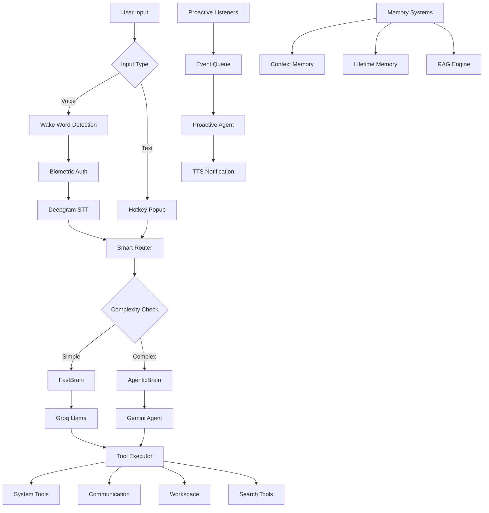

# 🧠 Jarvis - AI Assistant by Kaif Ansari

<div align="center">


[](https://github.com/thekaifansari01/jarvis-by-kaif-ansari/stargazers)
[](https://github.com/thekaifansari01/jarvis-by-kaif-ansari/network)
[](https://github.com/thekaifansari01/jarvis-by-kaif-ansari/issues)

> **Your Personal, Intelligent, and Proactive AI Assistant**

</div>

---

## 📋 Table of Contents

- [Overview](#-overview)
- [Key Features](#-key-features)
- [Architecture](#-architecture)
- [Technology Stack](#-technology-stack)
- [Installation](#-installation)
- [Environment Setup](#-environment-setup)
- [Usage](#-usage)
- [Configuration](#-configuration)
- [Project Structure](#-project-structure)
- [Research Paper](#-research-paper)
- [Troubleshooting](#-troubleshooting)
- [License](#-license)
- [Contributing](#-contributing)

---

## 🌟 Overview

**Jarvis** is a cutting-edge AI-powered personal assistant built by **Kaif Ansari**. It combines advanced natural language processing, biometric authentication, proactive intelligence, and multi-modal capabilities to create a seamless, human-like interaction experience.

### 🎯 What Makes Jarvis Special?

- **Hybrid Intelligence**: Combines Fast (stateless) and Agentic (stateful) reasoning for optimal performance
- **Multi-Modal Capabilities**: Voice, text, vision, and emotion-aware interactions
- **Biometric Security**: Voice and facial recognition for secure access
- **Proactive Intelligence**: Automatically detects and notifies about important events
- **Lifelong Memory**: Remembers facts, preferences, and conversations over time
- **Workspace Management**: Full file system operations, image generation, and document handling

---

## ✨ Key Features

### 🤖 Intelligent Processing
| Feature | Description |
|---------|-------------|
| **FastBrain** | Stateless, instant responses using Groq's Llama models |
| **AgenticBrain** | Stateful reasoning with Gemini's native tools and multi-step planning |
| **Smart Router** | Automatically selects Fast or Agentic mode based on command complexity |
| **Deep Research** | Tavily-powered comprehensive research with report generation |

### 🔐 Biometric Authentication
| Feature | Description |
|---------|-------------|
| **Voice Authentication** | Picovoice Eagle-based speaker verification |
| **Face Authentication** | Face++ API-based facial recognition with live capture |
| **Multi-Factor Security** | Combined voice + face authentication options |

### 🧠 Memory Systems
| Feature | Description |
|---------|-------------|
| **Context Memory** | 15-day short-term chat history with JSONL storage |
| **Lifetime Memory** | ChromaDB-based long-term episodic memory with embeddings |
| **User Bio & Preferences** | Learns and stores user facts, likes, and mood history |
| **RAG Engine** | Retrieval-Augmented Generation for workspace files |

### 🛠️ Integrated Tools
| Category | Tools |
|----------|-------|
| **Communication** | Email (Gmail API), WhatsApp (Baileys), Calendar (Google Calendar) |
| **Workspace** | File CRUD, Smart Search, Image Generation (Flux/AI Horde) |
| **Search** | Web (Tavily), YouTube Transcripts, ArXiv Papers, Webpage Scraping |
| **System** | App Open/Close, Volume/Brightness Control, Screenshot, Clipboard |
| **Proactive** | Email Listener, WhatsApp Listener, Reminder Listener |

### 🎨 User Interface
- **Agent Panel**: Floating, animated UI showing real-time agent status
- **STT Popup**: Visual feedback for speech recognition
- **System Tray**: Quick access and background operation
- **Terminal Output**: Clean, color-coded logs with rich formatting

### 🔊 Voice Features
- **Wake Word Detection**: "Jarvis" triggers listening mode
- **Deepgram STT**: Real-time speech-to-text with Hindi support
- **Edge TTS**: Fast, natural-sounding text-to-speech
- **Parallel Authentication**: Voice verification during wake word capture

---

## 🏗️ Architecture



### 🧩 Core Components

#### 1. **Processing Pipeline**
- **FastBrain**: Uses Groq's `llama-3.3-70b-versatile` for quick, stateless responses
- **AgenticBrain**: Uses Gemini's `gemma-4-31b-it` for complex, multi-step tasks
- **Smart Router**: Analyzes command complexity to choose the right processor

#### 2. **Memory Architecture**
- **Short-term**: JSONL-based chat history with 15-day rolling window
- **Long-term**: ChromaDB with Gemini embeddings for semantic search
- **User Context**: JSON stores for bio, preferences, and mood history

#### 3. **Authentication Layer**
- **Voice**: Picovoice Eagle with real-time scoring
- **Face**: Face++ API with live camera capture
- **Session**: Token-based authentication for Gmail and Calendar

#### 4. **Proactive Intelligence**
- **Listeners**: Gmail Pub/Sub, WhatsApp Baileys, Calendar Reminders
- **Event Queue**: Thread-safe queue for event processing
- **Scout Agent**: Evaluates event importance before notification

---

## 🛠️ Technology Stack

### 🤖 AI & Machine Learning
| Technology | Purpose |
|------------|---------|
| **Groq API** | Fast inference for Router, FastBrain, and Summarization |
| **Gemini API** | Agentic reasoning, Embeddings, and Vision capabilities |
| **Gemma 4** | 31B parameter model for complex reasoning |
| **Llama 3.3** | 70B parameter model for fast responses |
| **Flux.1-Schnell** | Image generation |
| **AI Horde** | Community-powered image editing |
| **Tavily** | Research and web search |

### 🎤 Voice & Audio
| Technology | Purpose |
|------------|---------|
| **Deepgram Nova-2** | Real-time speech-to-text with Hindi support |
| **Picovoice Porcupine** | Wake word detection ("Jarvis") |
| **Picovoice Eagle** | Voice biometric authentication |
| **Edge TTS** | Fast, natural text-to-speech |
| **Pygame** | Audio playback engine |

### 🗄️ Storage & Databases
| Technology | Purpose |
|------------|---------|
| **ChromaDB** | Vector database for embeddings |
| **SQLite** | Local message storage for WhatsApp |
| **JSON/L** | Configuration and chat history |

### 🔧 APIs & Services
| Service | Purpose |
|---------|---------|
| **Gmail API** | Email sending and receiving |
| **Google Calendar API** | Event management |
| **WhatsApp Baileys** | WhatsApp messaging |
| **Face++ API** | Facial recognition |
| **Together AI** | Image generation |
| **Pub/Sub** | Email notifications |

### 🖥️ UI & Visualization
| Technology | Purpose |
|------------|---------|
| **PyQt5** | Agent panel and UI popups |
| **Pystray** | System tray integration |
| **Rich** | Terminal formatting and logging |
| **ZMQ** | Real-time inter-process communication |

---

## 📦 Installation

### Prerequisites

- **Python**: 3.10 or higher
- **Node.js**: 18.0 or higher (for WhatsApp Baileys)
- **Git**: For cloning the repository
- **Windows**: For optimal system integration (works on Linux/macOS with limitations)

### Step-by-Step Setup

#### 1. Clone the Repository

```bash
git clone https://github.com/thekaifansari01/jarvis-by-kaif-ansari.git
cd jarvis-by-kaif-ansari
```

#### 2. Create Virtual Environment

```bash
# Windows
python -m venv venv
venv\Scripts\activate

# Linux/macOS
python3 -m venv venv
source venv/bin/activate
```

#### 3. Install Python Dependencies

```bash
pip install -r requirements.txt
```

#### 4. Install Node.js Dependencies

```bash
cd tools/Messanger/whatsapp/BaileysServer
npm install
cd ../../../../..
```

#### 5. Set Up Environment Variables

Create a `.env` file in the root directory:

```env
# API Keys
GROQ_API_KEY=your_groq_api_key
GEMINI_API_KEY=your_gemini_api_key
TAVILY_API_KEY=your_tavily_api_key
TOGETHER_AI=your_together_ai_key

# Speech & Voice
PICOVOICE_ACCESS_KEY=your_picovoice_key
DEEPGRAM_API_KEY=your_deepgram_api_key

# Face Recognition
FACEPP_API_KEY=your_facepp_api_key
FACEPP_API_SECRET=your_facepp_api_secret

# User Settings
USER_NAME=Kaif
```

#### 6. Add Required Files

Create the following directory structure:

```
Data/
├── Jarvis_Workspace/
│   ├── Creations/
│   ├── Vault/
│   └── Temp/
├── UserProfile/
│   ├── kaif_profile.egl      # Voice profile
│   └── UserFace.jpg          # Reference face image
├── jarvis_memory/
│   ├── lifetime_db/          # ChromaDB for LTM
│   └── rag_chroma_db/        # ChromaDB for RAG
├── SessionCookies/
│   ├── credentials.json      # Gmail OAuth credentials
│   ├── calendar_token.json   # Calendar OAuth token
│   └── auth_info_baileys/    # WhatsApp session
└── fonts/
    ├── english.ttf
    └── devangri.ttf
```

#### 7. Set Up Google OAuth

1. Go to [Google Cloud Console](https://console.cloud.google.com/)
2. Create a new project or select existing
3. Enable Gmail API and Google Calendar API
4. Create OAuth 2.0 credentials
5. Download `credentials.json` and place it in `Data/SessionCookies/`

#### 8. Set Up Face++ API

1. Register at [Face++](https://www.faceplusplus.com/)
2. Get API Key and Secret
3. Add them to `.env`
4. Place reference face image at `Data/UserProfile/UserFace.jpg`

#### 9. Set Up Voice Profile

1. Use Picovoice's Eagle to enroll voice
2. Save profile as `Data/UserProfile/kaif_profile.egl`

---

## 🚀 Usage

### Basic Commands

#### Text Mode
```bash
# Run in text mode (test mode)
python main.py test_jarvis

# Type your commands
❯ open YouTube
❯ send email to John about meeting
❯ generate image of a sunset
❯ what's the weather today?
```

#### Voice Mode
```bash
# Run in voice mode (default)
python main.py

# Say "Jarvis" to activate
# Speak your command naturally
```

### System Tray Mode
```bash
# Run with system tray
python main.py

# The app will minimize to system tray
# Use Ctrl+Shift+J to open input popup
# Right-click tray icon to show or exit
```

### Command Examples

#### 🗣️ System Controls
```bash
open chrome and spotify
close calculator
volume increase by 20
brightness set to 75
lock the PC
take a screenshot
```

#### 📧 Communication
```bash
send email to kaif@gmail.com subject "Meeting" body "Meeting at 3 PM"
whatsapp rahul "Coming to the party!"
check my calendar for tomorrow
create a reminder for 5 PM today "Gym"
```

#### 📁 Workspace
```bash
write a file report.md with content "Q4 Results..."
read the file report.md
list all files in workspace
open the image sunset.png
generate an image of a flying dragon
```

#### 🌐 Search & Research
```bash
search web for "latest AI news 2026"
read webpage https://example.com
search arxiv for "quantum computing"
deep research "future of renewable energy"
```

#### 🧠 Memory & Context
```bash
what did we talk about yesterday?
remember that I like coffee
what's my name?
tell me about my previous projects
```

### Hotkeys

| Hotkey | Action |
|--------|--------|
| `Ctrl+Shift+J` | Open text input popup |
| `System Tray` | Show/Hide Jarvis |
| `Voice` | Say "Jarvis" to activate |

---

## ⚙️ Configuration

### Core Configuration (`core/brain/config.py`)

```python
# Model Configuration
GROQ_ROUTER_MODEL = "llama-3.1-8b-instant"
GROQ_FAST_MODEL = "llama-3.3-70b-versatile"
GEMINI_AGENT_MODEL = "gemma-4-31b-it"
GEMINI_EMBEDDING_MODEL = "gemini-embedding-2"
GROQ_SUMMARY_MODEL = "openai/gpt-oss-120b"

# Agent Configuration
CONFIG = {
    "AGENT_MAX_STEPS": 20,
    "AGENT_TIMEOUT": 900,
    "AGENT_RETRY_LIMIT": 2,
}

# Voice Configuration
EDGE_TTS_VOICE = "hi-IN-MadhurNeural"
WHISPER_ENERGY_THRESHOLD = 400
WHISPER_PAUSE_THRESHOLD = 0.5
```

### Environment Variables

| Variable | Description | Required |
|----------|-------------|----------|
| `GROQ_API_KEY` | Groq API key | ✅ Yes |
| `GEMINI_API_KEY` | Google Gemini API key | ✅ Yes |
| `TAVILY_API_KEY` | Tavily API key | ✅ Yes |
| `PICOVOICE_ACCESS_KEY` | Picovoice key | For Voice |
| `DEEPGRAM_API_KEY` | Deepgram key | For STT |
| `FACEPP_API_KEY` | Face++ key | For Face Auth |
| `FACEPP_API_SECRET` | Face++ secret | For Face Auth |
| `TOGETHER_AI` | Together AI key | For Image Gen |
| `USER_NAME` | User's name | Recommended |

---

## 📁 Project Structure

```
jarvis-by-kaif-ansari/
├── core/
│   ├── auth/
│   │   ├── EagelAuth.py          # Voice authentication
│   │   └── FaceAuth.py           # Face authentication
│   ├── brain/
│   │   ├── Memory/
│   │   │   ├── Memory.py         # Context memory
│   │   │   └── LifetimeMemory.py # Long-term memory
│   │   ├── Processor/
│   │   │   ├── Processor.py      # Smart router
│   │   │   ├── FastBrain.py      # Fast responses
│   │   │   ├── AgenticBrain.py   # Complex reasoning
│   │   │   └── Prompts.py        # System prompts
│   │   ├── executor.py           # Tool executor
│   │   ├── RagEngine.py          # RAG for workspace
│   │   └── config.py             # Configuration
│   ├── voice/
│   │   ├── stt.py                # Speech-to-text
│   │   ├── tts.py                # Text-to-speech
│   │   ├── stt_status.py         # STT UI updates
│   │   └── interrupt.py          # Speech interruption
│   ├── terminal/
│   │   ├── jarvis_terminal.py    # Terminal UI
│   │   └── tray_manager.py       # System tray
│   ├── ui/
│   │   ├── agent_panel.py        # Floating agent UI
│   │   ├── agent_status.py       # ZMQ status updates
│   │   └── typing_status.py      # Typing indicator
│   ├── main/
│   │   ├── main.py               # Entry point
│   │   ├── CommandHandler.py     # Command processing
│   │   ├── HotKeyManager.py      # Hotkey management
│   │   ├── BackgroundServices.py # Service management
│   │   └── ServiceWatchdog.py    # Service monitoring
│   ├── logger/
│   │   └── logger.py             # Logging configuration
│   └── utils/
│       ├── ProcessManager.py     # Process management
│       └── utils.py              # Utilities
├── tools/
│   ├── Messanger/
│   │   ├── email_manager.py      # Gmail integration
│   │   └── whatsapp/
│   │       ├── whatsapp.py       # WhatsApp API
│   │       └── BaileysServer/    # Node.js bridge
│   ├── SystemTools/
│   │   ├── SystemTools.py        # System controls
│   │   └── clipboard_tool.py     # Clipboard operations
│   ├── SearchTools/
│   │   ├── WebSearch.py          # Tavily search
│   │   ├── SearchHub.py          # Search aggregator
│   │   ├── DeepResearch.py       # Tavily research
│   │   ├── ArxivTool.py          # ArXiv search
│   │   ├── YoutubeTranscriptFetcher.py
│   │   └── Scraper.py            # Webpage scraper
│   ├── workspace/
│   │   └── workspace.py          # File management
│   ├── ImageGeneration/
│   │   └── generate_image.py     # Image generation
│   ├── Calendar/
│   │   └── CalendarTool.py       # Google Calendar
│   └── OpenCloseApps/
│       ├── open_any.py           # App opener
│       └── close_any.py          # App closer
├── Proactive/
│   ├── proactive_agent.py        # Proactive intelligence
│   ├── event_queue.py            # Event queue
│   ├── prompts.py                # Proactive prompts
│   ├── Email/
│   │   └── EmailProactive.py     # Email listener
│   ├── WhatsApp/
│   │   └── WhatsappProactive.py  # WhatsApp listener
│   └── Reminder/
│       └── ReminderProactive.py  # Calendar listener
├── Data/
│   ├── Jarvis_Workspace/         # User workspace
│   ├── UserProfile/              # Authentication data
│   ├── jarvis_memory/            # Memory databases
│   ├── SessionCookies/           # OAuth tokens
│   └── fonts/                    # UI fonts
├── Bin/                          # Compiled executables
├── requirements.txt              # Python dependencies
├── .env                          # Environment variables
└── README.md                     # This file
```

---

## 📄 Research Paper

A comprehensive research paper on JARVIS has been published, detailing the architecture, implementation, and experimental results. The paper covers:

- **Hybrid Intelligence Architecture**: FastBrain + AgenticBrain + Smart Router
- **Biometric Security**: Voice (Eagle) + Face (Face++) authentication
- **Proactive Intelligence**: Context-aware event filtering
- **Memory Systems**: Short-term + Lifetime memory with RAG
- **Experimental Results**: 89% routing accuracy, 850ms FastBrain latency, 5.6% EER

📄 **[Read the Full Research Paper](./Jarvis_Research_Paper_Kaif_Ansari.pdf)**

---

## 🐛 Troubleshooting

### Common Issues & Solutions

#### 🔴 **API Key Errors**
```
Error: PICOVOICE_ACCESS_KEY missing in .env file.
```
**Solution**: Ensure all required API keys are set in `.env` file.

#### 🔴 **Voice Authentication Failed**
```
Voice Verification Failed! (Score: 0.34)
```
**Solution**: 
- Re-enroll voice profile for better accuracy
- Check microphone quality and background noise
- Adjust `AUTH_THRESHOLD` in `core/voice/stt.py`

#### 🔴 **Deepgram Connection Failed**
```
Deepgram Error: Connection timeout
```
**Solution**:
- Check internet connection
- Verify `DEEPGRAM_API_KEY` is valid
- Try increasing timeout values

#### 🔴 **Baileys WhatsApp Issues**
```
Node.js server is offline!
```
**Solution**:
```bash
cd tools/Messanger/whatsapp/BaileysServer
npm install
node baileys_service.js
```

#### 🔴 **Gmail Auth Issues**
```
Credentials file not found
```
**Solution**:
1. Download `credentials.json` from Google Cloud Console
2. Place in `Data/SessionCookies/`
3. Delete existing `token.json` and restart

#### 🔴 **ChromaDB Path Errors**
```
Failed to initialize LTM ChromaDB
```
**Solution**:
```bash
rm -rf Data/jarvis_memory/lifetime_db/*
rm -rf Data/jarvis_memory/rag_chroma_db/*
```
Restart Jarvis to rebuild indexes.

#### 🔴 **Face Recognition Fails**
```
Face++ API Error
```
**Solution**:
- Ensure `UserFace.jpg` is clear and front-facing
- Check `FACEPP_API_KEY` and `FACEPP_API_SECRET`
- Verify internet connectivity to Face++ servers

### Performance Tips

1. **Reduce Memory Usage**:
   - Lower `AGENT_MAX_STEPS` in config
   - Reduce `top_k` in LTM searches
   - Clear workspace cache regularly

2. **Improve Response Time**:
   - Use FastBrain for simple commands
   - Pre-warm model connections
   - Use `test_jarvis` mode for faster testing

3. **Voice Quality**:
   - Use a good quality microphone
   - Reduce background noise
   - Adjust `ENERGY_THRESHOLD` for sensitivity

---

## 📄 License

This project is licensed under the MIT License - see the [LICENSE](LICENSE) file for details.

---

## 🤝 Contributing

Contributions are welcome! Here's how you can help:

1. **Fork** the repository
2. **Create** a feature branch (`git checkout -b feature/AmazingFeature`)
3. **Commit** your changes (`git commit -m 'Add some AmazingFeature'`)
4. **Push** to the branch (`git push origin feature/AmazingFeature`)
5. **Open** a Pull Request

### Development Guidelines

- Follow PEP 8 style guidelines
- Add docstrings for all functions
- Update README for new features
- Test on Windows (primary), Linux, macOS (secondary)
- Keep dependencies minimal

### Reporting Issues

When reporting issues, please include:
- Operating system and version
- Python version (`python --version`)
- Error logs with traceback
- Steps to reproduce the issue

---

## 🙏 Acknowledgments

- **Kaif Ansari** - Creator and Lead Developer
- **Picovoice** - For voice wake word and biometrics
- **Deepgram** - For real-time speech recognition
- **Groq** - For fast inference capabilities
- **Google** - For Gemini, Gmail, and Calendar APIs
- **Baileys** - For WhatsApp integration
- **Tavily** - For research and web search

---

## 📞 Contact & Support

- **GitHub**: [@thekaifansari01](https://github.com/thekaifansari01)
- **Email**: kaif.ansari.global@gmail.com
- **Issues**: [GitHub Issues](https://github.com/thekaifansari01/jarvis-by-kaif-ansari/issues)

---

<div align="center">

### Made with ❤️ by Kaif Ansari

[](https://github.com/thekaifansari01)
[](https://twitter.com/thekaifansari)

**🌟 Star this repo if you find it useful!**

</div>

---

**Note**: This project is under active development. Features and APIs may change. Always refer to the latest documentation.
