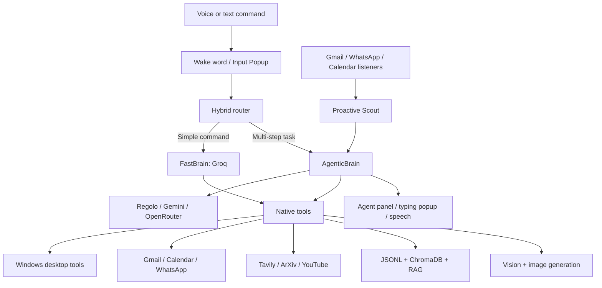

# JARVIS

> A Windows-first, voice-enabled personal AI assistant with hybrid LLM routing, local desktop tools, long-term memory, proactive alerts, and a native floating UI.

JARVIS is designed for hands-free and keyboard-driven assistance on a local Windows desktop. It combines a fast conversational path for simple commands with a multi-step agent path for coding, research, files, communication, memory, and automation.

## Table of contents

- [What JARVIS can do](#what-jarvis-can-do)
- [Architecture](#architecture)
- [Requirements](#requirements)
- [Installation](#installation)
- [Configuration](#configuration)
- [OAuth, Gmail, and Calendar](#oauth-gmail-and-calendar)
- [WhatsApp bridge](#whatsapp-bridge)
- [Running JARVIS](#running-jarvis)
- [Using JARVIS](#using-jarvis)
- [Feature reference](#feature-reference)
- [Data, logs, and privacy](#data-logs-and-privacy)
- [Repository layout](#repository-layout)
- [Troubleshooting](#troubleshooting)
- [Known limitations](#known-limitations)
- [Contributing](#contributing)
- [License](#license)

## What JARVIS can do

| Area | Capabilities |
| --- | --- |
| Voice and text | openWakeWord activation, Deepgram live speech-to-text, text entry from `Ctrl + Shift + J`, Groq TTS with Edge TTS fallback. |
| Hybrid intelligence | Routes simple requests to FastBrain and multi-step tasks to AgenticBrain. Uses Regolo, Gemini, and OpenRouter provider integrations with a configurable primary/fallback pair. |
| Desktop control | Open/close applications and websites, YouTube playback, volume, mute, brightness, lock, sleep, screenshots, and clipboard read/write. |
| Files and coding | Repository map, file view, exact block replacement, single/multi-file creation, Python execution, and terminal commands with an approval check for detected risky commands. |
| Research | Tavily web search/extract, ArXiv paper search, YouTube transcript retrieval, and multi-source deep-research reports. |
| Communication | Gmail send/delete support, Gmail proactive intake, Google Calendar create/check/delete, WhatsApp send/attachments/chat-history fetch. |
| Memory and RAG | JSONL conversation history, user facts/preferences/mood, ChromaDB episodic memory, and a local document vault indexed from `Documents/Jarvis/RAG`. |
| Media | Image generation through Regolo with Together/FLUX fallback, AI Horde image editing, and model-assisted image/PDF/video inspection. |
| Proactive assistance | Gmail, WhatsApp, and Calendar reminder listeners feed a background scout that can announce information or ask for confirmation before suggested background actions. |
| UI and resilience | Floating agent panel, typing popup, STT popup, input popup, a process watchdog, and persistent application logs. |

## Architecture



### Request routing

JARVIS first asks a short-timeout Regolo router whether a request is `FAST` or `AGENTIC`. If that call is unavailable, it uses a local keyword/length fallback.

| Route | Intended use | Examples |
| --- | --- | --- |
| FastBrain | Short conversation, simple web lookups, app/website control, media playback, and device controls. | “Chrome kholo”, “volume 10 percent badhao”, “Mumbai weather”, “YouTube par song chalao”. |
| AgenticBrain | Multi-step work, local files, code, memory, research, messages, calendar, vision, and images. | “Is folder ka repo map do”, “Kal wali meeting check karo”, “Is PDF ko explain karo”, “Kaif ko WhatsApp bhejo”. |

## Requirements

### Supported platform

JARVIS is **Windows-first**. Windows is required for the current registry protocol, Win32 audio/display controls, `winsound`, compiled popups, and several desktop integrations. macOS and Linux are not supported as complete desktop targets today.

Install these first:

- Windows 10 or Windows 11
- Python 3.10 or newer
- Node.js 18 or newer
- Git
- A microphone for voice mode

The following local assets must be present:

- `Data/model/Jarvis.onnx` — custom openWakeWord model
- `Bin/InputPopup.exe` and `Bin/SttPopup.exe` — optional but required for the native text/STT popups

If the `Bin` executables are unavailable, build the Qt projects under `core/UiSrc/` or run without those popup features.

## Installation

```powershell
git clone https://github.com/thekaifansari01/jarvis-by-kaif-ansari.git
cd jarvis-by-kaif-ansari

python -m venv .venv
.\.venv\Scripts\Activate.ps1

python -m pip install --upgrade pip
pip install -r requirements.txt
```

The app launcher integration uses `AppOpener`. If it was not installed by your existing environment, install it once:

```powershell
pip install AppOpener
```

Install Node dependencies for both manifests. The root manifest supplies `qrcode`; the Baileys service has its own dependencies.

```powershell
npm install
npm --prefix tools/Messanger/whatsapp/BaileysServer install
```

> The Python dependency list includes audio, UI, Google, ChromaDB, search, and local-system packages. Some packages—especially PyAudio and Windows COM dependencies—may need a compatible Python/Windows wheel.

## Configuration

Create a local environment file from the supplied template:

```powershell
Copy-Item .env.example .env
```

Do not commit `.env`, OAuth tokens, contacts, logs, or generated personal data.

### Environment variables

| Variable | Used by | Required when |
| --- | --- | --- |
| `USER_NAME` | Personalisation context | Optional. |
| `GROQ_API_KEY` | FastBrain, memory summarisation, proactive scout, primary TTS path | Required for normal FastBrain/proactive use. |
| `GEMINI_API_KEY` | Embeddings, RAG, lifetime memory, vision fallback | Required for RAG, embeddings, and Gemini fallback vision. |
| `REGOLO_API_KEY` | Default agent provider and primary image generation | Required when `regolo` is the active provider. |
| `OPENROUTER_API_KEY` | OpenRouter provider | Required only when selected. |
| `TAVILY_API_KEY` | Web search and webpage extraction | Required for web/research features. |
| `DEEPGRAM_API_KEY` | Live speech-to-text | Required for voice transcription. |
| `TOGETHER_AI` | FLUX image-generation fallback | Optional; only needed for the image fallback. |
| `AGENT_PRIMARY_PROVIDER` | Agentic provider selection | Optional; defaults to `regolo`. Values: `regolo`, `gemini`, `openrouter`. |
| `AGENT_FALLBACK_PROVIDER` | Agentic provider failover selection | Optional; defaults to `gemini`. |
| `API_BASE_URL` | `jarvis://` OAuth token exchange | Required for the OAuth callback handler; the template uses `https://jarvis-oauth-server.vercel.app`. |

### Runtime defaults

The defaults live in [`core/brain/config.py`](core/brain/config.py):

- Fast model: Groq `llama-3.3-70b-versatile`
- Agent providers: Regolo, Gemini, and OpenRouter
- Embedding dimension: `768`
- Maximum agent steps: `50`
- Agent timeout: `1800` seconds
- Deep-research timeout: `420` seconds
- Persistent log: `Data/jarvis.log`

## OAuth, Gmail, and Calendar

Gmail and Calendar authenticate through a local `jarvis://` protocol handler.

1. Activate the virtual environment you intend to run JARVIS with.
2. Configure `API_BASE_URL` in `.env`.
3. Register the protocol once:

   ```powershell
   python SetupRegistry.py
   ```

4. When JARVIS starts a Gmail or Calendar sign-in, complete the browser flow. The callback stores tokens in:

   - Gmail: `Data/SessionCookies/token.json`
   - Calendar: `Data/SessionCookies/calendar_token.json`

Calendar supports create, check, and delete operations. The agent-facing Gmail tool sends messages with optional attachments; the proactive listener also retrieves unread inbox content and can save received attachments.

### Gmail proactive listener

The Gmail listener uses a Google Pub/Sub watch. Its current project/topic/subscription names are implementation constants in `Proactive/Email/EmailProactive.py`:

- Project: `jarvisemailmanager`
- Topic: `projects/jarvisemailmanager/topics/jarvis-email-topic`
- Subscription: `projects/jarvisemailmanager/subscriptions/jarvis-email-sub`

This infrastructure must exist and the connected Gmail account must be authorised for it. The watch renews approximately every six days. Incoming attachments are saved under `Data/MediaVault/Email_Attachments/`.

## WhatsApp bridge

WhatsApp is implemented as a local Node.js Baileys service. JARVIS starts it automatically from `main.py` when `baileys_service.js` and Node.js are available.

- Local service URL: `http://localhost:3000`
- Send endpoint: `POST /send`
- Chat-history endpoint: `POST /fetch-chats`
- Alert endpoint: `GET /get-alerts`
- Session data: `Data/SessionCookies/auth_info_baileys/`
- Local SQLite history: `Data/SessionCookies/chats.db`
- Downloaded WhatsApp media: `Data/MediaVault/WhatsApp_Media/`

On the first run, scan the QR code displayed by the Baileys process. Keep the local service private; it is intended only for this machine.

### WhatsApp contacts

You can use a full number directly. For a 10-digit Indian number, the tool adds country code `91`. Named recipients require `Data/contacts.json`:

```json
{
  "kaif": "919876543210",
  "work": "911234567890"
}
```

## Running JARVIS

### Standard desktop and voice mode

```powershell
python main.py
```

This starts the agent panel, STT popup (when the binary exists), Baileys bridge, service watchdog, RAG engine, proactive listeners, global hotkey, and wake-word listener.

### Hotkey-only mode

```powershell
python main.py no_wake
```

This disables only the wake-word listener. The agent panel, background services, proactive listeners, and `Ctrl + Shift + J` hotkey still start.

### Development bootstrap mode

```powershell
python main.py test_jarvis
```

This mode skips the one-second startup delay. It does **not** disable STT, Baileys, the agent panel, RAG, or proactive services. Combine it with `no_wake` if you do not want wake-word listening.

### Stop JARVIS

- Say `exit`, `quit`, `stop`, or `bye` after voice activation, or
- Press `Ctrl + C` in the terminal running JARVIS.

The shutdown path stops the watchdog, managed background processes, TTS resources, and popup services.

## Using JARVIS

### Inputs

- **Voice:** Say the configured wake word. The bundled model is loaded from `Data/model/Jarvis.onnx`.
- **Text:** Press `Ctrl + Shift + J`, type a request in the native Input Popup, and press Enter.
- **Follow-up voice turn:** After a short/empty command, JARVIS may listen for a follow-up during its active-context window.

### Example requests

| Feature | Example |
| --- | --- |
| Desktop | “Chrome kholo”, “brightness 20 percent badhao”, “screenshot le lo”. |
| Web | “Aaj Delhi ka weather batao”, “latest AI news search karo”. |
| Research | “Is YouTube URL ka summary do”, “transformer attention papers ArXiv par dhoondo”. |
| Files | “Is project ka repo map do”, “`notes.md` banao”, “Is Python block ko replace karo”. |
| Coding | “Is folder ki Python files analyse karke bug samjhao”. |
| Memory | “Kal maine coffee ke baare mein kya bola tha?” |
| Calendar | “Kal 3 baje meeting create karo”, “Is hafte ke events check karo”. |
| Communication | “Kaif ko WhatsApp bhejo ki main 10 minute late aaunga”, “Email bhejo with this attachment”. |
| Vision | “Is image mein kya hai?”, “Is PDF ka summary do”. |
| Image generation | “Ek cyberpunk JARVIS wallpaper generate karo”, “Is image ka background rainy night bana do”. |

## Feature reference

### Voice, transcription, and speech

- **Wake word:** openWakeWord with the bundled ONNX model.
- **Speech-to-text:** Deepgram live transcription using the `nova-2` model, configured for Hindi input.
- **Speech output:** Groq audio generation is attempted first; Edge TTS is the fallback. Default Edge voice: `hi-IN-MadhurNeural`.
- **Voice feedback:** The STT popup reads status updates such as idle, listening, and understanding.

### Agentic file and code tools

The agent supports these file operations:

| Operation | What it does |
| --- | --- |
| `repo_map` | Returns a filtered project map. It skips `.venv`, `node_modules`, `__pycache__`, `.git`, and `Data`, and is capped at 30 listed files. |
| `view` | Reads a complete file or a specified line range. |
| `replace_block` | Replaces one exact, unique block of text. It normalises CRLF/LF line endings before matching. |
| `create` | Creates or overwrites one file. |
| `create_many` | Creates multiple files. |

Python file creation/replacement runs `py_compile` afterwards and reports a syntax error when detected. It does not automatically revert a broken edit. There is no dedicated file-delete tool in the current file-operation API.

For more complex work, JARVIS can run Python code in a temporary script or execute a command through a persistent terminal session. Commands matched as potentially risky (file mutations, downloads, package installs, shell redirection, and similar patterns) ask for terminal approval. Treat generated shell/Python actions as privileged local code and review approvals carefully.

### System and application control

- Opens local apps through `AppOpener`, with browser fallback for known websites and unrecognised app names.
- Opens Google, YouTube, GitHub, Gmail, and ChatGPT directly as web targets.
- Supports volume set/increase/decrease, speaker mute, brightness, screenshot, lock, and sleep.
- Screenshots are written to the temporary directory when executed through the agent; the direct utility defaults to `C:/Documents/Jarvis/Screenshots` when no destination is supplied.
- Clipboard tools can read and write plain text.

### Search and research

- **Web search:** Tavily search for quick facts, weather, news, and current information.
- **Webpage reading:** Tavily Extract for a supplied URL, truncated to 15,000 characters for agent context.
- **ArXiv:** Academic paper search.
- **YouTube:** Transcript retrieval and summarisation workflow.
- **Deep research:** Multi-step report generation with a configurable timeout. Reports are saved by the research tool.

### Vision and images

- Inline vision accepts `JPG`, `JPEG`, `PNG`, `WEBP`, and `GIF` when the active provider advertises vision.
- Gemini fallback inspection can send images, PDFs, and common video formats to `gemini-2.5-flash` when `GEMINI_API_KEY` is available.
- Analysis is model-assisted; JARVIS does not ship a separate local OCR or object-detection engine.
- Image generation uses Regolo `Qwen-Image` first and Together FLUX as a fallback.
- Image editing uses AI Horde img2img.
- Generated and edited images are saved under `Documents/Jarvis/GeneratedImages/`.

### Memory and RAG

| Store | Location | Purpose |
| --- | --- | --- |
| Short-term history | `Data/jarvis_memory/master_chat_history.jsonl` | Rolling conversation/activity history. |
| Profile and mood | `Data/jarvis_memory/` | User facts, preferences, and mood history. |
| Lifetime memory | `Data/jarvis_memory/lifetime_db/` | ChromaDB episodic summaries with embeddings. |
| Document vault | `Documents/Jarvis/RAG/` | Files indexed for local RAG search. |
| RAG index | `Data/jarvis_memory/rag_chroma_db/` | Persistent document vectors and hashes. |

Supported RAG source extensions are `.txt`, `.md`, `.json`, `.py`, `.js`, and `.csv`. Code is split around `def`/`class` boundaries where possible; other text is chunked for embedding. Changed files are detected with hashes before re-indexing.

### Proactive assistant

JARVIS starts three daemon listeners:

- Gmail unread-mail listener
- WhatsApp alert listener
- Calendar reminder listener

Events are batched and filtered for simple spam signals before a Groq-powered proactive scout classifies them. It can ignore an event, announce it, or prepare a suggested action.

For **proactive/background suggestions**, the agent prompt instructs JARVIS to ask for confirmation before permanent actions such as sending a message, editing files, or altering a calendar event. Confirmation state has a 60-second expiry. This is not a replacement for reviewing direct actions you request yourself.

### UI and background services

| Component | Role |
| --- | --- |
| Agent Panel | ZMQ subscriber on `tcp://127.0.0.1:5555` showing thought/action/observation status. |
| Typing Popup | Reads `Data/typing_status.json` and renders streamed Markdown, code highlighting, images, and link previews. |
| STT Popup | Native visual state indicator for listening/transcription. |
| Input Popup | Native hotkey text-command window that writes `JARVIS_CMD:::` to stdout for the Python launcher. |
| Service Watchdog | Checks the Baileys and STT popup processes every five seconds; restarts each up to three times with a cooldown. |

## Data, logs, and privacy

### Local data locations

| Path | Contents |
| --- | --- |
| `Data/SessionCookies/` | Gmail, Calendar, and WhatsApp authentication/session data. |
| `Data/jarvis_memory/` | Conversation history, profiles, RAG data, and ChromaDB stores. |
| `Data/MediaVault/` | Saved email attachments and WhatsApp media. |
| `Data/contacts.json` | Optional WhatsApp name-to-number contact map. |
| `Data/jarvis.log` | Persistent Python application log. |
| `Documents/Jarvis/RAG/` | Documents intended for RAG indexing. |
| `Documents/Jarvis/GeneratedImages/` | Generated and edited images. |

Sessions, runtime state, logs, generated media, and memory are excluded by `.gitignore`. `Data/contacts.json` is local personal data too, so keep it out of commits. Back up these locations only if you need to preserve memory, RAG state, contacts, or OAuth sessions.

### Privacy and safety notes

- Requests may be sent to the configured LLM, speech, search, image, Gmail, Calendar, WhatsApp, and research providers.
- Do not put private keys or OAuth tokens into prompts, source files, or commits.
- Local terminal/Python execution can affect your system. Review approval prompts before allowing an action.
- The WhatsApp bridge listens on local port 3000; do not expose it to a network.
- The code can create and overwrite files. Keep important work in version control and backups.

## Repository layout

```text
jarvis/
├── main.py                         # Application entry point and shutdown lifecycle
├── SetupRegistry.py                # Registers jarvis:// on Windows
├── JarvisProtocol.py               # Receives OAuth callback and stores tokens
├── requirements.txt                # Python dependencies
├── package.json                    # Root Node dependency manifest
├── .env.example                    # Environment variable template
├── core/
│   ├── brain/                      # Routing, providers, agent loop, tools, memory, RAG
│   ├── main/                       # Command bus, hotkey, services, watchdog
│   ├── voice/                      # Wake word, STT, TTS, interruption, popup status
│   ├── ui/                         # Python agent panel and typing popup
│   ├── UiSrc/                      # Qt/C++ popup source projects
│   ├── logger/                     # Shared logging setup
│   └── utils/                      # Process and text utilities
├── tools/
│   ├── Calendar/                   # Google Calendar actions
│   ├── ImageGeneration/            # Generation and editing
│   ├── Messanger/                  # Gmail and WhatsApp integration
│   ├── OpenCloseApps/              # Application launch/close helpers
│   ├── SearchTools/                # Tavily, ArXiv, YouTube, deep research
│   ├── SystemTools/                # Files, clipboard, hardware, screenshots
│   ├── Terminal/                   # Terminal and Python execution helpers
│   └── Vision/                     # Model-assisted media inspection
├── Proactive/                      # Event queue and Gmail/WhatsApp/Calendar listeners
├── Data/                           # Runtime state, model, icons, fonts, sessions
└── Bin/                            # Optional compiled Windows popup executables
```

## Troubleshooting

| Problem | Checks and fix |
| --- | --- |
| `ModuleNotFoundError` on startup | Activate `.venv`, run `pip install -r requirements.txt`, then install `AppOpener` if the missing module is `AppOpener`. |
| `openwakeword` / ONNX error | Confirm the dependency is installed and `Data/model/Jarvis.onnx` exists. |
| Wake word starts but speech is not transcribed | Set `DEEPGRAM_API_KEY`, allow microphone access in Windows, and verify the selected input device works. |
| Gmail/Calendar sign-in does not finish | Run `python SetupRegistry.py` from the active virtual environment, check `API_BASE_URL`, and retry the browser flow. Delete the relevant token JSON only when you intentionally want to re-authorise. |
| Gmail proactive alerts do not arrive | Verify the Google Pub/Sub project/topic/subscription, Gmail API permissions, OAuth scopes, and the six-day watch renewal. |
| WhatsApp cannot send | Run both `npm install` commands, start JARVIS, complete the QR login, and make sure port 3000 is free. |
| WhatsApp name is not found | Create `Data/contacts.json` using the format above, or provide a number directly. |
| Agent panel/STT/Input popup is absent | Ensure the relevant file exists in `Bin/`; otherwise build its matching Qt project under `core/UiSrc/`. |
| RAG returns no results | Put supported files in `Documents/Jarvis/RAG/`, set `GEMINI_API_KEY`, and allow the background indexer time to run. |
| Image fallback fails | Configure `TOGETHER_AI`; Regolo image generation also needs `REGOLO_API_KEY`. |
| Need diagnostic information | Read `Data/jarvis.log`. The console also prints service and tool errors. |

## Known limitations

- Windows is the only fully supported desktop platform.
- The project does not include a sandbox for untrusted terminal/Python execution.
- File operations do not include a dedicated delete command and are not restricted to a project root by the current implementation.
- Agent outcomes depend on external provider availability, credentials, quotas, and model behavior.
- Gmail Pub/Sub identifiers are currently code constants instead of environment-configured values.
- The source repository may not include prebuilt popup executables because build artifacts are ignored.
- The bundled project currently has no automated test suite documented for end users.

## Contributing

1. Fork the repository.
2. Create a feature branch.
3. Keep changes focused and do not commit `.env`, `Data/SessionCookies/`, generated media, or local memory.
4. Run relevant manual checks before opening a pull request.
5. Describe configuration changes and any new environment variables in the pull request.

## License

This project is released under the [MIT License](LICENSE).

---

Built by Kaif Ansari. If JARVIS helps you, consider starring the repository.
