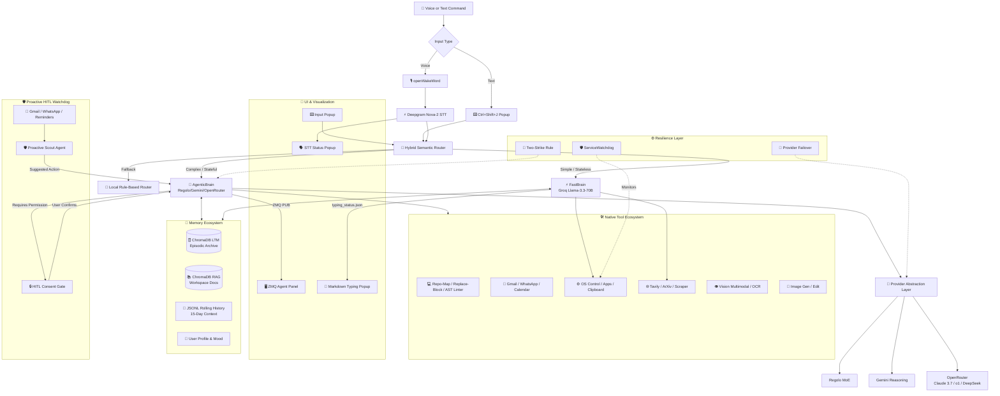

# 🧠 J.A.R.V.I.S. — The Autonomous AI Operating System & Software Engineer

> **A Windows-first, voice-enabled, hybrid-intelligence AI Operating System with multi-LLM failover, zero line-drift code editing, lifelong memory, proactive HITL safety, and a native reactive UI.**

[](https://www.python.org/)
[](https://nodejs.org/)
[](https://groq.com/)
[](https://deepmind.google/technologies/gemini/)
[](https://regolo.ai)
[](https://openrouter.ai)
[](LICENSE)
[](https://github.com/thekaifansari01/jarvis-by-kaif-ansari/pulls)

**Built by a 17-year-old solo developer. Commerce background. BCA first year. No team. No funding. Just late nights, coffee, and a burning passion to build the impossible.** ☕

---

## 📖 Table of Contents

- [🌟 What Makes JARVIS Special](#-what-makes-jarvis-special)
- [🏗️ System Architecture](#️-system-architecture)
- [⚡ FastBrain vs 🧠 AgenticBrain](#-fastbrain-vs--agenticbrain)
- [💻 Autonomous Software Engineering](#-autonomous-software-engineering--zero-line-drift)
- [🎨 UI & Visualization Ecosystem](#-ui--visualization-ecosystem)
- [🛡️ Resilience & Security Architecture](#️-resilience--security-architecture)
- [🧠 Memory & Long-Term Recall](#-memory--long-term-recall-ltm-ecosystem)
- [🛠️ Integrated Tool Ecosystem](#️-integrated-tool-ecosystem--native-executors)
- [📋 Example Requests — See Jarvis in Action](#-example-requests--see-jarvis-in-action)
- [🚀 Getting Started](#-getting-started)
- [⚙️ Configuration & Enterprise Security](#️-configuration--enterprise-security)
- [📂 Repository Anatomy](#-repository-anatomy)
- [🔧 Troubleshooting](#-troubleshooting)
- [🤝 Contributing](#-contributing)
- [📄 License](#-license)

---

## 🌟 What Makes JARVIS Special

JARVIS isn't just another ChatGPT wrapper. It's a **desktop-native AI Operating System** and **Autonomous Software Engineer** that bridges the gap between low-latency conversational AI and complex, multi-step engineering execution.

| Icon | Feature | Why It Matters |
|:---:|:---|:---|
| 💻 | **Zero Line-Drift Code Editing** | Uses exact `replace_block` diffs instead of fragile line numbers — eliminates the classic "line-drift bug" that plagues Claude Code and other AI agents. |
| 🛡️ | **Proactive HITL Safety** | Background listeners for Gmail/WhatsApp/Calendar. The agent *never* modifies critical files or schedules without explicit user consent. |
| 🔄 | **Multi-LLM Auto-Failover** | Seamlessly switches between **Regolo**, **Gemini**, and **OpenRouter** (Claude 3.7, o1, DeepSeek-V3) if the primary provider hits rate limits. |
| 🧠 | **Hybrid Semantic Routing** | Cloud Regolo router + local rule-based fallback — automatically routes commands to ultra-fast **FastBrain** or deep-reasoning **AgenticBrain**. |
| 📚 | **Lifelong Episodic LTM** | ChromaDB-backed persistent memory with daily Groq summarization. Remembers conversations from *months* ago. |
| ⚙️ | **Enterprise Resilience** | Dedicated **ServiceWatchdog** monitors background processes (STT Popup, Baileys) and auto-restarts them if they crash. |
| 🎨 | **Reactive UI Ecosystem** | ZMQ-powered floating Agent Panel, live markdown typing popup with async image previews, and native STT/Input popups. |
| 🗣️ | **Voice-First Multimodal** | Deepgram STT + Edge TTS + Vision (OCR/object detection) + Image Generation (Flux/AI Horde). |

---

## 🏗️ System Architecture

JARVIS uses a modular, event-driven architecture that separates fast conversational inference from stateful, multi-tool agentic engineering:



---

## ⚡ FastBrain vs 🧠 AgenticBrain

JARVIS uses a **Hybrid Semantic Router** (Regolo API + Local Keyword Fallback) to split commands. Here's exactly what each brain handles:

| Feature / Capability | ⚡ FastBrain (Groq LPU) | 🧠 AgenticBrain (Regolo/Gemini/OpenRouter) |
| :--- | :--- | :--- |
| **Core Philosophy** | Stateless, Sub-second latency, Direct OS toggles. | Stateful, Deep reasoning, Tool-calling Master. |
| **Routing Trigger** | Short commands, casual chat, simple toggles. | 25+ words, file ops, code gen, communication. |
| **System Controls** | Open/Close Apps, URLs, YouTube direct play. | Full system automation via Python scripts & Terminal. |
| **Hardware Toggles** | Volume (Set/Inc/Dec), Brightness, Mute, Screenshot, Lock/Sleep. | *(Same as FastBrain, but part of complex workflows)* |
| **File Operations** | ❌ Cannot modify files. | ✅ Full CRUD, `repo_map`, `replace_block` (Zero Drift), `create_many`. |
| **Communication** | ❌ No email/WhatsApp. | ✅ Send Gmails, WhatsApp messages, Fetch chat history. |
| **Code Execution** | ❌ No Python/Terminal execution. | ✅ `run_python_code` (preferred), `execute_terminal_command`. |
| **Memory Recall** | ❌ No personal LTM memory. | ✅ `memory_actions` (15-day logs + Lifetime episodic recall). |
| **Multimodal** | ❌ No vision. | ✅ `vision` (Image/Video analysis, OCR, object detection). |
| **Research** | ❌ Simple web search only (`quick_web_search`). | ✅ `deep_research` (420s multi-source synthesis), ArXiv, YouTube transcripts. |
| **Proactive HITL** | ❌ No. | ✅ Strict Partner Confirmation Mode. Asks consent before permanent changes. |

---

## 💻 Autonomous Software Engineering & Zero Line-Drift

JARVIS features a built-in software engineering engine inspired by **Claude Code** and **Devin**, enabling autonomous project scaffolding, bug hunting, and safe code refactoring:

### 1. 📂 Codebase Architecture Mapping (`repo_map`)
Before writing a single line, JARVIS inspects project structures natively. It automatically filters out heavy dependency directories (`node_modules`, `.venv`, `__pycache__`, `.git`, `Data`) to feed a clean, token-efficient ASCII tree directly into the LLM context window.

### 2. 🎯 Zero Line-Drift Block Editing (`replace_block`)
Eliminates the classic "Line Drift Bug" by replacing exact multi-line code diff blocks (`<<<<<<< SEARCH ======= >>>>>>>`) instead of fragile line numbers.
- **Windows Safe:** Normalizes Windows (`\r\n`) and POSIX (`\n`) line endings automatically for safe cross-platform matching.
- **Cost Efficient:** Reduces token usage by sending only the diff, not the whole file.

### 3. 🛡️ Instant AST Linter & Self-Correcting Loop
Embeds an automated post-write linter hook (`py_compile`) that validates syntax instantly upon file creation or modification.
- If a `SyntaxError` or indentation error occurs, JARVIS catches the compiler traceback and **autonomously self-corrects** the code in the very next step (`Two-Strike Rule`) without requiring human intervention.

### 4. ⚡ Multi-File Batching & Anti-Truncation
Dynamically routes small boilerplate tasks to native `create_many` CRUD tools while leveraging batched Python scripting (`run_python_code`) to build entire modular web applications (`index.html`, `css/`, `js/`) in a single execution step (~15 seconds).

### 5. 🔧 Terminal & Python REPL Execution
- `execute_terminal_command`: For OS system processes, package installs (`pip`/`npm`), git operations, or external executables.
- `run_python_code`: Preferred for OS discovery, data tasks, recursive folder searching, file filtering, complex data parsing, and multi-step logic.

---

## 🎨 UI & Visualization Ecosystem

JARVIS features a full-fledged, reactive UI suite built with **PyQt5** and **ZMQ** for real-time status updates, markdown rendering, and voice/text interactions.

### 1. 🖥️ Agent Panel (`core/ui/agent_panel.py`)
- **Role:** Floating, glass‑morphism status panel that shows the agent's **thought process**, **current action**, and **observation** in real time.
- **Communication:** Subscribes to ZMQ PUB socket (`tcp://127.0.0.1:5555`) – `agent_status.py` publishes `AGENT_UPDATE` messages.
- **Dynamic Glow:** Border glow changes color based on action type (Search = Cyan, Deep Task = Pink, File Ops = Orange, Communication = Green, Vision = Teal, etc.).
- **Auto‑Resize & Animation:** Smoothly adapts width/height to content and slides in/out with easing curves.
- **Smart Truncation:** Limits thought to 800 characters and observation to 200 characters to keep UI clean.
- **Font Fallback:** Automatically switches between English and Devanagari fonts based on text content.

### 2. 📝 Typing Popup (`core/ui/Popup/`)
- **Role:** Floating typewriter‑style popup that streams JARVIS's responses in real time with full markdown rendering.
- **Communication:** Reads `Data/typing_status.json` (written by `typing_status.py`) every 50ms.
- **Async Markdown Rendering:**
  - **Code Blocks:** Syntax‑highlighted using Pygments (Monokai theme) with a macOS‑style header.
  - **Tables, Lists, Blockquotes:** Fully supported with elegant styling.
  - **Images:** Supports local (`file://`) and remote images with async downloading and LRU caching (max 50 entries).
  - **Link Previews:** Automatically fetches rich previews via microlink.io API (`preview://` scheme).
  - **YouTube Previews:** Embeds `maxresdefault.jpg` thumbnails with a custom play button overlay.
- **Auto‑Scroll:** Sticks to the bottom while typing; allows manual scrolling once completed.
- **Smart Auto‑Close:** Closes automatically after a few seconds for short messages (<40 words) to reduce clutter.

### 3. 🗣️ STT Popup (`Bin/SttPopup.exe` – compiled from `core/voice/stt_status.py`)
- **Role:** Small floating indicator that appears when voice input is active (speech‑to‑text listening).
- **Behavior:** `BackgroundServices.start_stt_popup()` spawns it. `stt_status.py` controls visibility (show/hide) based on STT engine state.
- **Integration:** Seamlessly fades in/out to indicate voice activity without interrupting workflow.

### 4. ⌨️ Input Popup (`Bin/InputPopup.exe` – separate UI binary)
- **Role:** Triggered by global hotkey `Ctrl+Shift+J` – opens a lightweight text input window for typing commands.
- **Integration:** `HotKeyManager.py` spawns the process, reads stdout for `JARVIS_CMD:::` prefix, and submits the command to `main_command_processor`.
- **Use Case:** Perfect for silent text‑based interaction without using voice or terminal.

### 5. ⚙️ Core Rendering Engines (`AsyncBrowser.py` & `TextParser.py`)
- **AsyncBrowser:** A custom `QTextBrowser` subclass that handles async image downloads, manages a fail‑safe cache, and generates placeholders for loading/error states.
- **TextParser:** A background `QThread` that parses markdown, syntax‑highlights code, injects link preview tokens, and generates styled HTML – keeping the UI thread snappy.

---

## 🛡️ Resilience & Security Architecture

### 1. 🔄 Multi-LLM Auto-Failover (Provider Abstraction)
JARVIS doesn't rely on a single AI provider. The `BaseLLMProvider` abstract class implements **Regolo**, **Gemini**, and **OpenRouter** providers.
- **Primary:** Configurable via `AGENT_PRIMARY_PROVIDER`.
- **Fallback:** If quota is exhausted (429 error), it auto-switches to `AGENT_FALLBACK_PROVIDER` without crashing the agent loop.
- **Provider Support:** Regolo, Gemini, OpenRouter (Claude 3.7, o1, DeepSeek-V3, and 200+ models).

### 2. 🛡️ ServiceWatchdog (Background Process Guardian)
A dedicated daemon thread runs in the background, checking the health of critical subprocesses every 5 seconds:
- **Baileys Server** (WhatsApp Bridge)
- **STT Popup** (Voice Status UI)
- If a process is down, it attempts a restart up to `max_retries=3` with a 15-second cooldown period, ensuring maximum uptime.

### 3. 🔒 Human-in-the-Loop (HITL) Consent Protocol
- **Proactive Trigger Detection:** If the `Proactive Scout` detects an email/WhatsApp asking to reschedule a meeting, the AgenticBrain enters *Partner Confirmation Mode*.
- **Zero Unauthorized Execution:** The agent never executes `calendar_action`, `email_action`, or `file_operations` for critical modifications without the user explicitly saying *"Haa kar de"*, *"Yes do it"*, or *"Theek hai kardo"*.
- **TTL Expiry:** Pending confirmations auto-expire after 60 seconds to prevent stale memory injections.

### 4. 🔄 Two-Strike Error Recovery
If a tool or script fails:
- **Strike 1:** Reads stderr/stdout, fixes syntax/logic, and retries once with an improved script.
- **Strike 2:** If it fails a second time, ABANDONS that approach immediately and pivots to an alternative strategy.
- **Pragmatic Completion:** Avoids endless iterations for minor cosmetic perfection. Once the essential data/file is generated correctly, it invokes `complete_task`.

---

## 🧠 Memory & Long-Term Recall (LTM) Ecosystem

JARVIS employs a sophisticated three-tier memory system to maintain context across sessions:

### 1. 📜 Rolling JSONL History (Short-Term)
- Stores the last 15 days of conversation in `master_chat_history.jsonl`.
- Append-only architecture ensures zero data corruption during rapid write operations.
- Automatically prunes messages older than 15 days and archives them to LTM.

### 2. 🗄️ Lifetime Episodic Memory (Long-Term)
- Every 24 hours, the `LifetimeMemory` engine archives old chats.
- Uses Groq (`GROQ_SUMMARY_MODEL`) to extract dense, third-person factual summaries (ignoring small talk).
- Embeds summaries using `gemini-embedding-2` (768 dims) and stores them in a **ChromaDB** collection (`jarvis_episodic_memory`).

### 3. 📚 Workspace RAG (Vector Database)
- Indexes files in `Documents/Jarvis/RAG/` (supports `.txt`, `.md`, `.json`, `.py`, `.js`, `.csv`).
- **Smart Chunking:** Code files are split by `def`/`class`; text files by paragraphs.
- **Hash-Based Re-indexing:** Only re-indexes files that have changed (MD5 hash check), saving API costs.
- **Local Keyword Search:** Uses ChromaDB's `$contains` operator for fast, API-free local searches.

### 4. 👤 User Profile & Mood Tracking
- `user_bio.json`: Hard, unchanging facts about the user.
- `preferences.json`: Actionable preferences (likes, dislikes).
- `user_mood.json`: Mood history with timestamps.
- AI automatically extracts insights from conversations using Groq summarization.

---

## 🛠️ Integrated Tool Ecosystem & Native Executors

| Category | Supported Capabilities | Tech / API Bridge |
| :--- | :--- | :--- |
| 💻 **Software Engineering** | Project `repo_map`, Exact `replace_block` diffs, Post-edit syntax linting, Multi-file batch creation (`create_many`). | Python AST / `py_compile` / `fileEditor.py` |
| 📨 **Communication** | Send/read Gmails, Dispatch WhatsApp messages/files, Fetch WhatsApp chat history, Manage Google Calendar events. | Gmail Pub/Sub, Baileys Node.js Server, Calendar OAuth |
| 📂 **Workspace & RAG** | Single-file CRUD, Recursive directory scanning, Local markdown RAG indexing with hash-based change detection. | Python `os`/`pathlib`, ChromaDB Vector Index |
| 🌐 **Search & Research** | Live web scraping, Academic research (ArXiv), YouTube transcript summarization, Multi-source synthesis reports. | Tavily Search, BeautifulSoup, ArXiv API |
| ⚙️ **System Automation** | Launch/close desktop apps, Hardware volume/brightness, Screenshots, Clipboard CRUD (Read/Write). | Python OS Bindings, Win32 API, Pygame |
| 👁️ **Multimodal Vision** | Image/Video analysis, Object detection, OCR extraction from scanned documents/photos. | Gemini/Regolo Vision models |
| 🎨 **Image Generation** | Text-to-image generation, Image-to-image editing. | Regolo Qwen-Image / Together FLUX / AI Horde |

---

## 📋 Example Requests — See Jarvis in Action

### ⚡ FastBrain — Blazing Fast (< 1.5 sec response)

| Feature | Example Command | What Jarvis Does |
| :--- | :--- | :--- |
| **System Automation** | `"Chrome kholo, Spotify mein 'Blinding Lights' play karo, aur volume 70 kar do"` | Opens Chrome, launches Spotify via URI, plays the song, and adjusts system volume — **all in one command.** |
| **Hardware Toggles** | `"Brightness 50% kar do aur screenshot le lo"` | Changes display brightness to 50% and captures a full-screen screenshot in under 2 seconds. |
| **Smart Web Search** | `"Mumbai ka aaj ka weather aur IPL 2025 final ka score batao"` | Performs two parallel web searches and returns a concise, combined summary — **no agentic overhead.** |
| **YouTube Direct** | `"YouTube pe 'Arijit Singh latest song' chalao"` | Opens YouTube in browser and directly plays the song via `pywhatkit`. |
| **System Control** | `"System lock kar do aur 5 minute baad alarm laga do"` | Locks PC immediately and schedules a system alarm/reminder. |
| **Media Playback** | `"Spotify mein 'Atif Aslam hits' playlist play karo"` | Opens Spotify desktop app and starts the playlist via URI protocols. |
| **Quick Info** | `"Aaj ka date aur time batao"` | Returns current system date/time with timezone info. |
| **Clipboard** | `"Clipboard mein kya hai? Usme 'Hello World' likh do"` | Reads clipboard, then writes text to it — **instant clipboard management.** |
| **Power Actions** | `"PC ko sleep mode mein daalo"` | Puts system to sleep instantly. |
| **App Management** | `"Notepad aur Calculator kholo, fir VSCode band karo"` | Launches multiple apps while closing another — **batch app control.** |

### 🧠 AgenticBrain — Deep Reasoning, Autonomous Engineering

| Feature | Example Command | What Jarvis Does |
| :--- | :--- | :--- |
| **Multi-Step Software Engineering** | `"Mere project ka repo_map do, fir requirements.txt ke hisaab se missing dependencies install karo, fir main.py mein ek bug fix karo jo kal se crash kar raha hai"` | 1. Inspects project structure via `repo_map`.<br>2. Reads `requirements.txt` and runs `pip install` for missing packages.<br>3. Analyzes `main.py`, finds the bug, and uses `replace_block` to fix it — **all autonomously.** |
| **Zero Line-Drift Code Edit** | `"app.py mein 'get_user_data' function ko async banao aur isme error handling daalo"` | Reads the exact block, replaces it with async version + try-except — **without touching any other line.** |
| **Self-Correcting Python** | `"Ek Python function likho jo Fibonacci sequence generate kare. Agar syntax error aaye toh fix karna"` | Writes the function, catches `py_compile` errors, and **self-corrects** in the next step. |
| **Deep Research & Synthesis** | `"NVIDIA ke latest AI chips aur AMD ke MI400 series ka benchmark comparison research karke report banao"` | Searches web, reads multiple sources, synthesizes data, and returns a **structured markdown report** with tables and citations. |
| **Academic Research** | `"ArXiv par 'transformer attention optimization' papers dhoondo aur 2025 ke top papers ka summary do"` | Searches ArXiv, fetches abstracts, and summarizes key findings — **researcher-level automation.** |
| **Multimodal Vision** | `"Is screenshot mein kya hai? Is image se text extract karo"` | Inspects images/videos via Gemini vision, identifies objects, and extracts embedded text (OCR). |
| **YouTube Deep Dive** | `"Is YouTube link ka video summary do aur usme highlighted 5 key takeaways nikalo"` | Fetches transcript, summarizes content, and extracts 5 bullet-point insights. |
| **Email + Calendar** | `"Kaif ko email bhejo ki meeting 5 baje shift ho gayi hai, aur calendar update kar do"` | Sends email and updates Google Calendar — **with HITL consent gate.** |
| **WhatsApp Automation** | `"Rahul ko WhatsApp bhejo ki main 10 minute late aaunga, aur kal ki chat history fetch karo"` | Sends message and fetches chat history via Baileys — **all in one command.** |
| **Memory Recall** | `"3 months pehle maine kya project discuss kiya tha AI agents ke baare mein?"` | Searches ChromaDB LTM, fetches episodic memory, and returns the conversation context. |
| **Codebase Understanding** | `"Is codebase ka architecture explain karo aur dependencies ka graph banao"` | Scans project, generates `repo_map`, analyzes imports, and creates a visual dependency graph. |
| **Web Scraping & Analysis** | `"Is webpage ka content scrape karo aur sentiment analysis batao"` | Reads the page, extracts key text, and performs sentiment/tonality analysis. |
| **Image Generation** | `"Ek cyberpunk JARVIS wallpaper generate karo jisme neon purple glow ho"` | Generates image via Flux/AI Horde and saves it to desktop. |
| **System + File Operations** | `"Desktop par 'Projects' folder banao, usme 5 Python files create karo, aur har file mein class define karo"` | Uses `run_python_code` to batch-create multiple files with boilerplate classes — **all in 15 seconds.** |
| **Proactive HITL** | *(Jarvis detects email about meeting reschedule)* → `"Bhai, Ram ka mail aaya hai ki meeting 5 baje shift ho gayi. Kya main calendar update kar doon?"` | Enters **Partner Confirmation Mode**, asks for consent, and executes only after user says *"Haan kar de"*. |

### 🆚 FastBrain vs AgenticBrain — Quick Summary

| Command Type | Route | Typical Time |
| :--- | :--- | :--- |
| System controls, hardware toggles, simple searches | ⚡ **FastBrain** | `< 1.5 sec` |
| File editing, code generation, communication, research | 🧠 **AgenticBrain** | `15-60 sec` |
| Multi-step tasks with tool calls | 🧠 **AgenticBrain** | `30-120 sec` |
| Commands with 25+ words or complex intent | 🧠 **AgenticBrain** | Automatic |

### 🔥 Real-World Complex Commands (Advanced Scenarios)

| Scenario | Example Command | Jarvis's Action |
| :--- | :--- | :--- |
| **Code Migration** | `"Meri purani Python 2 project ko Python 3 mein migrate karo aur saari deprecations fix karo"` | Analyzes codebase, runs `2to3` tool, fixes imports, replaces deprecated functions, and runs linter. |
| **Full Stack App** | `"Desktop par 'StockTracker' naam ka project banao, usme React frontend, FastAPI backend, aur SQLite DB banao"` | Creates folder structure, writes all files, installs dependencies, runs migrations — **one-shot full-stack app generation.** |
| **Debugging Production** | `"main.py mein memory leak hai, isko profile karo aur fix karo"` | Runs memory profiler, identifies bottleneck, and patches the code via `replace_block`. |
| **Data Analysis** | `"Iss CSV file ka data analyze karo, outliers hatao, aur visualization generate karo"` | Reads CSV, cleans data, runs statistical analysis, and generates a matplotlib chart. |
| **Deployment** | `"Mere Flask app ko Docker container mein package karo aur localhost:5000 par deploy karo"` | Writes Dockerfile, builds image, runs container, and opens browser at `localhost:5000`. |
| **AI Model Integration** | `"Yahan Hugging Face model download karo, isko fine-tune karo, aur inference API banao"` | Downloads model, creates a fine-tuning script, runs it, and wraps it in a FastAPI server. |

### 🎯 Quick Decision Guide

| If you want to... | Use... |
| :--- | :--- |
| Open/close apps, change volume/brightness, take screenshot | ⚡ **FastBrain** |
| Search web, get weather, check scores | ⚡ **FastBrain** |
| Play YouTube/Spotify music | ⚡ **FastBrain** |
| Edit code, create files, generate projects | 🧠 **AgenticBrain** |
| Send emails, WhatsApp, manage calendar | 🧠 **AgenticBrain** |
| Research, analyze, summarize content | 🧠 **AgenticBrain** |
| Remember past conversations, recall facts | 🧠 **AgenticBrain** |
| Multi-step tasks with multiple actions | 🧠 **AgenticBrain** |
| Vision/Image analysis | 🧠 **AgenticBrain** |

---

## 🚀 Getting Started

### 1. System Prerequisites

- **OS:** Windows 10/11 (Required for full Win32/Registry protocol features)
- **Python:** `>= 3.10`
- **Node.js:** `>= 18.0` (Required for WhatsApp Baileys background service)
- **Git:** Latest stable release
- **Microphone:** For voice mode
- **Local Assets:**
  - `Data/model/Jarvis.onnx` — Custom openWakeWord model
  - `Bin/InputPopup.exe` and `Bin/SttPopup.exe` — Optional but required for native popups

### 2. Quick Install

```powershell
# Clone the repository
git clone https://github.com/thekaifansari01/jarvis-by-kaif-ansari.git
cd jarvis-by-kaif-ansari

# Create and activate a Python Virtual Environment
python -m venv .venv
.\.venv\Scripts\Activate.ps1

# Install required Python dependencies
python -m pip install --upgrade pip
pip install -r requirements.txt

# Install Node.js dependencies for WhatsApp Service
npm install
npm --prefix tools/Messanger/whatsapp/BaileysServer install
```

### 3. Register Desktop URI Protocol (OAuth)

To enable seamless OAuth web-authentication for Gmail and Google Calendar (`jarvis://` callback), run:

```powershell
python SetupRegistry.py
```

### 4. WhatsApp Bridge Setup

On the first run, scan the QR code displayed by the Baileys process. Keep the local service private; it is intended only for this machine.

- Local service URL: `http://localhost:3000`
- Session data: `Data/SessionCookies/auth_info_baileys/`

### 5. WhatsApp Contacts (Optional)

Create `Data/contacts.json` for named recipients:

```json
{
  "kaif": "919876543210",
  "work": "911234567890"
}
```

---

## ⚙️ Configuration & Enterprise Security

Create a `.env` file in your root project directory:

```powershell
Copy-Item .env.example .env
```

### Full Environment Variables & Hidden Configs (`config.py`)

| Variable | Description | Default |
| :--- | :--- | :--- |
| `GROQ_API_KEY` | FastBrain & Summarization API. | (Required) |
| `GEMINI_API_KEY` | Embeddings, Vision, Reasoning. | (Required) |
| `REGOLO_API_KEY` | Agentic Primary Provider. | (Required) |
| `OPENROUTER_API_KEY` | Fallback Agentic Provider. | (Optional) |
| `TAVILY_API_KEY` | Web search tool. | (Required for search) |
| `DEEPGRAM_API_KEY` | Live speech-to-text. | (Required for voice) |
| `TOGETHER_AI` | FLUX image-generation fallback. | (Optional) |
| `AGENT_PRIMARY_PROVIDER` | Choose `regolo`, `gemini`, or `openrouter`. | `regolo` |
| `AGENT_FALLBACK_PROVIDER` | Auto-fallback when primary fails. | `gemini` |
| `EMBEDDING_DIM` | Dimension for ChromaDB vectors. | `768` |
| `DEEP_RESEARCH_TIMEOUT` | Max seconds for deep research synthesis. | `420` |
| `AGENT_MAX_STEPS` | Max agent loop iterations. | `50` |
| `AGENT_TIMEOUT` | Max seconds for agent loop. | `1800` |
| `AGENT_RETRY_LIMIT` | Retries on tool failure before abort. | `2` |

> **Security Note:** Never commit your `.env` or `Data/SessionCookies/` directory to public version control. They are excluded via `.gitignore` by default.

---

## 🎮 Running JARVIS

### 1. Full Autonomous Voice & Desktop Mode (Default)

```powershell
python main.py
```

This starts the agent panel, STT popup (when the binary exists), Baileys bridge, service watchdog, RAG engine, proactive listeners, global hotkey, and wake-word listener.

### 2. Silent Mode (Wake Word Disabled, Trigger via Hotkeys Only)

```powershell
python main.py no_wake
```

This disables only the wake-word listener. The agent panel, background services, proactive listeners, and `Ctrl + Shift + J` hotkey still start.

### 3. Development Bootstrap Mode

```powershell
python main.py test_jarvis
```

This mode skips the one-second startup delay. It does **not** disable STT, Baileys, the agent panel, RAG, or proactive services. Combine it with `no_wake` if you do not want wake-word listening.

### 4. Stop JARVIS

- Say `exit`, `quit`, `stop`, or `bye` after voice activation, or
- Press `Ctrl + C` in the terminal running JARVIS.

### Keyboard Shortcuts

- `Ctrl + Shift + J`: Open Floating Text Input & Markdown UI Popup (Runs `InputPopup.exe`).

---

## 📂 Repository Anatomy

```
jarvis-by-kaif-ansari/
├── Bin/                           # Compiled Executables
│   ├── InputPopup.exe             # Text input UI (Hotkey trigger)
│   └── SttPopup.exe               # Voice status floating indicator
├── core/
│   ├── brain/
│   │   ├── Processor/             # Routing & Intelligence
│   │   │   ├── Processor.py       # RegoloSemanticRouter + Local Fallback
│   │   │   ├── FastBrain.py       # Groq LPU integration (Stateless)
│   │   │   ├── AgenticBrain.py    # Agent Loop, 4-Pillar Contract, Two-Strike
│   │   │   └── Prompts.py         # System Prompts & Safety Contracts
│   │   ├── Providers/             # Multi-LLM Abstraction Layer
│   │   │   ├── baseProvider.py    # Abstract Class
│   │   │   ├── regoloProvider.py
│   │   │   ├── geminiProvider.py
│   │   │   └── openrouterProvider.py
│   │   ├── Memory/                # Persistence Ecosystem
│   │   │   ├── Memory.py          # JSONL Context, User Bio/Mood, LTM Archiver
│   │   │   ├── LifetimeMemory.py  # ChromaDB Episodic Memory (Daily Summaries)
│   │   │   └── RagEngine.py       # Smart Chunking, Hash-based RAG Indexing
│   │   ├── executor.py            # Tool Dispatcher (System, File, Comms)
│   │   └── config.py              # Enterprise Configurations
│   ├── main/
│   │   ├── CommandHandler.py      # Main command bus, _is_busy state
│   │   ├── HotKeyManager.py       # Ctrl+Shift+J binding
│   │   ├── BackgroundServices.py  # Spawn/Kill STT, Baileys, Agent Panel
│   │   └── ServiceWatchdog.py     # Auto-Restart daemon for background processes
│   ├── voice/                     # STT, TTS, Wake Word
│   │   ├── stt.py (Deepgram)
│   │   ├── tts.py (Edge TTS)
│   │   └── stt_status.py          # Popup visibility controller
│   ├── ui/                        # PyQt5 UI Suite
│   │   ├── agent_panel.py         # ZMQ-based floating status panel
│   │   ├── agent_status.py        # ZMQ publisher for agent updates
│   │   ├── typing_status.py       # JSON file writer for typing popup
│   │   └── Popup/                 # Markdown rendering popup
│   │       ├── Popup.py           # Entry point
│   │       ├── PopupUI.py         # Main UI (glass-morphism, resize, animations)
│   │       ├── AsyncBrowser.py    # Async image loading, cache, preview engine
│   │       └── TextParser.py      # Background markdown parser, syntax highlighter
│   └── utils/
│       ├── utils.py               # resolve_pronouns, helpers
│       └── ProcessManager.py      # Safe subprocess tree spawning/killing
├── tools/
│   ├── Messanger/                 # Gmail Pub/Sub & Baileys WhatsApp
│   │   └── whatsapp/BaileysServer/ (Node.js)
│   ├── SystemTools/               # Win32 OS controls, File Editor
│   │   ├── fileEditor.py          # repo_map, replace_block, create_many
│   │   └── clipboard_tool.py      # OS Clipboard CRUD
│   ├── SearchTools/               # Tavily, ArXiv, DeepResearch
│   ├── Vision/                    # Multimodal image/video handlers
│   └── ImageGeneration/           # Text-to-image, image-to-image
├── Proactive/                     # HITL Scout & Event Queue
│   ├── proactive_agent.py
│   ├── Email/                     # Gmail Pub/Sub listener
│   ├── WhatsApp/                  # WhatsApp alert listener
│   └── Reminders/                 # Calendar reminder listener
├── Data/                          # Local State (Vectors, Profile, Cookies)
│   ├── jarvis_memory/             # ChromaDB LTM & JSONL history
│   └── SessionCookies/            # Baileys creds, OAuth tokens
├── fonts/                         # UI fonts (English, Devanagari)
├── SetupRegistry.py               # Registers jarvis:// URI protocol
├── main.py                        # Primary Entry Point
└── requirements.txt               # Production dependencies
```

---

## 🔧 Troubleshooting

| Problem | Checks and Fix |
| :--- | :--- |
| `ModuleNotFoundError` on startup | Activate `.venv`, run `pip install -r requirements.txt`. |
| `openwakeword` / ONNX error | Confirm `Data/model/Jarvis.onnx` exists. |
| Wake word starts but speech is not transcribed | Set `DEEPGRAM_API_KEY`, allow microphone access in Windows. |
| Gmail/Calendar sign-in does not finish | Run `python SetupRegistry.py`, check `API_BASE_URL`, retry browser flow. |
| WhatsApp cannot send | Run both `npm install` commands, complete QR login, ensure port 3000 is free. |
| Agent panel/STT/Input popup is absent | Ensure the relevant executable exists in `Bin/`; otherwise build from `core/UiSrc/`. |
| RAG returns no results | Put supported files in `Documents/Jarvis/RAG/`, set `GEMINI_API_KEY`, allow background indexer time. |
| Need diagnostic information | Read `Data/jarvis.log` — console also prints service/tool errors. |

---

## 🤝 Contributing

1. **Fork** the repository.
2. **Create** a feature branch (`git checkout -b feature/AdvancedTooling`).
3. **Commit** your changes with clear, descriptive messages.
4. **Push** to your fork (`git push origin feature/AdvancedTooling`).
5. **Open** a Pull Request for review.

> **Note:** Do not commit `.env`, `Data/SessionCookies/`, generated media, or local memory. They are excluded via `.gitignore`.

---

## 📄 License

This project is released under the **MIT License** — see the [LICENSE](LICENSE) file for complete details.

---

**Built with ❤️ and pragmatic engineering by Kaif Ansari**

*If this project inspired your own AI architecture, consider leaving a ⭐ on the repository!*