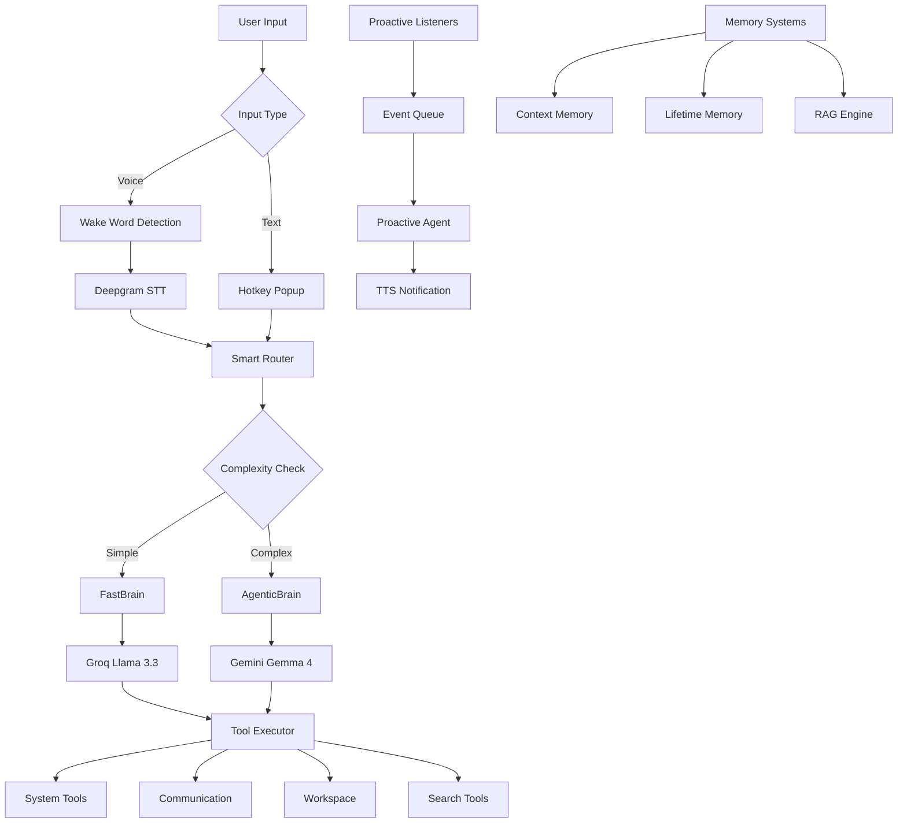

# 🧠 Jarvis – AI Assistant by Kaif Ansari

> **Your Personal, Intelligent, and Proactive AI Assistant – Built with Python, Groq, Gemini, and Deepgram.**

[](https://github.com/thekaifansari01/jarvis-by-kaif-ansari/blob/main/LICENSE)
[](https://www.python.org/)
[](https://nodejs.org/)
[](https://groq.com/)
[](https://deepmind.google/technologies/gemini/)
[](https://github.com/thekaifansari01/jarvis-by-kaif-ansari/pulls)

---

## 📌 Table of Contents

- [🌟 Overview](#-overview)
- [✨ Key Features](#-key-features)
- [🏗️ Architecture](#-architecture)
- [🛠️ Technology Stack](#-technology-stack)
- [📦 Installation](#-installation)
- [🚀 Usage](#-usage)
- [⚙️ Configuration](#-configuration)
- [📁 Project Structure](#-project-structure)
- [🐛 Troubleshooting](#-troubleshooting)
- [🤝 Contributing](#-contributing)
- [📄 License](#-license)
- [🙏 Acknowledgments](#-acknowledgments)

---

## 🌟 Overview

**Jarvis** is a cutting-edge AI assistant that combines voice interaction, intelligent reasoning, lifelong memory, and a powerful toolset. It uses **Groq** for fast responses, **Gemini** for complex agentic tasks, **Deepgram** for speech recognition, and **Edge TTS** for natural speech output.

### 🎯 What Makes Jarvis Special?

- **Hybrid Intelligence** – FastBrain (stateless) for instant replies, AgenticBrain (stateful) for multi-step tasks.
- **Voice-First** – Wake word "Jarvis", real-time STT, and natural TTS.
- **Lifelong Memory** – Remembers facts, preferences, and conversations over time.
- **Proactive Intelligence** – Automatically detects important emails, WhatsApp messages, and calendar reminders.
- **Workspace Integration** – Read, write, search, and generate files and images locally.
- **Rich Toolset** – Email, WhatsApp, Calendar, Web Search, Deep Research, System Control, and more.

---

## ✨ Key Features

### 🤖 Intelligent Processing

| Component | Description |
|-----------|-------------|
| **FastBrain** | Uses Groq's `llama-3.3-70b-versatile` for low-latency, stateless responses. |
| **AgenticBrain** | Uses Gemini's `gemma-4-31b-it` with native function calling for planning and tool use. |
| **Smart Router** | Analyzes command complexity to route to Fast or Agentic path automatically. |
| **Deep Research** | Tavily-powered comprehensive research with structured report generation. |

### 🧠 Memory Systems

| System | Technology | Purpose |
|--------|------------|---------|
| **Context Memory** | JSONL (15-day rolling window) | Short-term chat history and recent actions. |
| **Lifetime Memory** | ChromaDB + Gemini Embeddings | Long-term episodic memory with semantic search. |
| **User Profile** | JSON (bio, preferences, mood) | Learns user facts, likes, and emotional state. |
| **RAG Engine** | ChromaDB + Gemini Embeddings | Retrieval-augmented generation from workspace files. |

### 🛠️ Integrated Tools

| Category | Tools |
|----------|-------|
| **Communication** | Gmail (send/delete), WhatsApp (Baileys – send/fetch), Google Calendar (create/check/delete). |
| **Workspace** | File CRUD, smart search, image generation (Flux.1-Schnell), image editing (AI Horde). |
| **Search** | Web (Tavily), YouTube transcripts, ArXiv papers, webpage scraping. |
| **System** | Open/close apps, volume/brightness control, screenshot, clipboard, lock/sleep PC. |
| **Terminal & Code** | Stateful terminal execution, Python REPL with safety checks and user approval. |
| **Proactive** | Email listener (Gmail Pub/Sub), WhatsApp listener, calendar reminder listener. |

### 🎨 User Interface

- **Agent Panel** – Floating, animated window showing real-time agent steps, thoughts, and actions.
- **Typing Popup** – Markdown viewer with image previews, code highlighting, and auto-scroll.
- **System Tray** – Quick access and background operation.
- **Rich Terminal Logging** – Colour-coded, formatted logs via `rich`.

### 🔊 Voice Features

- **Wake Word** – "Jarvis" detected via Picovoice Porcupine.
- **Speech-to-Text** – Deepgram Nova-2 with Hindi support and custom keywords.
- **Text-to-Speech** – Edge TTS (fast, natural) with Groq Orpheus as primary.
- **Interrupt Handling** – Wake word instantly stops TTS and ongoing processing.

---

## 🏗️ Architecture



### Core Components

#### 1. **Processing Pipeline**
- **FastBrain** – instant, stateless responses using Groq.
- **AgenticBrain** – multi-step, stateful reasoning with Gemini and native tools.
- **Smart Router** – decides which brain to use based on command keywords.

#### 2. **Memory Architecture**
- **Short-term** – JSONL chat history with a 15-day rolling window.
- **Long-term** – ChromaDB + Gemini embeddings for semantic retrieval.
- **User Context** – JSON stores for bio, preferences, and mood history.

#### 3. **Proactive Intelligence**
- **Listeners** – Gmail Pub/Sub, WhatsApp Baileys, Calendar reminders.
- **Event Queue** – Thread-safe queue for event processing.
- **Scout Agent** – Evaluates event importance before notification.

---

## 🛠️ Technology Stack

### 🤖 AI & ML

| Technology | Purpose |
|------------|---------|
| **Groq API** | Fast inference for Router, FastBrain, and Summarization. |
| **Gemini API** | Agentic reasoning, embeddings, and vision capabilities. |
| **Gemma 4 (31B)** | Complex reasoning in AgenticBrain. |
| **Llama 3.3 (70B)** | Fast responses in FastBrain. |
| **Flux.1-Schnell** | High-speed image generation. |
| **AI Horde** | Community-powered image editing. |
| **Tavily** | Research and web search. |

### 🎤 Voice & Audio

| Technology | Purpose |
|------------|---------|
| **Deepgram Nova-2** | Real-time speech-to-text with Hindi support. |
| **Picovoice Porcupine** | Wake word detection ("Jarvis"). |
| **Edge TTS** | Fast, natural text-to-speech. |
| **Pygame** | Audio playback engine. |

### 🗄️ Storage & Databases

| Technology | Purpose |
|------------|---------|
| **ChromaDB** | Vector database for embeddings (LTM & RAG). |
| **SQLite** | Local message storage for WhatsApp. |
| **JSON / JSONL** | Configuration, chat history, and user profile. |

### 🔌 APIs & Services

| Service | Purpose |
|---------|---------|
| **Gmail API** | Email sending and receiving. |
| **Google Calendar API** | Event management. |
| **WhatsApp Baileys** | WhatsApp messaging bridge. |
| **Together AI** | Image generation. |
| **Google Pub/Sub** | Email notifications. |

### 🖥️ UI & Visualisation

| Technology | Purpose |
|------------|---------|
| **PyQt5** | Agent panel and UI popups. |
| **Pystray** | System tray integration. |
| **Rich** | Terminal formatting and logging. |
| **ZMQ** | Real-time inter-process communication. |

---

## 📦 Installation

### Prerequisites

- **Python** – 3.10 or higher
- **Node.js** – 18.x or higher (for WhatsApp Baileys)
- **Git** – for cloning the repository
- **Windows** – recommended for full system integration (Linux/macOS support is partial)

### Step-by-Step Setup

#### 1. Clone the Repository
```bash
git clone https://github.com/thekaifansari01/jarvis-by-kaif-ansari.git
cd jarvis-by-kaif-ansari
```

#### 2. Create Virtual Environment
```bash
# Windows
python -m venv venv
venv\Scripts\activate

# Linux/macOS
python3 -m venv venv
source venv/bin/activate
```

#### 3. Install Python Dependencies
```bash
pip install -r requirements.txt
```

#### 4. Install Node.js Dependencies (for WhatsApp)
```bash
cd tools/Messanger/whatsapp/BaileysServer
npm install
cd ../../../..
```

#### 5. Set Up Environment Variables
Create a `.env` file in the root directory (see `.env.example`):
```ini
# API Keys
GROQ_API_KEY=your_groq_api_key
GEMINI_API_KEY=your_gemini_api_key
TAVILY_API_KEY=your_tavily_api_key
TOGETHER_AI=your_together_ai_key

# Speech & Voice
DEEPGRAM_API_KEY=your_deepgram_api_key

# User Settings
USER_NAME=YourName
```

#### 6. Register Custom URL Protocol (for Gmail/Calendar OAuth)
Run this once to register the `jarvis://` protocol in Windows Registry:
```bash
python core/JarvisProtocol/SetupRegistry.py
```

#### 7. Add Required Directories
Create the following structure (auto-created on first run, but you can pre-create):
```
Data/
├── Jarvis_Workspace/
│   ├── Creations/
│   ├── Vault/
│   └── Temp/
├── jarvis_memory/
│   ├── lifetime_db/          # ChromaDB for LTM
│   └── rag_chroma_db/        # ChromaDB for RAG
├── SessionCookies/           # OAuth tokens (auto-generated)
└── fonts/
    ├── english.ttf
    └── devangri.ttf
```

---

## 🚀 Usage

### Basic Modes

| Mode | Command | Description |
|------|---------|-------------|
| **Voice** (default) | `python main.py` | Starts with wake-word listening and voice interaction. |
| **Text (Test)** | `python main.py test_jarvis` | Runs in text-only mode – type commands directly. |
| **No Wake** | `python main.py no_wake` | Disables wake-word, useful for debugging. |

### System Tray
- Run normally: `python main.py`
- The app minimises to the system tray.
- Use `Ctrl+Shift+J` to open the text input popup.
- Right-click the tray icon to show or exit.

### Command Examples

#### 🗣️ System Controls
```
open chrome and spotify
close calculator
volume increase by 20
brightness set to 75
lock the PC
take a screenshot
```

#### 📧 Communication
```
send email to kaif@gmail.com subject "Meeting" body "Meeting at 3 PM"
whatsapp rahul "Coming to the party!"
check my calendar for tomorrow
create a reminder for 5 PM today "Gym"
```

#### 📁 Workspace
```
write a file report.md with content "Q4 Results..."
read the file report.md
list all files in workspace
open the image sunset.png
generate an image of a flying dragon
```

#### 🌐 Search & Research
```
search web for "latest AI news 2026"
read webpage https://example.com
search arxiv for "quantum computing"
deep research "future of renewable energy"
```

#### 🧠 Memory & Context
```
what did we talk about yesterday?
remember that I like coffee
what's my name?
tell me about my previous projects
```

### Hotkeys
| Hotkey | Action |
|--------|--------|
| `Ctrl+Shift+J` | Open text input popup. |
| Voice | Say **"Jarvis"** to activate. |

---

## ⚙️ Configuration

### Core Configuration (`core/brain/config.py`)
```python
# Models
GROQ_FAST_MODEL = "llama-3.3-70b-versatile"
GEMINI_AGENT_MODEL = "gemma-4-31b-it"
GEMINI_EMBEDDING_MODEL = "gemini-embedding-2"

# Agent Limits
CONFIG = {
    "AGENT_MAX_STEPS": 20,
    "AGENT_TIMEOUT": 900,          # seconds
    "AGENT_RETRY_LIMIT": 2,
}

# Voice
EDGE_TTS_VOICE = "hi-IN-MadhurNeural"
```

### Environment Variables
| Variable | Description | Required |
|----------|-------------|----------|
| `GROQ_API_KEY` | Groq API key | ✅ Yes |
| `GEMINI_API_KEY` | Google Gemini API key | ✅ Yes |
| `TAVILY_API_KEY` | Tavily API key | ✅ Yes |
| `PICOVOICE_ACCESS_KEY` | Picovoice key | For Wake Word |
| `DEEPGRAM_API_KEY` | Deepgram key | For STT |
| `TOGETHER_AI` | Together AI key | For Image Gen |
| `USER_NAME` | User's name | Recommended |

---

## 📁 Project Structure
```
jarvis-by-kaif-ansari/
├── core/
│   ├── brain/
│   │   ├── Memory/
│   │   │   ├── Memory.py         # Context memory
│   │   │   └── LifetimeMemory.py # Long-term memory
│   │   ├── Processor/
│   │   │   ├── Processor.py      # Smart router
│   │   │   ├── FastBrain.py      # Fast responses
│   │   │   ├── AgenticBrain.py   # Complex reasoning
│   │   │   └── Prompts.py        # System prompts
│   │   ├── executor.py           # Tool executor
│   │   ├── RagEngine.py          # RAG for workspace
│   │   └── config.py             # Configuration
│   ├── voice/
│   │   ├── stt.py                # Speech-to-text
│   │   ├── tts.py                # Text-to-speech
│   │   ├── stt_status.py         # STT UI updates
│   │   └── interrupt.py          # Speech interruption
│   ├── ui/
│   │   ├── agent_panel.py        # Floating agent UI
│   │   ├── agent_status.py       # ZMQ status updates
│   │   └── typing_status.py      # Typing indicator
│   ├── main/
│   │   ├── main.py               # Entry point
│   │   ├── CommandHandler.py     # Command processing
│   │   ├── HotKeyManager.py      # Hotkey management
│   │   ├── BackgroundServices.py # Service management
│   │   └── ServiceWatchdog.py    # Service monitoring
│   ├── JarvisProtocol/
│   │   ├── JarvisProtocol.py     # OAuth protocol handler
│   │   └── SetupRegistry.py      # Windows Registry setup
│   ├── logger/
│   │   └── logger.py             # Logging configuration
│   └── utils/
│       ├── ProcessManager.py     # Process management
│       └── utils.py              # Utilities
├── tools/
│   ├── Messanger/
│   │   ├── email_manager.py      # Gmail integration
│   │   └── whatsapp/
│   │       ├── whatsapp.py       # WhatsApp API
│   │       └── BaileysServer/    # Node.js bridge
│   ├── SystemTools/
│   │   ├── SystemTools.py        # System controls
│   │   └── clipboard_tool.py     # Clipboard operations
│   ├── SearchTools/
│   │   ├── WebSearch.py          # Tavily search
│   │   ├── SearchHub.py          # Search aggregator
│   │   ├── DeepResearch.py       # Tavily research
│   │   ├── ArxivTool.py          # ArXiv search
│   │   ├── YoutubeTranscriptFetcher.py
│   │   └── Scraper.py            # Webpage scraper
│   ├── workspace/
│   │   └── workspace.py          # File management
│   ├── ImageGeneration/
│   │   └── generate_image.py     # Image generation
│   ├── Calendar/
│   │   └── CalendarTool.py       # Google Calendar
│   └── OpenCloseApps/
│       ├── open_any.py           # App opener
│       └── close_any.py          # App closer
├── Proactive/
│   ├── proactive_agent.py        # Proactive intelligence
│   ├── event_queue.py            # Event queue
│   ├── prompts.py                # Proactive prompts
│   ├── Email/
│   │   └── EmailProactive.py     # Email listener
│   ├── WhatsApp/
│   │   └── WhatsappProactive.py  # WhatsApp listener
│   └── Reminder/
│       └── ReminderProactive.py  # Calendar listener
├── Data/                         # User data (auto-created)
├── Bin/                          # Compiled executables
├── main.py                       # Application entry point
├── requirements.txt              # Python dependencies
├── .env.example                  # Environment template
└── README.md                     # This file
```

---

## 🐛 Troubleshooting

### Common Issues & Solutions

#### 🔴 **API Key Errors**
```
Error: PICOVOICE_ACCESS_KEY missing in .env file.
```
**Solution**: Ensure all required API keys are set in `.env`.

#### 🔴 **Deepgram Connection Timeout**
```
Deepgram Error: Connection timeout
```
**Solution**:
- Verify internet connection.
- Ensure `DEEPGRAM_API_KEY` is valid.
- Try increasing timeout values in `stt.py`.

#### 🔴 **Baileys WhatsApp Offline**
```
Node.js server is offline!
```
**Solution**:
```bash
cd tools/Messanger/whatsapp/BaileysServer
npm install
node baileys_service.js
```

#### 🔴 **OAuth Token Not Found (Gmail/Calendar)**
```
Credentials file not found
```
**Solution**:
1. Run `python core/JarvisProtocol/SetupRegistry.py` once.
2. The first time you use email/calendar, Jarvis will open a browser for OAuth login.
3. Tokens are auto-saved in `Data/SessionCookies/`.

#### 🔴 **ChromaDB Path Errors**
```
Failed to initialize LTM ChromaDB
```
**Solution**:
```bash
rm -rf Data/jarvis_memory/lifetime_db/*
rm -rf Data/jarvis_memory/rag_chroma_db/*
```
Restart Jarvis to rebuild indexes.

### Performance Tips
1. **Reduce Memory Usage**:
   - Lower `AGENT_MAX_STEPS` in config.
   - Reduce `top_k` in LTM searches.
2. **Improve Response Time**:
   - Use FastBrain for simple commands.
   - Use `test_jarvis` mode for faster debugging.
3. **Voice Quality**:
   - Use a good quality microphone.
   - Adjust `ENERGY_THRESHOLD` for sensitivity.

---

## 🤝 Contributing

Contributions are welcome! Here's how you can help:

1. **Fork** the repository.
2. **Create** a feature branch (`git checkout -b feature/AmazingFeature`).
3. **Commit** your changes (`git commit -m 'Add some AmazingFeature'`).
4. **Push** to the branch (`git push origin feature/AmazingFeature`).
5. **Open** a Pull Request.

### Development Guidelines
- Follow PEP 8 style guidelines.
- Add docstrings for all functions.
- Update README for new features.
- Test on Windows (primary), Linux/macOS (secondary).
- Keep dependencies minimal.

### Reporting Issues
When reporting issues, please include:
- Operating system and version.
- Python version (`python --version`).
- Error logs with traceback.
- Steps to reproduce the issue.

---

## 📄 License

This project is licensed under the **MIT License** – see the [LICENSE](LICENSE) file for details.

---

## 🙏 Acknowledgments

- **Kaif Ansari** – Creator and Lead Developer.
- **Picovoice** – For wake word detection.
- **Deepgram** – For real-time speech recognition.
- **Groq** – For fast inference capabilities.
- **Google** – For Gemini, Gmail, and Calendar APIs.
- **Baileys** – For WhatsApp integration.
- **Tavily** – For research and web search.

---

## 📞 Contact & Support

- **GitHub**: [@thekaifansari01](https://github.com/thekaifansari01)
- **Email**: [kaif.ansari.global@gmail.com](mailto:kaif.ansari.global@gmail.com)
- **Issues**: [GitHub Issues](https://github.com/thekaifansari01/jarvis-by-kaif-ansari/issues)

---

### Made with ❤️ by Kaif Ansari

**🌟 Star this repo if you find it useful!**