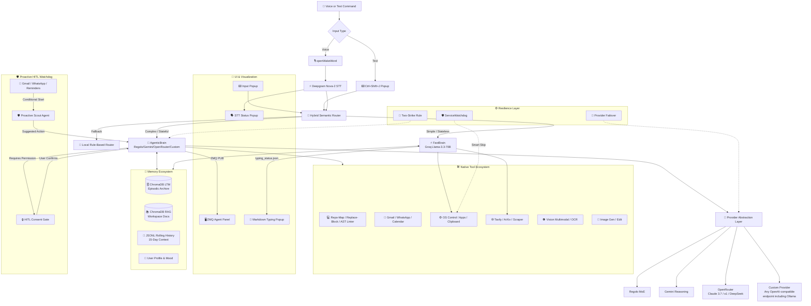

<div align="center">

# 🧠 J.A.R.V.I.S. — The Autonomous AI Agent

> **A Windows-first, voice-enabled, hybrid-intelligence AI Operating System with multi‑LLM failover, zero line‑drift code editing, lifelong memory, proactive HITL safety, and a native reactive UI.**

[](https://www.python.org/)
[](https://nodejs.org/)
[](https://groq.com/)
[](https://deepmind.google/technologies/gemini/)
[](https://regolo.ai)
[](https://openrouter.ai)
[](https://github.com/thekaifansari01/jarvis-by-kaif-ansari)
[](https://ollama.com)
[](LICENSE)
[](https://github.com/thekaifansari01/jarvis-by-kaif-ansari/pulls)

**Built by a 18‑year‑old solo developer. Commerce background. BCA first year. No team. No funding. Just late nights, coffee, and a burning passion to build the impossible.** ☕

</div>

---

## 📖 Table of Contents

<details>
<summary><strong>Expand to navigate</strong></summary>

- [🌟 What Makes JARVIS Special](#-what-makes-jarvis-special)
- [🏗️ System Architecture](#️-system-architecture)
- [⚡ FastBrain vs 🧠 AgenticBrain](#-fastbrain-vs--agenticbrain)
- [🧠 Memory & Long-Term Recall](#-memory--long-term-recall)
- [🎨 UI & Visualization Ecosystem](#-ui--visualization-ecosystem)
- [🛡️ Resilience & Security Architecture](#️-resilience--security-architecture)
- [🛠️ Integrated Tool Ecosystem](#️-integrated-tool-ecosystem)
- [📋 Example Requests](#-example-requests--see-jarvis-in-action)
- [🚀 Advanced Scenarios](#-advanced-scenarios)
- [🚀 Getting Started](#-getting-started)
- [⚙️ Configuration](#️-configuration--enterprise-security)
- [📂 Repository Anatomy](#-repository-anatomy)
- [🔧 Troubleshooting](#-troubleshooting)
- [🤝 Contributing](#-contributing)
- [📄 License](#-license)

</details>

---

## 🌟 What Makes JARVIS Special

JARVIS isn't just another ChatGPT wrapper. It's a **desktop-native AI Operating System** and **Autonomous Agent** that bridges low-latency conversational AI with complex, multi-step engineering execution.

| Icon | Feature | Why It Matters |
|:---:|:---|:---|
| 💻 | **Zero Line-Drift Code Editing** | Uses exact `replace_block` diffs instead of fragile line numbers — eliminates the classic "line-drift bug" that plagues Claude Code and other AI agents. Automatically catches syntax errors via AST linter and self‑corrects without human intervention. |
| 📨 | **Proactive Email + WhatsApp + Calendar Automation** | Background listeners for Gmail, WhatsApp, and Calendar detect important emails, meeting reschedules, and messages in real time. The agent never modifies critical data without explicit user consent — asks before acting. |
| 🔄 | **Multi-LLM Auto-Failover** | Seamlessly switches between Regolo, Gemini, OpenRouter, or any custom OpenAI‑compatible endpoint (including local models like Ollama, LM Studio, vLLM) if the primary provider hits rate limits. Zero downtime — no interruption to your workflow. |
| 🧠 | **Hybrid Semantic Routing** | Cloud Regolo router + local rule‑based fallback — intelligently routes commands to ultra‑fast **FastBrain** (Groq LPU, <1.5 sec) for simple tasks, or deep‑reasoning **AgenticBrain** for complex multi‑step engineering, coding, and research tasks. |
| 📚 | **Lifelong Episodic LTM & RAG** | ChromaDB‑backed persistent memory with daily Groq summarization. Remembers conversations from months ago. Also indexes your local documents (`Documents/Jarvis/RAG/`) for instant semantic search — your personal knowledge base. |
| ⚙️ | **Enterprise-Grade Resilience** | Dedicated **ServiceWatchdog** monitors background processes (STT Popup, Baileys) and auto‑restarts them if they crash — but intelligently skips monitoring for services that are not logged in, logging only once per minute to avoid spam. Multi‑threaded executor ensures parallel task execution without blocking the main loop. |
| 🎨 | **Reactive UI Ecosystem** | ZMQ‑powered floating Agent Panel with real‑time thought/action/observation streaming, live markdown typing popup with async image previews (YouTube thumbnails, link previews, local images), and native STT/Input popups. Glass‑morphism, dynamic glow, auto‑resize. |
| 🗣️ | **Voice‑First Multimodal** | Deepgram speech‑to‑text (Nova‑2) with openWakeWord detection, Edge TTS voice output, multimodal vision (OCR, object detection, image analysis via Gemini/Regolo), and image generation (Flux/AI Horde) — all integrated. |
| 🤖 | **Autonomous Software Engineering** | Can autonomously explore codebases (`repo_map`), read files (`view`), replace exact code blocks (`replace_block` — zero line‑drift), create multiple files (`create_many`), execute Python scripts (`run_python_code`), and run terminal commands (`execute_terminal_command`). Real‑world bug fixing (10 tests, 3 bugs, 0.17 seconds) — proven. |
| 🛡️ | **Human‑in‑the‑Loop (HITL) Safety** | Never executes irreversible actions (sending emails, deleting files, updating calendars) without explicit user consent. Pending confirmations auto‑expire after 60 seconds to prevent stale memory injections. |
| 🛡️ | **Intelligent Command Security** | Uses `shlex` tokenization and `os.path.realpath` canonicalization to auto‑block only system‑destroying commands (`rm -rf /`, `format C:`, `dd` to `/dev/sda`, `diskpart`). Safe commands (`pip`, `git`, `mkdir`, `rm file.txt`) run without prompts — zero friction, enterprise safety. |
| 🌐 | **Any Provider, Anywhere** | Works with Regolo, Gemini, OpenRouter, or any custom OpenAI‑compatible endpoint — including local models (Ollama, LM Studio, vLLM). 100% local inference possible — no internet required with local LLMs. |
| 🧩 | **Extensible Tool Ecosystem** | Integrated with Gmail Pub/Sub, WhatsApp Baileys bridge, Google Calendar OAuth, Tavily search, ArXiv academic research, YouTube transcript summarization, system clipboard, hardware controls (volume/brightness/screenshot), and more. |
| 🔐 | **Conditional Service Startup** | WhatsApp, Email, and Calendar services start **only if credentials exist** — no unwanted browser/QR popups on startup. Proactive listeners and ServiceWatchdog automatically skip unlogged services, keeping the system clean and focused. Manual login commands let you authenticate on demand. |

---

### 🔥 Why This Matters (The Real Story)

| Problem | How JARVIS Solves It |
|---------|----------------------|
| **AI agents hallucinate line numbers** | `replace_block` uses exact SEARCH/REPLACE diffs — **zero line‑drift** |
| **AI forgets past conversations** | ChromaDB LTM + daily Groq summarization — **remembers months of context** |
| **AI can't control your desktop** | Win32 API + AppOpener — **opens apps, changes volume, takes screenshots** |
| **AI can't read your emails** | Gmail Pub/Sub listener — **detects important emails proactively** |
| **AI can't send WhatsApp** | Baileys Node.js bridge — **sends messages, fetches chat history** |
| **AI crashes and stops working** | ServiceWatchdog — **auto‑restarts background processes** |
| **AI is locked to one provider** | Provider abstraction + custom endpoint — **use any model, any provider, anywhere** |
| **AI has no safety** | HITL consent gate — **never modifies critical data without permission** |
| **AI has no UI** | ZMQ‑powered Agent Panel + Typing Popup — **real‑time status, markdown rendering, async images** |
| **AI can't hear or see** | Deepgram STT + Gemini Vision — **voice input, image analysis, OCR** |
| **AI opens unwanted login popups on startup** | Conditional service startup + manual login CLI — **services start only when you're ready** |
| **AI blocks harmless commands unnecessarily** | Intelligent command security — **auto‑blocks only OS‑destroying commands, auto‑approves everything else** |

---

## 🏗️ System Architecture

JARVIS uses a modular, event‑driven architecture that separates fast conversational inference from stateful, multi‑tool agentic engineering:



---

## ⚡ FastBrain vs 🧠 AgenticBrain

JARVIS uses a **Hybrid Semantic Router** (Regolo API + Local Keyword Fallback) to split commands. Here is exactly what each brain handles:

| Feature / Capability | ⚡ FastBrain (Groq LPU) | 🧠 AgenticBrain (Regolo/Gemini/OpenRouter/Custom) |
| :--- | :--- | :--- |
| **Core Philosophy** | Stateless, sub‑second latency, direct OS toggles. | Stateful, deep reasoning, tool‑calling master. |
| **Routing Trigger** | Short commands, casual chat, simple toggles. | 25+ words, file ops, code gen, communication. |
| **System Controls** | Open/Close Apps, URLs, YouTube direct play. | Full system automation via Python scripts & Terminal. |
| **Hardware Toggles** | Volume (Set/Inc/Dec), Brightness, Mute, Screenshot, Lock/Sleep. | *(Same as FastBrain, but part of complex workflows)* |
| **File Operations** | ❌ Cannot modify files. | ✅ Full CRUD, `repo_map`, `replace_block` (Zero Drift), `create_many`. |
| **Communication** | ❌ No email/WhatsApp. | ✅ Send Gmails, WhatsApp messages, Fetch chat history. |
| **Code Execution** | ❌ No Python/Terminal execution. | ✅ `run_python_code` (preferred), `execute_terminal_command`. |
| **Memory Recall** | ❌ No personal LTM memory. | ✅ `memory_actions` (15‑day logs + Lifetime episodic recall). |
| **Multimodal** | ❌ No vision. | ✅ `vision` (Image/Video analysis, OCR, object detection). |
| **Research** | ❌ Simple web search only (`quick_web_search`). | ✅ `deep_research` (420s multi‑source synthesis), ArXiv, YouTube transcripts. |
| **Proactive HITL** | ❌ No. | ✅ Strict Partner Confirmation Mode. Asks consent before permanent changes. |

---

## 🧠 Memory & Long‑Term Recall

JARVIS employs a sophisticated three‑tier memory system to maintain context across sessions:

### 1. 📜 Rolling JSONL History (Short‑Term)
- Stores the last 15 days of conversation in `master_chat_history.jsonl`.
- Append‑only architecture ensures zero data corruption during rapid write operations.
- Automatically prunes messages older than 15 days and archives them to LTM.

### 2. 🗄️ Lifetime Episodic Memory (Long‑Term)
- Every 24 hours, the `LifetimeMemory` engine archives old chats.
- Uses Groq (`GROQ_SUMMARY_MODEL`) to extract dense, third‑person factual summaries (ignoring small talk).
- Embeds summaries using `gemini-embedding-2` (768 dims) and stores them in a **ChromaDB** collection (`jarvis_episodic_memory`).

### 3. 📚 Workspace RAG (Vector Database)
- Indexes files in `Documents/Jarvis/RAG/` (supports `.txt`, `.md`, `.json`, `.py`, `.js`, `.csv`).
- **Smart Chunking:** Code files are split by `def`/`class`; text files by paragraphs.
- **Hash‑Based Re‑indexing:** Only re‑indexes files that have changed (MD5 hash check), saving API costs.
- **Local Keyword Search:** Uses ChromaDB's `$contains` operator for fast, API‑free local searches.

### 4. 👤 User Profile & Mood Tracking
- `user_bio.json`: Hard, unchanging facts about the user.
- `preferences.json`: Actionable preferences (likes, dislikes).
- `user_mood.json`: Mood history with timestamps.
- The AI automatically extracts insights from conversations using Groq summarization.

---

## 🎨 UI & Visualization Ecosystem

JARVIS features a full‑fledged, reactive UI suite built with **PyQt5** and **ZMQ** for real‑time status updates, markdown rendering, and voice/text interactions.

### 1. 🖥️ Agent Panel (`core/ui/agent_panel.py`)
- **Role:** Floating, glass‑morphism status panel that shows the agent's **thought process**, **current action**, and **observation** in real time.
- **Communication:** Subscribes to ZMQ PUB socket (`tcp://127.0.0.1:5555`) – `agent_status.py` publishes `AGENT_UPDATE` messages.
- **Dynamic Glow:** Border glow changes color based on action type (Search = Cyan, Deep Task = Pink, File Ops = Orange, Communication = Green, Vision = Teal, etc.).
- **Auto‑Resize & Animation:** Smoothly adapts width/height to content and slides in/out with easing curves.
- **Smart Truncation:** Limits thought to 800 characters and observation to 200 characters to keep UI clean.
- **Font Fallback:** Automatically switches between English and Devanagari fonts based on text content.

### 2. 📝 Typing Popup (`core/ui/Popup/`)
- **Role:** Floating typewriter‑style popup that streams JARVIS's responses in real time with full markdown rendering.
- **Communication:** Reads `Data/typing_status.json` (written by `typing_status.py`) every 50ms.
- **Async Markdown Rendering:**
  - **Code Blocks:** Syntax‑highlighted using Pygments (Monokai theme) with a macOS‑style header.
  - **Tables, Lists, Blockquotes:** Fully supported with elegant styling.
  - **Images:** Supports local (`file://`) and remote images with async downloading and LRU caching (max 50 entries).
  - **Link Previews:** Automatically fetches rich previews via microlink.io API (`preview://` scheme).
  - **YouTube Previews:** Embeds `maxresdefault.jpg` thumbnails with a custom play button overlay.
- **Auto‑Scroll:** Sticks to the bottom while typing; allows manual scrolling once completed.
- **Smart Auto‑Close:** Closes automatically after a few seconds for short messages (<40 words) to reduce clutter.

### 3. 🗣️ STT Popup (`Bin/SttPopup.exe`)
- **Role:** Small floating indicator that appears when voice input is active (speech‑to‑text listening).
- **Behavior:** `BackgroundServices.start_stt_popup()` spawns it. `stt_status.py` controls visibility (show/hide) based on STT engine state.

### 4. ⌨️ Input Popup (`Bin/InputPopup.exe`)
- **Role:** Triggered by global hotkey `Ctrl+Shift+J` – opens a lightweight text input window for typing commands.
- **Integration:** `HotKeyManager.py` spawns the process, reads stdout for `JARVIS_CMD:::` prefix, and submits the command to `main_command_processor`.

### 5. ⚙️ Core Rendering Engines (`AsyncBrowser.py` & `TextParser.py`)
- **AsyncBrowser:** A custom `QTextBrowser` subclass that handles async image downloads, manages a fail‑safe cache, and generates placeholders for loading/error states.
- **TextParser:** A background `QThread` that parses markdown, syntax‑highlights code, injects link preview tokens, and generates styled HTML – keeping the UI thread snappy.

---

## 🛡️ Resilience & Security Architecture

### 1. 🔄 Multi‑LLM Auto‑Failover (Provider Abstraction)
JARVIS does not rely on a single AI provider. The `BaseLLMProvider` abstract class implements **Regolo**, **Gemini**, **OpenRouter**, and now a **CustomProvider** that works with any OpenAI‑compatible endpoint (including local models).
- **Primary:** Configurable via `AGENT_PRIMARY_PROVIDER`.
- **Fallback:** If quota is exhausted (429 error), it auto‑switches to `AGENT_FALLBACK_PROVIDER` without crashing the agent loop.
- **Provider Support:** 
  - ☁️ **Cloud:** Regolo, Gemini, OpenRouter (Claude 3.7, o1, DeepSeek‑V3, 200+ models)
  - 🖥️ **Local Models:** Ollama, LM Studio, vLLM, LocalAI, or any self‑hosted OpenAI‑compatible endpoint.

### 2. 🛡️ ServiceWatchdog (Background Process Guardian)
A dedicated daemon thread runs in the background, checking the health of critical subprocesses every 5 seconds:
- **Baileys Server** (WhatsApp Bridge)
- **STT Popup** (Voice Status UI)

**Smart Monitoring:**
- If a service is **not logged in** (credentials missing), the watchdog **skips monitoring** entirely and logs only **once per minute** to avoid spam.
- If the service is logged in and crashes, it attempts a restart up to `max_retries=3` with a 15‑second cooldown period.
- This ensures maximum uptime for active services while keeping the system clean and quiet for unauthenticated ones.

### 3. 🔒 Human‑in‑the‑Loop (HITL) Consent Protocol
- **Proactive Trigger Detection:** If the `Proactive Scout` detects an email/WhatsApp asking to reschedule a meeting, the AgenticBrain enters *Partner Confirmation Mode*.
- **Zero Unauthorized Execution:** The agent never executes `calendar_action`, `email_action`, or `file_operations` for critical modifications without the user explicitly saying *"Yes do it"* or *"Go ahead"*.
- **TTL Expiry:** Pending confirmations auto‑expire after 60 seconds to prevent stale memory injections.

### 4. 🔄 Two‑Strike Error Recovery
If a tool or script fails:
- **Strike 1:** Reads stderr/stdout, fixes syntax/logic, and retries once with an improved script.
- **Strike 2:** If it fails a second time, ABANDONS that approach immediately and pivots to an alternative strategy.
- **Pragmatic Completion:** Avoids endless iterations for minor cosmetic perfection. Once the essential data/file is generated correctly, it invokes `complete_task`.

### 5. 🔐 Conditional Service Startup & Manual Login
- **Startup:** WhatsApp, Email, and Calendar services start **only if credentials exist**. No unwanted browser or QR popups appear.
- **Proactive Listeners:** Only start for services that are already logged in, preventing unnecessary background threads.
- **Tool Calls:** When you explicitly ask to send an email or create a calendar event, the authentication flow opens as expected — preserving the interactive experience.
- **Manual Login CLI:** Use `jarvis login --whatsapp/--mail/--calendar` to authenticate on demand (requires Jarvis to be stopped).

### 6. 🛡️ Intelligent Terminal Command Security
JARVIS now features an advanced, zero‑bother security layer for terminal commands. Instead of blocking safe commands like `pip install`, `git clone`, `mkdir`, or even `rm file.txt`, it uses `shlex` tokenization and `os.path.realpath` canonicalization to intelligently detect only system‑destroying commands:
- **Auto‑Blocked (Never Executed):** `rm -rf /`, `rm -rf /*`, `del /s C:\*`, `format C:`, `diskpart`, `dd` to `/dev/sda`, `mkfs`, `fdisk`, `parted`.
- **Auto‑Approved (Run Without Prompts):** `pip`, `git`, `npm`, `mkdir`, `cp`, `mv`, `rm file.txt`, `del mylog.log`, `wget`, `curl`, `>`.
- **How It Works:** Parses the command, extracts the target path, resolves symlinks, and checks if the target is a system core directory (`/`, `C:\Windows`, `/boot`, `/etc`). Only when destructive flags (`-rf`, `/s`, `/q`) are combined with a system root target does it hard‑block execution — protecting your OS without interrupting your workflow.

---

## 🛠️ Integrated Tool Ecosystem

| Category | Supported Capabilities | Tech / API Bridge |
| :--- | :--- | :--- |
| 💻 **Software Engineering** | Project `repo_map`, Exact `replace_block` diffs, Post‑edit syntax linting, Multi‑file batch creation (`create_many`). | Python AST / `py_compile` / `fileEditor.py` |
| 📨 **Communication** | Send/read Gmails, Dispatch WhatsApp messages/files, Fetch WhatsApp chat history, Manage Google Calendar events. | Gmail Pub/Sub, Baileys Node.js Server, Calendar OAuth |
| 📂 **Workspace & RAG** | Single‑file CRUD, Recursive directory scanning, Local markdown RAG indexing with hash‑based change detection. | Python `os`/`pathlib`, ChromaDB Vector Index |
| 🌐 **Search & Research** | Live web scraping, Academic research (ArXiv), YouTube transcript summarization, Multi‑source synthesis reports. | Tavily Search, BeautifulSoup, ArXiv API |
| ⚙️ **System Automation** | Launch/close desktop apps, Hardware volume/brightness, Screenshots, Clipboard CRUD (Read/Write). | Python OS Bindings, Win32 API, Pygame |
| 👁️ **Multimodal Vision** | Image/Video analysis, Object detection, OCR extraction from scanned documents/photos. | Gemini/Regolo Vision models |
| 🎨 **Image Generation** | Text‑to‑image generation, Image‑to‑image editing. | Regolo Qwen‑Image / Together FLUX / AI Horde |

---

## 📋 Example Requests — See Jarvis in Action

### ⚡ FastBrain — Blazing Fast (< 1.5 sec response)

| Feature | Example Command | What Jarvis Does |
| :--- | :--- | :--- |
| **System Automation** | `"Open Chrome, play 'Blinding Lights' on Spotify, and set volume to 70%"` | Opens Chrome, launches Spotify via URI, plays the song, and adjusts system volume — **all in one command.** |
| **Hardware Toggles** | `"Set brightness to 50% and take a screenshot"` | Changes display brightness to 50% and captures a full‑screen screenshot in under 2 seconds. |
| **Smart Web Search** | `"Get today's weather in Mumbai and the latest IPL 2025 final score"` | Performs two parallel web searches and returns a concise, combined summary — **no agentic overhead.** |
| **YouTube Direct** | `"Play 'Arijit Singh latest song' on YouTube"` | Opens YouTube in browser and directly plays the song via `pywhatkit`. |
| **System Control** | `"Lock the system and set an alarm for 5 minutes later"` | Locks PC immediately and schedules a system alarm/reminder. |
| **Media Playback** | `"Play 'Atif Aslam hits' playlist on Spotify"` | Opens Spotify desktop app and starts the playlist via URI protocols. |
| **Quick Info** | `"What is today's date and time?"` | Returns current system date/time with timezone info. |
| **Clipboard** | `"Read the clipboard and write 'Hello World' to it"` | Reads clipboard, then writes text to it — **instant clipboard management.** |
| **Power Actions** | `"Put the PC to sleep"` | Puts system to sleep instantly. |
| **App Management** | `"Open Notepad and Calculator, then close VSCode"` | Launches multiple apps while closing another — **batch app control.** |

---

### 🧠 AgenticBrain — Deep Reasoning, Autonomous Engineering

| Feature | Example Command | What Jarvis Does |
| :--- | :--- | :--- |
| **Multi‑Step Software Engineering** | `"Give me a repo map of my project, install missing dependencies from requirements.txt, and fix the bug in main.py that has been crashing since yesterday"` | 1. Inspects project structure via `repo_map`.<br>2. Reads `requirements.txt` and runs `pip install` for missing packages.<br>3. Analyzes `main.py`, finds the bug, and uses `replace_block` to fix it — **all autonomously.** |
| **Zero Line‑Drift Code Edit** | `"Convert the 'get_user_data' function in app.py to async and add error handling"` | Reads the exact block, replaces it with async version + try‑except — **without touching any other line.** |
| **Self‑Correcting Python** | `"Write a Python function to generate the Fibonacci sequence. If there's a syntax error, fix it."` | Writes the function, catches `py_compile` errors, and **self‑corrects** in the next step. |
| **Deep Research & Synthesis** | `"Research and compare NVIDIA's latest AI chips with AMD's MI400 series, and generate a benchmark report"` | Searches web, reads multiple sources, synthesizes data, and returns a **structured markdown report** with tables and citations. |
| **Academic Research** | `"Search ArXiv for 'transformer attention optimization' papers and summarize the top 2025 papers"` | Searches ArXiv, fetches abstracts, and summarizes key findings — **researcher‑level automation.** |
| **Multimodal Vision** | `"What is in this screenshot? Extract the text from this image."` | Inspects images/videos via Gemini vision, identifies objects, and extracts embedded text (OCR). |
| **YouTube Deep Dive** | `"Summarize this YouTube link and extract 5 key takeaways"` | Fetches transcript, summarizes content, and extracts 5 bullet‑point insights. |
| **Email + Calendar** | `"Send an email to Kaif that the meeting has been moved to 5 PM, and update the calendar accordingly"` | Sends email and updates Google Calendar — **with HITL consent gate.** |
| **WhatsApp Automation** | `"Send a WhatsApp message to Rahul that I'll be 10 minutes late, and fetch yesterday's chat history"` | Sends message and fetches chat history via Baileys — **all in one command.** |
| **Memory Recall** | `"What project did I discuss about AI agents three months ago?"` | Searches ChromaDB LTM, fetches episodic memory, and returns the conversation context. |
| **Codebase Understanding** | `"Explain the architecture of this codebase and generate a dependency graph"` | Scans project, generates `repo_map`, analyzes imports, and creates a visual dependency graph. |
| **Web Scraping & Analysis** | `"Scrape the content of this webpage and perform sentiment analysis"` | Reads the page, extracts key text, and performs sentiment/tonality analysis. |
| **Image Generation** | `"Generate a cyberpunk JARVIS wallpaper with neon purple glow"` | Generates image via Flux/AI Horde and saves it to desktop. |
| **System + File Operations** | `"Create a 'Projects' folder on the desktop, create 5 Python files inside it, and define a class in each file"` | Uses `run_python_code` to batch‑create multiple files with boilerplate classes — **all in 15 seconds.** |
| **Proactive HITL** | *(Jarvis detects email about meeting reschedule)* → `"Bro, Ram's email has arrived that the meeting has been shifted to 5 PM. Should I update the calendar?"` | Enters **Partner Confirmation Mode**, asks for consent, and executes only after user says *"Yes do it"*. |

---

### 🆚 FastBrain vs AgenticBrain — Quick Summary

| Command Type | Route | Typical Time |
| :--- | :--- | :--- |
| System controls, hardware toggles, simple searches | ⚡ **FastBrain** | `< 1.5 sec` |
| File editing, code generation, communication, research | 🧠 **AgenticBrain** | `15‑60 sec` |
| Multi‑step tasks with tool calls | 🧠 **AgenticBrain** | `30‑120 sec` |
| Commands with 25+ words or complex intent | 🧠 **AgenticBrain** | Automatic |

---

## 🚀 Advanced Scenarios

| Scenario | Example Command | Jarvis's Autonomous Action Plan |
| :--- | :--- | :--- |
| **Autonomous Bug Fixing** | `"There is a project in F:/legacy-invoice-app. Run pytest -v, see the failures, then fix 3 bugs — convert tax_rate to float() in calculate_total() in utils.py, handle None in normalize_name(), call self.total() (instead of self.total) in Invoice.summary() in models.py — after each fix, run pytest -v to verify, and when all 10 tests pass, call complete_task."` | 1. Inspects project structure via `repo_map`.<br>2. Runs `pytest -v`, identifies 6 failures.<br>3. Uses `replace_block` to fix the first bug (`tax_rate` → `float(tax_rate)`).<br>4. Runs `pytest -v` → 4 failures.<br>5. Uses `replace_block` to fix the second bug (handle `None` in `normalize_name`).<br>6. Runs `pytest -v` → 2 failures.<br>7. Uses `replace_block` to fix the third bug (`self.total` → `self.total()`).<br>8. Runs `pytest -v` → **10/10 PASS**.<br>9. Calls `complete_task` with a detailed report. |
| **Full‑Stack App with Testing** | `"Create a project named 'TaskFlow' on the Desktop. FastAPI backend with SQLite, React frontend with Tailwind, and 10+ unit tests. Then run pytest and make all tests pass."` | 1. Creates folder structure (`backend/`, `frontend/`, `tests/`).<br>2. Generates `requirements.txt` and `package.json`.<br>3. Writes FastAPI app with CRUD endpoints.<br>4. Writes React frontend with Tailwind components.<br>5. Writes `pytest` tests for all endpoints.<br>6. Runs `npm install` and `pip install`.<br>7. Runs `pytest` — if any fail, uses `replace_block` to fix.<br>8. When all tests pass, calls `complete_task`. |
| **Production Debugging with Profiling** | `"There is a memory leak in main.py. Install memory_profiler, run the profile, identify the bottleneck, fix it, and verify that the leak is fixed."` | 1. Runs `pip install memory_profiler`.<br>2. Runs `mprof run main.py`.<br>3. Generates a graph via `mprof plot`.<br>4. Identifies the leak (e.g., unclosed file handles, large lists).<br>5. Applies the fix using `replace_block`.<br>6. Runs `mprof run main.py` again — verifies memory is stable.<br>7. Calls `complete_task` with a before/after comparison. |
| **Data Analysis Pipeline** | `"Analyze this CSV file. Handle missing values, remove outliers, generate a correlation matrix, and create a plotly visualization. Then generate a summary report."` | 1. Reads the CSV with `pandas`.<br>2. Detects and handles missing values (mean/median imputation).<br>3. Detects and removes outliers (IQR method).<br>4. Generates a correlation matrix.<br>5. Creates interactive heatmap + scatter plots using `plotly`.<br>6. Generates a summary report (mean, median, std, skewness).<br>7. Saves all files to the `output/` folder.<br>8. Calls `complete_task` with the report. |
| **Proactive HITL — Email + Calendar Automation** | *(Jarvis detects email: "Meeting rescheduled to 5 PM")* → `"Bro, Ram's email has arrived that the meeting has been shifted to 5 PM. Should I update the calendar?"` → *User: "Yes do it"* → `"Meeting updated to 5 PM. Sending confirmation email to Ram."` | 1. Proactive listener detects the email.<br>2. Scout agent classifies the email (important, action required).<br>3. Enters **Partner Confirmation Mode** — asks the user.<br>4. User says "Yes do it" → calls `calendar_action`.<br>5. Updates the calendar event (time change).<br>6. Sends a confirmation email to Ram via `email_action`.<br>7. Calls `complete_task` with the success report. |
| **System Setup Automation** | `"Install Python, Node.js, Docker, VS Code extensions, and project dependencies on my new laptop. Then generate a .env file with the template."` | 1. Installs Python, Node.js, Docker via `winget` / `choco`.<br>2. Installs VS Code extensions (Python, JS/TS, Docker).<br>3. Runs `pip install -r requirements.txt`.<br>4. Runs `npm install`.<br>5. Generates `.env` from `.env.example`.<br>6. Verifies all installations (`python --version`, `node --version`).<br>7. Calls `complete_task` with the installation log. |

---

## 🚀 Getting Started

### 1. System Prerequisites

- **OS:** Windows 10/11 (Required for full Win32/Registry protocol features)
- **Python:** `>= 3.10`
- **Node.js:** `>= 18.0` (Required for WhatsApp Baileys background service)
- **Git:** Latest stable release
- **Microphone:** For voice mode
- **Local Assets:**
  - `Data/model/Jarvis.onnx` — Custom openWakeWord model
  - `Bin/InputPopup.exe` and `Bin/SttPopup.exe` — Optional but required for native popups

### 2. Quick Install

```powershell
# Clone the repository
git clone https://github.com/thekaifansari01/jarvis-by-kaif-ansari.git
cd jarvis-by-kaif-ansari

# Create and activate a Python Virtual Environment
python -m venv .venv
.\.venv\Scripts\Activate.ps1

# Install required Python dependencies
python -m pip install --upgrade pip
pip install -r requirements.txt

# Install Node.js dependencies for WhatsApp Service
npm install
npm --prefix tools/Messanger/whatsapp/BaileysServer install
```

### 3. Setup CLI & URI Protocol (One‑Time)

JARVIS includes a smart setup script that configures both the `jarvis://` URL protocol and the global `jarvis` terminal command.

```powershell
# Activate your virtual environment first
.\.venv\Scripts\Activate.ps1

# Run the setup script
python SetupRegistry.py
```

**What this does:**
- ✅ Registers `jarvis://` protocol for OAuth callbacks (Gmail/Calendar)
- ✅ Installs the `jarvis` CLI command via editable pip install
- ✅ Adds `.venv\Scripts` to your Windows PATH
- ✅ Automatically detects if components are already set up and skips duplicates

After running, **open a new terminal** and type:
```powershell
jarvis
```

> 🚀 **Global Command:** After running `SetupRegistry.py`, the `jarvis` command becomes available globally. You can type `jarvis` in any terminal, from any folder, without activating the virtual environment. The script automatically adds `.venv\Scripts` to your Windows PATH. No need to activate the virtual environment each time.

### 4. WhatsApp Bridge Setup

On the first run, scan the QR code displayed by the Baileys process. Keep the local service private; it is intended only for this machine.

- Local service URL: `http://localhost:3000`
- Session data: `Data/SessionCookies/auth_info_baileys/`

> **Tip:** You can also set up WhatsApp manually using the terminal login command (see [Session & Memory Management CLI](#7-session--memory-management-cli)).

### 5. WhatsApp Contacts (Optional)

Create `Data/contacts.json` for named recipients:

```json
{
  "kaif": "919876543210",
  "work": "911234567890"
}
```

### 6. Running JARVIS

#### Full Autonomous Voice & Desktop Mode (Default)
```powershell
python main.py
```
or (if you ran `SetupRegistry.py`):
```powershell
jarvis
```

This starts the agent panel, STT popup (when the binary exists), Baileys bridge (only if WhatsApp is logged in), service watchdog (smart monitoring), RAG engine, proactive listeners (only for logged-in services), global hotkey, and wake‑word listener.

#### Silent Mode (Wake Word Disabled, Trigger via Hotkeys Only)
```powershell
python main.py no_wake
```

This disables only the wake‑word listener. The agent panel, background services, proactive listeners, and `Ctrl + Shift + J` hotkey still start.

#### Development Bootstrap Mode
```powershell
python main.py test_jarvis
```

This mode skips the one‑second startup delay. It does **not** disable STT, Baileys, the agent panel, RAG, or proactive services. Combine it with `no_wake` if you do not want wake‑word listening.

#### Stop JARVIS
- Say `exit`, `quit`, `stop`, or `bye` after voice activation, or
- Press `Ctrl + C` in the terminal running JARVIS.

### 7. Session & Memory Management CLI

JARVIS includes powerful CLI subcommands to manage sessions, memory, and reset the system.

> **⚠️ IMPORTANT:** All logout, memory clear, login, and reset commands require Jarvis to be **OFF** (not running). Stop Jarvis first (`Ctrl + C` or say `exit`) before running these.

| Command | Action |
|---------|--------|
| `jarvis login --whatsapp` | Start WhatsApp QR login (manual scan — opens popup) |
| `jarvis login --mail` | Start Gmail OAuth login (opens browser) |
| `jarvis login --calendar` | Start Google Calendar OAuth login (opens browser) |
| `jarvis login --all` | Login to all services sequentially |
| `jarvis logout --whatsapp` | Logout WhatsApp & clear `chats.db` |
| `jarvis logout --mail` | Logout Gmail session & clear token |
| `jarvis logout --calendar` | Logout Google Calendar session |
| `jarvis logout --mail --calendar` | Logout multiple services at once |
| `jarvis logout --all` | Logout from **ALL** connected services |
| `jarvis memory --clear` | Clear AI contextual memory & chat history (keeps sessions intact) |
| `jarvis reset --hard` | **FACTORY RESET:** Wipe memory AND all sessions |
| `jarvis -h` or `jarvis --help` | Display the complete CLI help menu |

**Examples:**
```powershell
# View help menu
jarvis -h

# Login to WhatsApp only
jarvis login --whatsapp

# Login to Gmail + Calendar together
jarvis login --mail --calendar

# Logout WhatsApp only
jarvis logout --whatsapp

# Clear memory (keep sessions)
jarvis memory --clear

# Factory reset (wipe everything)
jarvis reset --hard
```

> 💡 **After logging in:** Restart Jarvis. The service will now start automatically on every launch, and its proactive listener will begin monitoring.

### 8. Keyboard Shortcuts

- `Ctrl + Shift + J`: Open Floating Text Input & Markdown UI Popup (Runs `InputPopup.exe`).

---

## ⚙️ Configuration & Enterprise Security

Create a `.env` file in your root project directory:

```powershell
Copy-Item .env.example .env
```

### Full Environment Variables & Hidden Configs (`config.py`)

| Variable | Description | Default |
| :--- | :--- | :--- |
| `GROQ_API_KEY` | FastBrain & Summarization API. | (Required) |
| `GEMINI_API_KEY` | Embeddings, Vision, Reasoning. | (Required) |
| `REGOLO_API_KEY` | Agentic Primary Provider. | (Required) |
| `OPENROUTER_API_KEY` | Fallback Agentic Provider. | (Optional) |
| `TAVILY_API_KEY` | Web search tool. | (Required for search) |
| `DEEPGRAM_API_KEY` | Live speech‑to‑text. | (Required for voice) |
| `TOGETHER_AI` | FLUX image‑generation fallback. | (Optional) |
| `AGENT_PRIMARY_PROVIDER` | Choose `regolo`, `gemini`, `openrouter`, or `custom`. | `regolo` |
| `AGENT_FALLBACK_PROVIDER` | Auto‑fallback when primary fails. | `gemini` |
| **🖥️ Custom Provider Variables (Cloud or Local)** | | |
| `CUSTOM_API_KEY` | API key for custom provider (use `EMPTY_KEY` for local models like Ollama). | `EMPTY_KEY` |
| `CUSTOM_BASE_URL` | Base URL of the OpenAI‑compatible endpoint.<br>• **Local Ollama:** `http://localhost:11434/v1`<br>• **LM Studio:** `http://localhost:1234/v1`<br>• **vLLM:** `http://localhost:8000/v1`<br>• **Any self‑hosted:** Your custom URL | `http://localhost:11434/v1` |
| `CUSTOM_MODEL` | Model name to use with the custom provider.<br>• **Ollama example:** `llama3.2:3b`, `mistral:7b`, `deepseek‑coder:6.7b`<br>• **LM Studio:** Model name as shown in UI | `default‑model` |
| `CUSTOM_THINKING_ENABLED` | Enable reasoning content if supported by the model. | `True` |
| **Other** | | |
| `EMBEDDING_DIM` | Dimension for ChromaDB vectors. | `768` |
| `DEEP_RESEARCH_TIMEOUT` | Max seconds for deep research synthesis. | `420` |
| `AGENT_MAX_STEPS` | Max agent loop iterations. | `50` |
| `AGENT_TIMEOUT` | Max seconds for agent loop. | `1800` |
| `AGENT_RETRY_LIMIT` | Retries on tool failure before abort. | `2` |

> **Security Note:** Never commit your `.env` or `Data/SessionCookies/` directory to public version control. They are excluded via `.gitignore` by default.

---

## 📂 Repository Anatomy

```
jarvis-by-kaif-ansari/
├── Bin/                           # Compiled Executables
│   ├── InputPopup.exe             # Text input UI (Hotkey trigger)
│   └── SttPopup.exe               # Voice status floating indicator
├── core/
│   ├── brain/
│   │   ├── Processor/             # Routing & Intelligence
│   │   │   ├── Processor.py       # RegoloSemanticRouter + Local Fallback
│   │   │   ├── FastBrain.py       # Groq LPU integration (Stateless)
│   │   │   ├── AgenticBrain.py    # Agent Loop, 4‑Pillar Contract, Two‑Strike
│   │   │   └── Prompts.py         # System Prompts & Safety Contracts
│   │   ├── Providers/             # Multi‑LLM Abstraction Layer
│   │   │   ├── baseProvider.py    # Abstract Class
│   │   │   ├── regoloProvider.py
│   │   │   ├── geminiProvider.py
│   │   │   ├── openrouterProvider.py
│   │   │   └── customProvider.py  # Any OpenAI‑compatible endpoint (Ollama, LM Studio, etc.)
│   │   ├── Memory/                # Persistence Ecosystem
│   │   │   ├── Memory.py          # JSONL Context, User Bio/Mood, LTM Archiver
│   │   │   ├── LifetimeMemory.py  # ChromaDB Episodic Memory (Daily Summaries)
│   │   │   └── RagEngine.py       # Smart Chunking, Hash‑based RAG Indexing
│   │   ├── executor.py            # Tool Dispatcher (System, File, Comms)
│   │   └── config.py              # Enterprise Configurations
│   ├── main/
│   │   ├── CommandHandler.py      # Main command bus, _is_busy state
│   │   ├── HotKeyManager.py       # Ctrl+Shift+J binding
│   │   ├── BackgroundServices.py  # Spawn/Kill STT, Baileys, Agent Panel (conditional)
│   │   └── ServiceWatchdog.py     # Auto‑Restart daemon with smart monitoring
│   ├── voice/                     # STT, TTS, Wake Word
│   │   ├── stt.py (Deepgram)
│   │   ├── tts.py (Edge TTS)
│   │   └── stt_status.py          # Popup visibility controller
│   ├── ui/                        # PyQt5 UI Suite
│   │   ├── agent_panel.py         # ZMQ‑based floating status panel
│   │   ├── agent_status.py        # ZMQ publisher for agent updates
│   │   ├── typing_status.py       # JSON file writer for typing popup
│   │   └── Popup/                 # Markdown rendering popup
│   │       ├── Popup.py           # Entry point
│   │       ├── PopupUI.py         # Main UI (glass‑morphism, resize, animations)
│   │       ├── AsyncBrowser.py    # Async image loading, cache, preview engine
│   │       └── TextParser.py      # Background markdown parser, syntax highlighter
│   └── utils/
│       ├── utils.py               # resolve_pronouns, helpers
│       └── ProcessManager.py      # Safe subprocess tree spawning/killing
├── tools/
│   ├── Messanger/                 # Gmail Pub/Sub & Baileys WhatsApp
│   │   └── whatsapp/BaileysServer/ (Node.js)
│   ├── SystemTools/               # Win32 OS controls, File Editor
│   │   ├── fileEditor.py          # repo_map, replace_block, create_many
│   │   └── clipboard_tool.py      # OS Clipboard CRUD
│   ├── SearchTools/               # Tavily, ArXiv, DeepResearch
│   ├── Vision/                    # Multimodal image/video handlers
│   └── ImageGeneration/           # Text‑to‑image, image‑to‑image
├── Proactive/                     # HITL Scout & Event Queue
│   ├── proactive_agent.py         # Conditional listener startup
│   ├── Email/                     # Gmail Pub/Sub listener (non‑interactive auth)
│   ├── WhatsApp/                  # WhatsApp alert listener
│   └── Reminders/                 # Calendar reminder listener (non‑interactive auth)
├── Data/                          # Local State (Vectors, Profile, Cookies)
│   ├── jarvis_memory/             # ChromaDB LTM & JSONL history
│   └── SessionCookies/            # Baileys creds, OAuth tokens
├── fonts/                         # UI fonts (English, Devanagari)
├── SetupRegistry.py               # Registers jarvis:// URI protocol + CLI command
├── main.py                        # Primary Entry Point
└── requirements.txt               # Production dependencies
```

---

## 🔧 Troubleshooting

| Problem | Checks and Fix |
| :--- | :--- |
| `ModuleNotFoundError` on startup | Activate `.venv`, run `pip install -r requirements.txt`. |
| `openwakeword` / ONNX error | Confirm `Data/model/Jarvis.onnx` exists. |
| Wake word starts but speech is not transcribed | Set `DEEPGRAM_API_KEY`, allow microphone access in Windows. |
| Gmail/Calendar sign‑in does not finish | Run `python SetupRegistry.py`, check `API_BASE_URL`, retry browser flow. |
| WhatsApp cannot send | Run both `npm install` commands, complete QR login, ensure port 3000 is free. |
| Agent panel/STT/Input popup is absent | Ensure the relevant executable exists in `Bin/`; otherwise build from `core/UiSrc/`. |
| RAG returns no results | Put supported files in `Documents/Jarvis/RAG/`, set `GEMINI_API_KEY`, allow background indexer time. |
| Custom provider not working | Verify `CUSTOM_BASE_URL`, `CUSTOM_MODEL`, and that the endpoint is OpenAI‑compatible. For local models, ensure Ollama/LM Studio is running. Check `Data/jarvis.log` for details. |
| `jarvis` command not recognised | Run `SetupRegistry.py` from the activated virtual environment, then open a **new terminal**. |
| Unwanted browser/QR popup on startup | Log out of the service (`jarvis logout --service`). The system now starts services only when credentials exist. |
| Watchdog logs spam | Already fixed — watchdog now logs unlogged services only once per minute. If you see frequent logs, ensure you are using the latest version. |
| Need diagnostic information | Read `Data/jarvis.log` — console also prints service/tool errors. |

---

## 🤝 Contributing

1. **Fork** the repository.
2. **Create** a feature branch (`git checkout -b feature/AdvancedTooling`).
3. **Commit** your changes with clear, descriptive messages.
4. **Push** to your fork (`git push origin feature/AdvancedTooling`).
5. **Open** a Pull Request for review.

> **Note:** Do not commit `.env`, `Data/SessionCookies/`, generated media, or local memory. They are excluded via `.gitignore`.

---

## 📄 License

This project is released under the **MIT License** — see the [LICENSE](LICENSE) file for complete details.

---

<div align="center">

**Built with ❤️ and pragmatic engineering by Kaif Ansari**

*If this project inspired your own AI architecture, consider leaving a ⭐ on the repository!*

</div>
