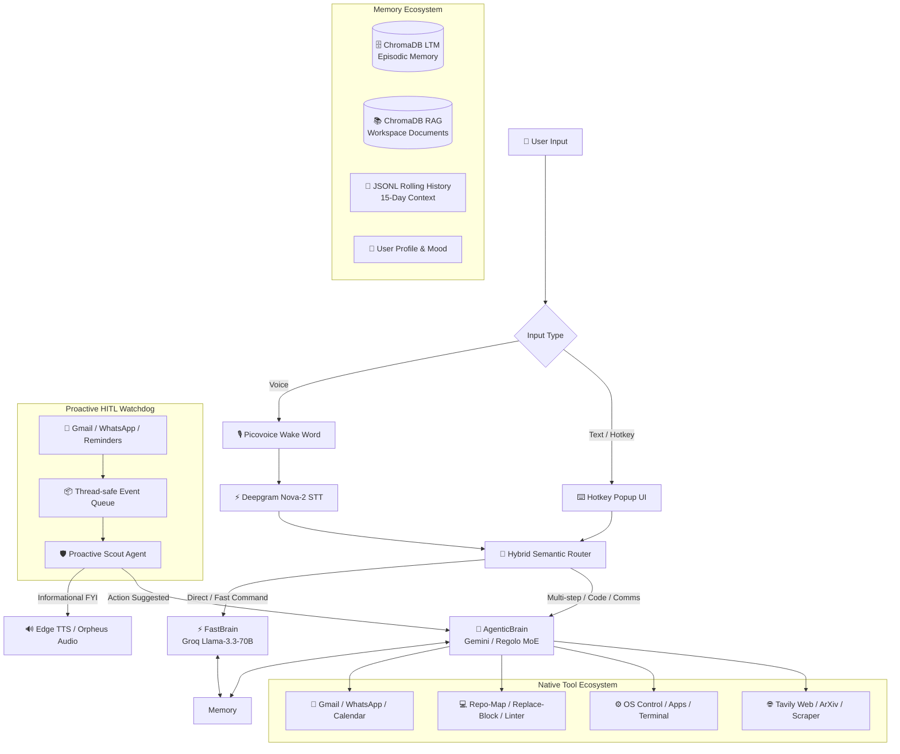

<div align="center">

# 🧠 JARVIS — Autonomous OS Mastermind & AI Software Engineer

**An Elite, Voice-First, Hybrid Intelligence System & Autonomous Coding Agent with Human-in-the-Loop (HITL) Safety & Local Workspace Mastery.**

[](https://github.com/thekaifansari01/jarvis-by-kaif-ansari/blob/main/LICENSE)
[](https://www.python.org/)
[](https://nodejs.org/)
[](https://groq.com/)
[](https://deepmind.google/technologies/gemini/)
[](https://github.com/thekaifansari01/jarvis-by-kaif-ansari/pulls)

[**Key Features**](#-why-jarvis-stands-out) • [**Architecture**](#-system-architecture) • [**Autonomous Coding**](#-level-4-autonomous-software-engineering) • [**Installation**](#-getting-started) • [**Configuration**](#-configuration--security) • [**Tool Ecosystem**](#-integrated-tool-ecosystem)

</div>

---

## 🌟 Executive Summary

**Jarvis** is a cutting-edge, desktop-native AI Operating System and **Autonomous Software Engineer** designed to bridge the gap between low-latency conversational assistance and complex, multi-step engineering execution. Built with an emphasis on **Human-in-the-Loop (HITL) safety**, Jarvis monitors your digital environment proactively while never executing irreversible system actions without explicit user consent.

Unlike conventional chatbots, Jarvis operates directly on your local system — combining **Claude-Code style codebase mapping**, **precision diff-block editing**, **automatic compiler linter self-correction**, **real-time speech recognition**, **vector-backed episodic memory**, and **native OS automation** into a unified, highly extensible mastermind.

---

## ✨ Why Jarvis Stands Out

| Icon | Feature | Description |
|:---:|:---|:---|
| 💻 | **AI Coding Engineer** | Claude-Code style `repo_map` architecture reading, Zero-Drift exact block diffs (`replace_block`), and instant Python linter self-correction. |
| 🛡️ | **Proactive Watchdog** | Background Pub/Sub & event listeners for Gmail, WhatsApp, and Calendar with intelligent spam filtering. |
| 🧠 | **Hybrid Intelligence** | Semantic routing switches between low-latency FastBrain and deep-reasoning AgenticBrain automatically. |
| 🗣️ | **Human-in-the-Loop** | Never modifies critical calendars, files, or emails without voice/text confirmation from the user. |
| 📚 | **Lifelong Episodic LTM** | Vector-backed persistent memory (ChromaDB) that learns user facts, preferences, and technical workflows. |

---

## 🏗️ System Architecture

Jarvis utilizes a modular, event-driven architecture that separates fast conversational inference from stateful, multi-tool agentic engineering:



---

## 💻 Autonomous Software Engineering

Jarvis features a built-in software engineering engine inspired by **Claude Code** and **Devin**, enabling autonomous project scaffolding, bug hunting, and safe code refactoring:

### 1. 📂 Codebase Architecture Mapping (`repo_map`)

* Inspects project structures natively before writing a single line of code.
* Automatically filters out heavy dependency directories (`node_modules`, `.venv`, `__pycache__`) to feed a clean, token-efficient ASCII tree into the LLM context window.

### 2. 🎯 Zero Line-Drift Block Editing (`replace_block`)

* Eliminates the classic "Line Drift Bug" common in naive AI agents by replacing exact multi-line code diff blocks (`<<<<<<< SEARCH ======= >>>>>>>`) instead of fragile line numbers.
* Normalizes Windows (`\r\n`) and POSIX (`\n`) line endings automatically for safe cross-platform matching.

### 3. 🛡️ Instant Linter & Self-Correcting Loop (`_validate_syntax`)

* Embeds an automated post-write linter hook (`py_compile`) that validates syntax instantly upon file creation or modification.
* If a syntax or indentation error occurs, Jarvis catches the compiler traceback and **autonomously self-corrects** the code in the very next step without requiring human intervention.

### 4. ⚡ Multi-File Batching & Anti-Truncation

* Dynamically routes small boilerplate tasks to native `create_many` CRUD tools while leveraging batched Python scripting (`run_python_code`) to build entire modular web applications (`index.html`, `css/`, `js/`) in a single execution step (~15 seconds).

---

## 🧠 Core Intelligence Modules

### 1. 🚦 Hybrid Semantic Router

* **Zero-Latency Routing:** Dynamically inspects user prompts to classify them as either **FAST** (stateless, casual chat, quick OS toggles) or **AGENTIC** (deep reasoning, file editing, API automation).
* **Fallback Rule-Engine:** Built-in heuristics ensure guaranteed routing even during cloud API degradation.

### 2. ⚡ FastBrain (Groq LPU)

* Optimized for sub-second conversational responses using `llama-3.3-70b-versatile`.
* Handles direct desktop controls, playback queries, and factual Q&A without tool overhead.

### 3. 🧠 AgenticBrain (Regolo MoE / Gemini Reasoning)

* Employs a strict **4-Pillar Reasoning Contract** (Fact Audit -> Missing Piece Check -> Safety Audit -> Pragmatic Exit) to prevent infinite loops and hallucinations.
* Equipped with resilient error keyword detection to catch runtime exceptions and trigger immediate AI self-repair.

### 4. 🛡️ Proactive Scout & HITL Security

* **Silent Background Execution:** Evaluates batched background notifications without hijacking active desktop UI or full-screen applications.
* **Consent Gate:** Asks concise confirmation questions before executing permanent changes (e.g., *"Meeting reschedule request received. Should I update your Google Calendar?"*).

---

## 🛠️ Integrated Tool Ecosystem

| Category | Supported Capabilities | Tech / API Bridge |
| --- | --- | --- |
| 💻 **Software Engineering** | Project tree mapping (`repo_map`), exact diff block replacement (`replace_block`), post-edit syntax linting, multi-file batch creation. | Python AST / `py_compile` / `file_operations` |
| 📨 **Communication** | Send/read Gmails, dispatch WhatsApp messages, manage Google Calendar events. | Gmail Pub/Sub, Baileys Node.js Server, Calendar OAuth |
| 📂 **Workspace & RAG** | Single-file CRUD, recursive directory scanning, local markdown RAG indexing. | Python `os`/`pathlib`, ChromaDB Vector Index |
| 🌐 **Search & Research** | Live web scraping, academic research (ArXiv), YouTube transcripts, synthesis reports. | Tavily Search, BeautifulSoup, ArXiv API |
| ⚙️ **System Automation** | Launch/close desktop apps, hardware volume/brightness, screenshots, clipboard CRUD. | Python OS Bindings, Win32 API, Pygame |

---

## 🚀 Getting Started

### 1. System Prerequisites

* **OS:** Windows 10/11 (Recommended for full native Win32/Registry protocol features)
* **Python:** `>= 3.10`
* **Node.js:** `>= 18.0` (Required for WhatsApp Baileys background service)
* **Git:** Latest stable release

### 2. Quick Install

```bash
# Clone the repository
git clone [https://github.com/thekaifansari01/jarvis-by-kaif-ansari.git](https://github.com/thekaifansari01/jarvis-by-kaif-ansari.git)
cd jarvis-by-kaif-ansari

# Create and activate a Python Virtual Environment
python -m venv venv
venv\Scripts\activate     # Windows
# source venv/bin/activate  # Linux / macOS

# Install required Python dependencies
pip install -r requirements.txt

# Install Node.js dependencies for WhatsApp Service
cd tools/Messanger/whatsapp/BaileysServer
npm install
cd ../../..

```

### 3. Register Desktop URI Protocol

To enable seamless OAuth web-authentication for Gmail and Google Calendar (`jarvis://` callback), run:

```bash
python SetupRegistry.py

```

---

## ⚙️ Configuration & Security

Create a `.env` file in your root project directory by copying the provided example template:

```bash
cp .env.example .env

```

### Full Environment Variables Example (`.env.example`)

```env
# ============================================
# API KEYS - Add your keys below
# ============================================
USER_NAME=
GROQ_API_KEY=
TOGETHER_AI=
TAVILY_API_KEY=
GEMINI_API_KEY=
DEEPGRAM_API_KEY=
REGOLO_API_KEY=

# ============================================
# API ENDPOINTS & MODELS
# ============================================
API_BASE_URL=[https://jarvis-oauth-server.vercel.app](https://jarvis-oauth-server.vercel.app)
REGOLO_BASE_URL=[https://api.regolo.ai/v1](https://api.regolo.ai/v1)
REGOLO_MODEL=gemma4-31b

# ============================================
# AGENT CONFIGURATION
# ============================================
AGENT_PRIMARY_PROVIDER=regolo
AGENT_FALLBACK_PROVIDER=gemini
REGOLO_THINKING_ENABLED=True

```

> **Security Note:** Never commit your `.env` or `Data/SessionCookies/` directory to public version control. They are excluded via `.gitignore` by default.

---

## 🎮 Execution Modes

Jarvis can be launched in multiple operational configurations depending on your workflow:

```bash
# 1. Full Autonomous Voice & Desktop Mode (Default)
python main.py

# 2. Terminal Text-Only Testing Mode (No Microphone Required)
python main.py test_jarvis

# 3. Silent Mode (Wake Word Disabled, Trigger via Hotkeys Only)
python main.py no_wake

```

### Keyboard Shortcuts

* `Ctrl + Shift + J`: Open Floating Text Input & Markdown UI Popup.

---

## 📁 Repository Anatomy

```
jarvis-by-kaif-ansari/
├── core/
│   ├── brain/              # Neural engines (FastBrain, AgenticBrain, Smart Router)
│   ├── voice/              # Deepgram STT, Picovoice Wake Word, Edge TTS engines
│   ├── ui/                 # ZMQ-powered floating PyQt5 UI widgets & status panels
│   └── logger/             # Thread-safe colored terminal loggers (Rich)
├── tools/
│   ├── Messanger/          # Gmail Pub/Sub & Baileys WhatsApp bridges
│   ├── SystemTools/        # Win32 OS controls, hardware toggles, clipboard, & File Editor
│   ├── SearchTools/        # Tavily deep research, ArXiv, and web scrapers
│   └── workspace/          # Local filesystem RAG and file CRUD executor
├── Proactive/
│   ├── proactive_agent.py  # Background Scout logic & HITL consent manager
│   └── event_queue.py      # Thread-safe time-window event batching queue
├── Data/                   # Local state (ChromaDB vectors, user profile, cookies)
├── main.py                 # Primary entry point & service supervisor
└── requirements.txt        # Verified Python production dependencies

```

---

## 🛣️ Roadmap & Future Scope

* [x] **Phase 1:** Real-time Voice Wake Word & Hybrid Semantic Routing.
* [x] **Phase 2:** ChromaDB Episodic Memory & Local Workspace RAG Engine.
* [x] **Phase 3:** Proactive HITL Watchdog for Gmail, WhatsApp, and Calendar.
* [x] **Phase 4:** Level 4 Autonomous Software Engineering (AST Repo-Map, Zero-Drift Diffs, Auto-Linter).
* [ ] **Phase 5:** Dockerized Sandbox Execution for running untrusted code safely.
* [ ] **Phase 6:** Full Multi-platform macOS & Linux native system accessibility.

---

## 🤝 Contributing

We welcome contributions from developers, researchers, and AI enthusiasts!

1. **Fork** the repository.
2. **Create** a feature branch (`git checkout -b feature/AdvancedTooling`).
3. **Commit** your changes with clear, descriptive messages.
4. **Push** to your fork (`git push origin feature/AdvancedTooling`).
5. **Open** a Pull Request for review.

---

## 📄 License & Attribution

This project is open-source and licensed under the **MIT License** — see the [LICENSE](LICENSE) file for complete details.

**Built with ❤️ and pragmatic engineering by Kaif Ansari**

*If this project inspired your own AI architecture, consider leaving a ⭐ on the repository!*