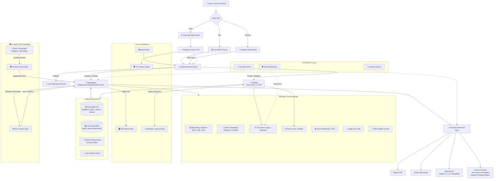

# 🧠 J.A.R.V.I.S. – The Autonomous AI Agent for Windows

> *"We call it an AI Operating System because it controls your PC, Phone, Files, and Memory — not just your code."*

> **Zero line‑drift coding · Lifelong memory · Voice‑first · Proactive HITL · Mobile control · Telegram Remote · Hybrid RAG · Weighted Graph Decay**

[](https://www.python.org/)
[](https://nodejs.org/)
[](https://groq.com/)
[](https://deepmind.google/technologies/gemini/)
[](https://regolo.ai)
[](https://openrouter.ai)
[](https://github.com/thekaifansari01/Jarvis-OS-Agent)
[](https://ollama.com)
[](https://whatsapp.com)
[](https://telegram.org)
[](https://mail.google.com)
[](https://calendar.google.com)

[](LICENSE)
[](https://github.com/thekaifansari01/Jarvis-OS-Agent/pulls)

**Built by an 18‑year‑old solo developer. Commerce background. BCA first year. No team. No funding. Just late nights, coffee, and a burning passion to build the impossible.** ☕

---

## 📌 Table of Contents
- [🎯 The Hook – What Makes JARVIS Special](#-the-hook--what-makes-jarvis-special)
- [🔥 Problem vs Solution – The "Claude Code Killer"](#-problem-vs-solution--the-claude-code-killer)
- [🏗️ Technical Architecture (Trust Through Transparency)](#️-technical-architecture-trust-through-transparency)
- [⚡ FastBrain vs 🧠 AgenticBrain – Dual‑Engine Magic](#-fastbrain-vs--agenticbrain--dualengine-magic)
- [🧠 Memory & Long‑Term Recall](#-memory--longterm-recall)
- [📱 Mobile Phone Control (Android)](#-mobile-phone-control-android)
- [🛠️ Integrated Tool Ecosystem](#️-integrated-tool-ecosystem)
- [🚀 Getting Started (Zero Friction)](#-getting-started-zero-friction)
- [📋 Real‑World Use Cases (Scenarios)](#-realworld-use-cases-scenarios)
- [⚙️ CLI & Configuration](#️-cli--configuration)
- [🔧 Troubleshooting](#-troubleshooting)
- [🤝 Contributing & Community](#-contributing--community)
- [📄 License](#-license)

---

## 🎯 The Hook – What Makes JARVIS Special

**JARVIS is not a ChatGPT wrapper.** It is a **desktop‑native AI Operating System** and **Autonomous Agent** that bridges low‑latency conversational AI with complex, multi‑step engineering execution.

| Icon | Feature | Why It Matters |
|:---:|:---|:---|
| 💻 | **Zero Line‑Drift Code Editing** | Uses exact `replace_block` diffs instead of fragile line numbers — eliminates the classic "line‑drift bug" that plagues Claude Code and other AI agents. Automatically catches syntax errors via AST linter and self‑corrects without human intervention. |
| 📨 | **Proactive Email + WhatsApp + Telegram + Calendar Automation** | Background listeners for Gmail, WhatsApp, Telegram, and Calendar detect important messages, emails, and reschedules in real time. The agent never modifies critical data without explicit user consent — asks before acting. |
| 🌍 | **Telegram Remote Control** | Control your PC from anywhere in the world via a dedicated Telegram bot. Commands trigger silent background execution without disrupting your active desktop workflow. Securely authenticated via CLI. |
| 📱 | **Mobile Phone Control (Android)** | Control your Android phone remotely via ADB over Tailscale — lock/unlock, open apps, make calls, send SMS, toggle WiFi/Data, take screenshots, adjust volume, and more. Automatically connects on startup and reconnects if the connection drops. |
| 🔄 | **Multi‑LLM Auto‑Failover** | Seamlessly switches between Regolo, Gemini, OpenRouter, or any custom OpenAI‑compatible endpoint (including local models like Ollama, LM Studio, vLLM) if the primary provider hits rate limits. Zero downtime — no interruption to your workflow. |
| 🧠 | **Hybrid Semantic Routing** | Cloud Regolo router + local rule‑based fallback — intelligently routes commands to ultra‑fast **FastBrain** (Groq LPU, <1.5 sec) for simple tasks, or deep‑reasoning **AgenticBrain** for complex multi‑step engineering, coding, and research tasks. |
| 📚 | **Lifelong Episodic LTM & Hybrid RAG** | ChromaDB‑backed persistent memory with daily Groq summarization. Remembers conversations from months ago. Also indexes your local documents (`Documents/Jarvis/RAG/`) with **smart chunk overlap (1500 chars, 200 overlap)**, **Hybrid search (Vector + BM25 + RRF)** and **Recency boost** — your personal knowledge base that understands both semantics and exact keywords. |
| ⚙️ | **Enterprise‑Grade Resilience** | Dedicated **ServiceWatchdog** monitors background processes (STT Popup, Baileys, Mobile ADB, Telegram Remote) and auto‑restarts them if they crash — but intelligently skips monitoring for services that are not logged in, logging only once per minute to avoid spam. Multi‑threaded executor ensures parallel task execution without blocking the main loop. |
| 🎨 | **Reactive UI Ecosystem** | ZMQ‑powered floating Agent Panel with real‑time thought/action/observation streaming, live markdown typing popup with async image previews (YouTube thumbnails, link previews, local images), and native STT/Input popups. Glass‑morphism, dynamic glow, auto‑resize. |
| 🗣️ | **Voice‑First Multimodal** | Deepgram speech‑to‑text (Nova‑2) with **Vosk KWS (Keyword Spotting)** wake word detection for sub‑second noise‑immune triggering on older hardware, Edge TTS voice output, multimodal vision (OCR, object detection, image analysis via Gemini/Regolo), and image generation (Flux/AI Horde) — all integrated. |
| 🤖 | **Autonomous Software Engineering** | Can autonomously explore codebases (`repo_map`), read files (`view`), replace exact code blocks (`replace_block` — zero line‑drift), create multiple files (`create_many`), execute Python scripts (`run_python_code`), and run terminal commands (`execute_terminal_command`). Real‑world bug fixing (10 tests, 3 bugs, 0.17 seconds) — proven. |
| 🛡️ | **Human‑in‑the‑Loop (HITL) Safety** | Never executes irreversible actions (sending emails, deleting files, updating calendars) without explicit user consent. Pending confirmations auto‑expire after 60 seconds to prevent stale memory injections. |
| 🛡️ | **Intelligent Command Security** | Uses `shlex` tokenization and `os.path.realpath` canonicalization to auto‑block only system‑destroying commands (`rm -rf /`, `format C:`, `dd` to `/dev/sda`, `diskpart`). Safe commands (`pip`, `git`, `mkdir`, `rm file.txt`) run without prompts — zero friction, enterprise safety. |
| 🌐 | **Any Provider, Anywhere** | Works with Regolo, Gemini, OpenRouter, or any custom OpenAI‑compatible endpoint — including local models (Ollama, LM Studio, vLLM). 100% local inference possible — no internet required with local LLMs. |
| 🔐 | **Conditional Service Startup** | WhatsApp, Telegram, Email, Calendar, and **Mobile ADB** services start **only if credentials exist** — no unwanted browser/QR popups on startup. Proactive listeners and ServiceWatchdog automatically skip unlogged services, keeping the system clean and focused. Manual login commands let you authenticate on demand. |

---

## 🔥 Problem vs Solution – The "Claude Code Killer"

| **Existing Tools / Pain Points** | **JARVIS Magic** |
| :--- | :--- |
| **Claude Code is expensive** & requires constant subscriptions. | **Free & Open Source.** Run it with local models (Ollama/LM Studio) or cloud APIs. |
| **Line‑drift bugs** ruin code edits. LLMs often "miss" the exact line. | **`replace_block`** – Diff‑based exact matching. **Zero line‑drift.** Finds the exact code block, irrespective of line numbers. |
| **Session‑based memory** – Forgets what you said within 2 minutes. | **Lifelong Memory (LTM)** – Episodic memory via ChromaDB with weighted edges, temporal decay, and entity aliases. Remembers your coffee preference and which files you are working on. |
| **No tooling for real systems.** Only generates text, does not execute code. | **Native Tool Execution** – Terminal, Python REPL, File CRUD, Email, WhatsApp, Telegram, Calendar, Image Gen, and **ADB (Android control)**. |
| **No remote execution capabilities.** | **Telegram Remote Bot** – Issue commands to your PC remotely via Telegram; Jarvis executes them silently in the background. |
| **Doesn't read your emails/chats.** | **Proactive HITL (Human-in-the-Loop)** – Jarvis reads your emails, WhatsApp & Telegram in the background, *asks permission*, and takes action (e.g., rescheduling calendar events). |
| **RAG is either semantic or keyword, never both.** | **Hybrid RAG** – BM25 keyword search + Vector semantic search merged with **Reciprocal Rank Fusion (RRF)**. Plus **chunk overlap** and **recency boost** for maximum accuracy. |

---

## 🏗️ Technical Architecture (Trust Through Transparency)



---

## ⚡ FastBrain vs 🧠 AgenticBrain – Dual‑Engine Magic

| Feature / Capability | ⚡ FastBrain (Groq LPU) | 🧠 AgenticBrain (Regolo/Gemini/OpenRouter/Custom) |
| --- | --- | --- |
| **Core Philosophy** | Stateless, sub‑second latency, direct OS toggles. | Stateful, deep reasoning, tool‑calling master. |
| **Routing Trigger** | Short commands, casual chat, simple toggles. | 25+ words, file ops, code gen, communication. |
| **System Controls** | Open/Close Apps, URLs, YouTube direct play. | Full system automation via Python scripts & Terminal. |
| **Hardware Toggles** | Volume (Set/Inc/Dec), Brightness, Mute, Screenshot, Lock/Sleep. | *(Same as FastBrain, but part of complex workflows)* |
| **File Operations** | ❌ Cannot modify files. | ✅ Full CRUD, `repo_map`, `replace_block` (Zero Drift), `create_many`. |
| **Communication** | ❌ No email/WhatsApp/Telegram. | ✅ Send Gmails, WhatsApp & Telegram messages, Fetch chat history. |
| **Code Execution** | ❌ No Python/Terminal execution. | ✅ `run_python_code` (preferred), `execute_terminal_command`. |
| **Memory Recall** | ❌ No LTM; only recent history. | ✅ `memory_actions` (15‑day logs + Lifetime weighted graph recall with alias expansion & recency decay). |
| **Multimodal** | ❌ No vision. | ✅ `vision` (Image/Video analysis, OCR, object detection). |
| **Research** | ❌ Simple web search only (`quick_web_search`). | ✅ `deep_research` (420s multi‑source synthesis), ArXiv, YouTube transcripts. |
| **Mobile Control** | ❌ No. | ✅ ADB over Tailscale – lock/unlock, apps, calls, SMS, screenshots, WiFi/Data, etc. |
| **Proactive HITL** | ❌ No. | ✅ Strict Partner Confirmation Mode. Asks consent before permanent changes. |

---

## 🧠 Memory & Long‑Term Recall

JARVIS employs a sophisticated **four‑tier** memory system that combines short‑term context, weighted lifelong graph, hybrid RAG, and user profiling:

1. **📜 Rolling JSONL History (Short‑Term)** – 15‑day rolling context, auto‑pruned and archived into the graph.
2. **🗄️ Weighted Lifetime Episodic Graph (Long‑Term)** – 
   - Built on NetworkX with **weighted edges** (frequency of mention) and **temporal decay** (relations older than 6 months lose half their weight).
   - **Entity aliases** – automatically maps synonyms (e.g., "car" → "BMW") via a `aliases.json` file that can be manually extended.
   - **Search** returns results sorted by relevance (weight × decay), ensuring the most frequent and recent facts surface first.
3. **📚 Hybrid RAG (Workspace Documents)** –
   - **Smart chunking** with overlap (1500 chars, 200 overlap) to preserve context across chunk boundaries.
   - **Hybrid retrieval** – combines **BM25 keyword search** and **Gemini embedding vector search**, merged via **Reciprocal Rank Fusion (RRF)** for the best of both worlds.
   - **Recency boost** – files modified recently get a 20% score lift, making the knowledge base self‑updating.
4. **👤 User Profile & Mood** – Automatically tracks mood, though bio/preferences are no longer auto‑extracted; instead, the system now **only** extracts knowledge‑graph triplets from conversations, leaving personal facts to be entered explicitly or through the graph.

This layered design ensures Jarvis never forgets critical context, yet remains efficient and cost‑effective.

---

## 📱 Mobile Phone Control (Android)

JARVIS can control your Android phone via ADB over Tailscale:

| Category | Example Commands |
| --- | --- |
| **System Actions** | Lock/Unlock, Home, Back, Recent Apps |
| **Volume & Media** | Volume Up/Down, Mute, Flashlight Toggle |
| **App Launcher** | WhatsApp, Chrome, YouTube, Spotify, Camera, Settings |
| **Calls & SMS** | Make a call (direct), Open dialer, Send SMS |
| **Screenshots** | Take screenshot and save to PC |
| **WiFi & Data** | Enable/Disable WiFi, Enable/Disable Mobile Data |
| **Notifications** | Expand notification panel, Quick Settings |
| **Battery** | Check battery level, charging status |
| **File Transfer** | Pull files from phone to PC, Push files from PC to phone |

**Setup:** Enable USB debugging, run `adb tcpip 5555`, connect via Tailscale IP, and set `ADB_PHONE_IP` in `.env`.

---

## 🛠️ Integrated Tool Ecosystem

| Category | Supported Capabilities |
| --- | --- |
| 💻 **Software Engineering** | `repo_map`, `replace_block` (zero drift), AST linting, `create_many` |
| 📨 **Communication** | Gmail Pub/Sub (send/read), WhatsApp & Telegram (send/fetch chats), Calendar OAuth |
| 📂 **Workspace & RAG** | Single‑file CRUD, recursive scanning, hybrid RAG (BM25+Vector+RRF) with overlap & recency |
| 📱 **Mobile Control** | ADB – lock/unlock, apps, calls, SMS, screenshots, WiFi/Data, file transfer |
| 🌍 **Remote Control** | Telegram Bot integration to execute PC commands remotely and silently. |
| 🌐 **Search & Research** | Tavily web search, ArXiv academic search, YouTube transcript summarization, deep research reports |
| ⚙️ **System Automation** | Launch/close apps, volume/brightness, screenshots, clipboard CRUD |
| 👁️ **Multimodal Vision** | Image/Video analysis, object detection, OCR extraction |
| 🎨 **Image Generation** | Text‑to‑image (Regolo/FLUX), image‑to‑image editing (AI Horde) |

---

## 🚀 Getting Started (Zero Friction)

### 📋 Prerequisites

* **Windows 10/11** (Primary)
* **Python 3.10+**
* **Node.js 18+**

### 🛠️ Single Block Installation

Copy and paste this entire block into your terminal (PowerShell recommended):

```powershell
# 1. Clone and Enter
git clone https://github.com/thekaifansari01/Jarvis-OS-Agent.git
cd Jarvis-OS-Agent

# 2. Python Virtual Env & Dependencies
python -m venv .venv
.\.venv\Scripts\Activate.ps1
python -m pip install --upgrade pip
pip install -r requirements.txt

# 3. Node.js Dependencies (for WhatsApp Bridge)
cd tools/Messanger/whatsapp/BaileysServer
npm install
cd ../../../..

# 4. Global CLI Setup (Run this once from the root project directory)
python SetupRegistry.py
```

> ⚠️ **Ensure you are in the root project directory** (`Jarvis-OS-Agent/`) before running `python SetupRegistry.py`.

### 🌐 Global Command Magic

After running `SetupRegistry.py`, open a **new terminal** and simply type:

```bash
jarvis
```

No need to activate the virtual environment every time – the `jarvis` command is available system‑wide.

### 📝 Configure Environment

Copy `.env.example` to `.env` and fill in your API keys. For local models (Ollama), set:

```ini
CUSTOM_API_KEY=EMPTY_KEY
CUSTOM_BASE_URL=http://localhost:11434/v1
CUSTOM_MODEL=llama3.2:3b
```

---

## 📋 Real‑World Use Cases (Scenarios)

### 🐞 Scenario 1: Bug Fixing (The "Zero Line‑Drift" Power)

1. **User:** *"Run the tests in my project and fix any failing ones."*
2. **Jarvis (AgenticBrain):** Runs `pytest -v`, sees 3 failing tests.
3. **Jarvis:** Uses `view` to read the failing files.
4. **Jarvis:** Uses `replace_block` (exact search & replace) to fix logic errors.
5. **Jarvis:** Re‑runs `pytest -v` to verify.
6. **Jarvis (Speaks):** *"Sir, all tests have passed. I have made changes to 3 files. Would you like to review them?"*

### 🚨 Scenario 2: Proactive HITL (Your Personal Secretary)

1. **Background:** `EmailProactive` listener sees an email: *"Meeting shifted to 5 PM."*
2. **Jarvis (Scout):** Evaluates and decides to ask for consent.
3. **Jarvis (Speaks):** *"[alert] Brother, there's an email from Ram saying the meeting has been moved to 5 PM. Should I update the calendar?"*
4. **User:** *"Yes, do it."*
5. **Jarvis:** Triggers AgenticBrain → `calendar_action` to update the event.
6. **Jarvis:** *"Done sir, the calendar has been updated."*

### 📱 Scenario 3: Mobile & PC Unification (ADB Control)

1. **User:** *"Lock my phone."*
2. **Jarvis:** Executes `adb shell input keyevent 26`.
3. **Jarvis:** *"Phone locked, sir."*
4. **User:** *"Tell me today's OTP."*
5. **Jarvis:** Reads the latest SMS via ADB content provider and speaks the OTP.

### 🌍 Scenario 4: Remote Telegram Control

1. **User (on phone away from PC):** Messages the Telegram Bot: *"Open Spotify and play my playlist."*
2. **Jarvis (Background Service):** Receives the command securely via the Telegram Bot API.
3. **Jarvis (AgenticBrain):** Activates in a silent execution mode (no UI popups). Opens Spotify and plays the music.
4. **Jarvis (Telegram Bot):** Replies: *"Executing: Open Spotify and play my playlist."*

### 🧪 Scenario 5: Full‑Stack App Generation

**User:** *"Create a project named 'TaskFlow' on the Desktop. FastAPI backend with SQLite, React frontend with Tailwind, and 10+ unit tests. Then run pytest and make all tests pass."*

**Jarvis:**

1. Creates folder structure.
2. Generates `requirements.txt` and `package.json`.
3. Writes FastAPI CRUD endpoints.
4. Writes React frontend with Tailwind.
5. Writes `pytest` tests.
6. Runs `npm install` and `pip install`.
7. Runs `pytest` – if any fail, uses `replace_block` to fix.
8. When all tests pass, calls `complete_task`.

### 🧠 Scenario 6: Weighted Graph Memory & Aliases

1. **Day 1:** User: *"Mujhe BMW pasand hai."* → Graph stores `[User] --(LIKES)--> [BMW]` weight=1.
2. **Day 60:** User: *"Meri car ka colour kya hai?"* → `car` alias maps to `BMW`, search returns `[User] --(LIKES)--> [BMW]`.
3. **Day 100:** User: *"Mujhe BMW bahut pasand hai"* → weight becomes 2.
4. **Day 400:** User: *"Mujhe kya pasand hai?"* → `BMW` weight=2, `last_seen`=Day100, decay factor 0.5 → adjusted weight 1.0; any newer fact (if any) will rank higher. Result sorted by relevance.

---

## ⚙️ CLI & Configuration

### Session & Memory Management CLI

> **⚠️ Important:** All logout, memory clear, login, bot, and reset commands require Jarvis to be **OFF** (not running).

| Command | Action |
| --- | --- |
| `jarvis login --whatsapp` | Start WhatsApp QR login |
| `jarvis login --telegram` | Start Telegram login (Phone + OTP) |
| `jarvis login --mail` | Start Gmail OAuth login |
| `jarvis login --calendar` | Start Google Calendar OAuth |
| `jarvis login --all` | Login to all services |
| `jarvis logout --whatsapp` | Logout WhatsApp & clear session |
| `jarvis logout --telegram` | Logout Telegram & clear session |
| `jarvis logout --mail` | Logout Gmail |
| `jarvis logout --calendar` | Logout Calendar |
| `jarvis logout --all` | Logout from **ALL** services |
| `jarvis bot --activate` | Setup and activate Remote Telegram Bot using your BotFather token |
| `jarvis bot --deactivate` | Revoke token and stop remote bot |
| `jarvis bot --status` | Check if remote bot is active |
| `jarvis memory --clear` | Clear AI contextual memory (keep sessions) |
| `jarvis reset --hard` | **FACTORY RESET** – wipe memory AND all sessions |
| `jarvis --help` | Display help menu |

### Environment Variables (`.env`)

| Variable | Description | Default |
| --- | --- | --- |
| `GROQ_API_KEY` | FastBrain & Summarization | (Required) |
| `GEMINI_API_KEY` | Embeddings, Vision, Reasoning | (Required) |
| `REGOLO_API_KEY` | Agentic Primary Provider | (Required) |
| `OPENROUTER_API_KEY` | Fallback Agentic Provider | (Optional) |
| `TAVILY_API_KEY` | Web search tool | (Required) |
| `DEEPGRAM_API_KEY` | Live speech‑to‑text | (Required) |
| `ADB_PHONE_IP` | Tailscale IP of Android phone | (Optional) |
| `TELEGRAM_API_ID` | Telegram App API ID | (Optional) |
| `TELEGRAM_API_HASH` | Telegram App API Hash | (Optional) |
| `CUSTOM_BASE_URL` | Local/cloud OpenAI‑compatible endpoint | `http://localhost:11434/v1` |
| `CUSTOM_MODEL` | Model name for custom provider | `default‑model` |

---

## 🔧 Troubleshooting

| Problem | Solution |
| --- | --- |
| `ModuleNotFoundError` | Activate `.venv` and `pip install -r requirements.txt`. |
| Vosk model missing | Run `jarvis` once to auto‑download, or manually place in `Data/model/vosk-model-small/`. |
| WhatsApp fails | Ensure Node.js 18+, run `npm install` in BaileysServer, complete QR login, port 3000 free. |
| Telegram App fails | Ensure `TELEGRAM_API_ID` and `TELEGRAM_API_HASH` are set in `.env` and you ran `jarvis login --telegram`. |
| Remote Telegram Bot not responding | Ensure you activated it via `jarvis bot --activate` with a valid BotFather token and restarted Jarvis. |
| `jarvis` command not recognized | Run `python SetupRegistry.py` from activated venv and from the **root project directory**, then open a **new terminal**. |
| Unwanted browser/QR popup | Logout of the service (`jarvis logout --service`). Services start only when credentials exist. |
| Mobile ADB fails | Check `ADB_PHONE_IP` in `.env`, ensure Tailscale is running, run `adb devices` manually. |
| Custom provider not working | Verify `CUSTOM_BASE_URL`, `CUSTOM_MODEL`, and that the endpoint is OpenAI‑compatible. |
| Graph memory seems stale | Delete `Data/jarvis_memory/lifetime_graph.json` and restart – weights and aliases will rebuild. |
| RAG results inaccurate | Delete `Data/jarvis_memory/rag_chroma_db` and restart – re‑index with new chunking & hybrid search. |

---

## 🤝 Contributing & Community

We welcome contributions! Whether it's a bug fix, new provider, or documentation:

1. Fork the repository.
2. Create a feature branch (`git checkout -b feature/AmazingFeature`).
3. Commit your changes (`git commit -m 'Add some AmazingFeature'`).
4. Push to the branch (`git push origin feature/AmazingFeature`).
5. Open a Pull Request.

---

## 📄 License

Distributed under the MIT License. See `LICENSE` for more information.

---

## 🌟 Show Your Support

If this project made you smile, saved you time, or inspired you:

* ⭐ **Star** this repository.
* 🐦 Tweet about it tagging [@thekaifansari01](https://twitter.com/thekaifansari01).
* ☕ Buy me a coffee (coming soon) – because late nights are expensive.