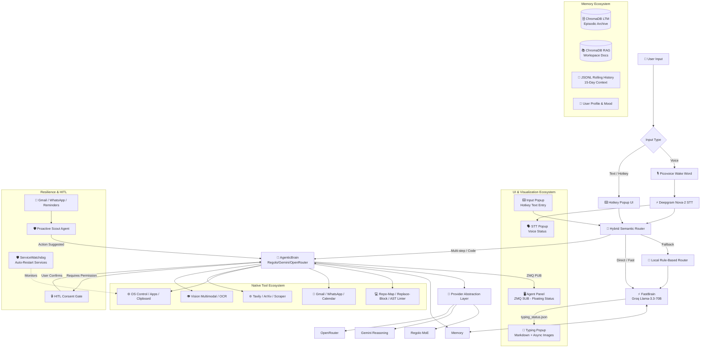

<div align="center">

# 🧠 JARVIS — The Autonomous OS Mastermind & AI Software Engineer

**An Elite, Voice-First, Hybrid Intelligence System & Autonomous Coding Agent with Human-in-the-Loop (HITL) Safety, Multi-LLM Failover, Zero Line-Drift Workspace Mastery, & a Full-Featured Reactive UI Ecosystem.**

[](https://github.com/thekaifansari01/jarvis-by-kaif-ansari/blob/main/LICENSE)
[](https://www.python.org/)
[](https://nodejs.org/)
[](https://groq.com/)
[](https://deepmind.google/technologies/gemini/)
[](https://regolo.ai)
[](https://openrouter.ai)
[](https://github.com/thekaifansari01/jarvis-by-kaif-ansari/pulls)

[**Executive Summary**](#-executive-summary) • [**Why Jarvis?**](#-why-jarvis-stands-out) • [**FastBrain vs AgenticBrain**](#-core-intelligence--fastbrain-vs-agenticbrain-decision-matrix) • [**Autonomous Engineering**](#-autonomous-software-engineering--zero-line-drift) • [**UI Ecosystem**](#-ui--visualization-ecosystem) • [**Tool Ecosystem**](#-integrated-tool-ecosystem--native-executors) • [**Installation**](#-getting-started) • [**Configuration**](#-configuration--enterprise-security)

</div>

---

## 🌟 Executive Summary

**Jarvis** isn't just another chatbot wrapper. It is a **desktop-native AI Operating System** and **Autonomous Software Engineer** designed to bridge the gap between low-latency conversational AI and complex, multi-step engineering execution.

Built with a **Zero Line-Drift** editing engine, **Proactive Human-in-the-Loop (HITL)** safety gates, a **Multi-Provider LLM failover** architecture, and a **rich reactive UI ecosystem**, Jarvis actively monitors your digital environment while executing irreversible system actions (file edits, calendar updates, email sending) only with explicit user consent.

Unlike conventional agents, Jarvis operates directly on your local system — combining **Claude-Code style repo-mapping**, **precision diff-block editing**, **automatic Python AST linter self-correction**, **real-time Deepgram speech**, **vector-backed ChromaDB episodic memory**, **native Win32 OS automation**, and a **full-featured ZMQ-powered UI suite** into a unified, highly extensible mastermind.

---

## ✨ Why Jarvis Stands Out

| Icon | Feature | Description |
|:---:|:---|:---|
| 💻 | **Zero Line-Drift Code Editing** | Implements Claude-Code style `repo_map` architecture reading and exact `replace_block` diffs to eliminate the classic "line-drift bug" that plagues traditional AI agents. |
| 🛡️ | **Proactive Watchdog & HITL Safety** | Background Pub/Sub listeners for Gmail/WhatsApp/Calendar. The agent *never* modifies critical files or schedules without confirming via an explicit voice/text consent gate. |
| 🔄 | **Multi-LLM Auto-Failover** | Built-in Provider Abstraction Layer seamlessly switches between **Regolo**, **Gemini**, and **OpenRouter** if the primary provider hits rate limits or crashes. |
| 🧠 | **Hybrid Semantic Routing** | A dual-layer router (Cloud Regolo + Local Rule-Based Fallback) dynamically classifies commands into ultra-low-latency **FastBrain** or deep-reasoning **AgenticBrain** to optimize both cost and speed. |
| 📚 | **Lifelong Episodic LTM** | Vector-backed persistent memory (ChromaDB) with automated daily Groq summarization. The system learns user facts, preferences, and technical workflows over months of interaction. |
| ⚙️ | **Enterprise Resilience** | A dedicated **ServiceWatchdog** process monitors critical background services (STT Popup, Baileys WhatsApp server) and automatically restarts them if they crash. |
| 🎨 | **Reactive UI Ecosystem** | ZMQ-based floating Agent Panel, live typing popup with markdown rendering, async image/link previews, and native STT/Input popups — all built with PyQt5. |

---

## 🏗️ System Architecture

Jarvis utilizes a modular, event-driven architecture that separates fast conversational inference from stateful, multi-tool agentic engineering:



---

## 🧠 Core Intelligence – FastBrain vs AgenticBrain (Decision Matrix)

Jarvis uses a **Hybrid Semantic Router** (Regolo API + Local Keyword Fallback) to split commands. Here is exactly what each brain handles:

| Feature / Capability | ⚡ FastBrain (Groq LPU) | 🧠 AgenticBrain (Regolo/Gemini/OpenRouter) |
| :--- | :--- | :--- |
| **Core Philosophy** | Stateless, Sub-second latency, Direct OS toggles. | Stateful, Deep reasoning, Tool-calling Master. |
| **Routing Trigger** | Short commands, casual chat, simple toggles (e.g., "Volume up"). | 25+ words, file ops, code gen, "send email", "create file". |
| **System Controls** | Open/Close Apps, URLs, YouTube direct play. | Full system automation via Python scripts & Terminal. |
| **Hardware Toggles** | Volume (Set/Inc/Dec), Brightness, Mute, Screenshot, Lock/Sleep. | *(Same as FastBrain, but part of complex workflows)* |
| **File Operations** | ❌ Cannot modify files. | ✅ Full CRUD, `repo_map`, `replace_block` (Zero Drift), `create_many`. |
| **Communication** | ❌ No email/WhatsApp. | ✅ Send Gmails, WhatsApp messages, Fetch chat history. |
| **Code Execution** | ❌ No Python/Terminal execution. | ✅ `run_python_code` (preferred), `execute_terminal_command`. |
| **Memory Recall** | ❌ No personal LTM memory. | ✅ `memory_actions` (15-day logs + Lifetime episodic recall). |
| **Multimodal** | ❌ No vision. | ✅ `vision` (Image/Video analysis, OCR, object detection). |
| **Research** | ❌ Simple web search only (`quick_web_search`). | ✅ `deep_research` (420s multi-source synthesis), ArXiv, YouTube transcripts. |
| **Proactive HITL** | ❌ No. | ✅ Strict Partner Confirmation Mode. Asks consent before permanent changes. |

---

## 💻 Autonomous Software Engineering & Zero Line-Drift

Jarvis features a built-in software engineering engine inspired by **Claude Code** and **Devin**, enabling autonomous project scaffolding, bug hunting, and safe code refactoring:

### 1. 📂 Codebase Architecture Mapping (`repo_map`)
Before writing a single line, Jarvis inspects project structures natively. It automatically filters out heavy dependency directories (`node_modules`, `.venv`, `__pycache__`) to feed a clean, token-efficient ASCII tree directly into the LLM context window.

### 2. 🎯 Zero Line-Drift Block Editing (`replace_block`)
Eliminates the classic "Line Drift Bug" by replacing exact multi-line code diff blocks (`<<<<<<< SEARCH ======= >>>>>>>`) instead of fragile line numbers.
- **Windows Safe:** Normalizes Windows (`\r\n`) and POSIX (`\n`) line endings automatically for safe cross-platform matching.
- **Cost Efficient:** Reduces token usage by sending only the diff, not the whole file.

### 3. 🛡️ Instant AST Linter & Self-Correcting Loop
Embeds an automated post-write linter hook (`py_compile`) that validates syntax instantly upon file creation or modification.
- If a `SyntaxError` or indentation error occurs, Jarvis catches the compiler traceback and **autonomously self-corrects** the code in the very next step (`Two-Strike Rule`) without requiring human intervention.

### 4. ⚡ Multi-File Batching & Anti-Truncation
Dynamically routes small boilerplate tasks to native `create_many` CRUD tools while leveraging batched Python scripting (`run_python_code`) to build entire modular web applications (`index.html`, `css/`, `js/`) in a single execution step (~15 seconds).

---

## 🎨 UI & Visualization Ecosystem

Jarvis features a full-fledged, reactive UI suite built with **PyQt5** and **ZMQ** for real-time status updates, markdown rendering, and voice/text interactions.

### 1. 🖥️ Agent Panel (`core/ui/agent_panel.py`)
- **Role:** Floating, glass‑morphism status panel that shows the agent's **thought process**, **current action**, and **observation** in real time.
- **Communication:** Subscribes to ZMQ PUB socket (`tcp://127.0.0.1:5555`) – `agent_status.py` publishes `AGENT_UPDATE` messages.
- **Dynamic Glow:** Border glow changes color based on action type (Search = Cyan, Deep Task = Pink, File Ops = Orange, Communication = Green, Vision = Teal, etc.).
- **Auto‑Resize & Animation:** Smoothly adapts width/height to content and slides in/out with easing curves.
- **Smart Truncation:** Limits thought to 800 characters and observation to 200 characters to keep UI clean.
- **Font Fallback:** Automatically switches between English and Devanagari fonts based on text content.

### 2. 📝 Typing Popup (`core/ui/Popup/`)
- **Role:** Floating typewriter‑style popup that streams Jarvis's responses in real time with full markdown rendering.
- **Communication:** Reads `Data/typing_status.json` (written by `typing_status.py`) every 50ms.
- **Async Markdown Rendering:**
  - **Code Blocks:** Syntax‑highlighted using Pygments (Monokai theme) with a macOS‑style header.
  - **Tables, Lists, Blockquotes:** Fully supported with elegant styling.
  - **Images:** Supports local (`file://`) and remote images with async downloading and LRU caching (max 50 entries).
  - **Link Previews:** Automatically fetches rich previews via microlink.io API (`preview://` scheme).
  - **YouTube Previews:** Embeds `maxresdefault.jpg` thumbnails with a custom play button overlay.
- **Auto‑Scroll:** Sticks to the bottom while typing; allows manual scrolling once completed.
- **Smart Auto‑Close:** Closes automatically after a few seconds for short messages (<40 words) to reduce clutter.

### 3. 🗣️ STT Popup (`Bin/SttPopup.exe` – compiled from `core/voice/stt_status.py`)
- **Role:** Small floating indicator that appears when voice input is active (speech‑to‑text listening).
- **Behavior:** `BackgroundServices.start_stt_popup()` spawns it. `stt_status.py` controls visibility (show/hide) based on STT engine state.
- **Integration:** Seamlessly fades in/out to indicate voice activity without interrupting workflow.

### 4. ⌨️ Input Popup (`Bin/InputPopup.exe` – separate UI binary)
- **Role:** Triggered by global hotkey `Ctrl+Shift+J` – opens a lightweight text input window for typing commands.
- **Integration:** `HotKeyManager.py` spawns the process, reads stdout for `JARVIS_CMD:::` prefix, and submits the command to `main_command_processor`.
- **Use Case:** Perfect for silent text‑based interaction without using voice or terminal.

### 5. ⚙️ Core Rendering Engines (`AsyncBrowser.py` & `TextParser.py`)
- **AsyncBrowser:** A custom `QTextBrowser` subclass that handles async image downloads, manages a fail‑safe cache, and generates placeholders for loading/error states.
- **TextParser:** A background `QThread` that parses markdown, syntax‑highlights code, injects link preview tokens, and generates styled HTML – keeping the UI thread snappy.

---

## 🛡️ Resilience & Security Architecture

### 1. 🔄 Multi-LLM Auto-Failover (Provider Abstraction)
Jarvis doesn't rely on a single AI provider. The `BaseLLMProvider` abstract class implements **Regolo**, **Gemini**, and **OpenRouter** providers.
- **Primary:** Configurable via `AGENT_PRIMARY_PROVIDER`.
- **Fallback:** If quota is exhausted (429 error), it auto-switches to `AGENT_FALLBACK_PROVIDER` without crashing the agent loop.

### 2. 🛡️ ServiceWatchdog (Background Process Guardian)
A dedicated daemon thread runs in the background, checking the health of critical subprocesses:
- **Baileys Server** (WhatsApp Bridge)
- **STT Popup** (Voice Status UI)
- If a process is down, it attempts a restart up to `max_retries=3` with a cooldown period, ensuring maximum uptime.

### 3. 🔒 Human-in-the-Loop (HITL) Consent Protocol
- **Proactive Trigger Detection:** If the `Proactive Scout` detects an email/WhatsApp asking to reschedule a meeting, the AgenticBrain enters *Partner Confirmation Mode*.
- **Zero Unauthorized Execution:** The agent never executes `calendar_action`, `email_action`, or `file_operations` for critical modifications without the user explicitly saying *"Haa kar de"*, *"Yes do it"*, or *"Theek hai kardo"*.
- **TTL Expiry:** Pending confirmations auto-expire after 60 seconds to prevent stale memory injections.

---

## 🛠️ Integrated Tool Ecosystem & Native Executors

| Category | Supported Capabilities | Tech / API Bridge |
| :--- | :--- | :--- |
| 💻 **Software Engineering** | Project `repo_map`, Exact `replace_block` diffs, Post-edit syntax linting, Multi-file batch creation (`create_many`). | Python AST / `py_compile` / `fileEditor.py` |
| 📨 **Communication** | Send/read Gmails, Dispatch WhatsApp messages/files, Fetch WhatsApp chat history, Manage Google Calendar events. | Gmail Pub/Sub, Baileys Node.js Server, Calendar OAuth |
| 📂 **Workspace & RAG** | Single-file CRUD, Recursive directory scanning, Local markdown RAG indexing with hash-based change detection. | Python `os`/`pathlib`, ChromaDB Vector Index |
| 🌐 **Search & Research** | Live web scraping, Academic research (ArXiv), YouTube transcript summarization, Multi-source synthesis reports. | Tavily Search, BeautifulSoup, ArXiv API |
| ⚙️ **System Automation** | Launch/close desktop apps, Hardware volume/brightness, Screenshots, Clipboard CRUD (Read/Write). | Python OS Bindings, Win32 API, Pygame |
| 👁️ **Multimodal Vision** | Image/Video analysis, Object detection, OCR extraction from scanned documents/photos. | Gemini/Regolo Vision models |

---

## 🧠 Memory & Long-Term Recall (LTM) Ecosystem

Jarvis employs a sophisticated three-tier memory system to maintain context across sessions:

1.  **Rolling JSONL History (Short-Term):**
    - Stores the last 15 days of conversation in `master_chat_history.jsonl`.
    - Append-only architecture ensures zero data corruption during rapid write operations.

2.  **Lifetime Episodic Memory (Long-Term):**
    - Every 24 hours, the `LifetimeMemory` engine archives old chats.
    - Uses Groq (`GROQ_SUMMARY_MODEL`) to extract dense, third-person factual summaries (ignoring small talk).
    - Embeds summaries using `gemini-embedding-2` (768 dims) and stores them in a **ChromaDB** collection (`jarvis_episodic_memory`).

3.  **Workspace RAG (Vector Database):**
    - Indexes files in `Documents/Jarvis/RAG/` (supports `.txt`, `.md`, `.json`, `.py`, `.js`, `.csv`).
    - **Smart Chunking:** Code files are split by `def`/`class`; text files by paragraphs.
    - **Hash-Based Re-indexing:** Only re-indexes files that have changed (MD5 hash check), saving API costs.

---

## 🚀 Getting Started

### 1. System Prerequisites

- **OS:** Windows 10/11 (Recommended for full native Win32/Registry protocol features)
- **Python:** `>= 3.10`
- **Node.js:** `>= 18.0` (Required for WhatsApp Baileys background service)
- **Git:** Latest stable release

### 2. Quick Install

```bash
# Clone the repository
git clone https://github.com/thekaifansari01/jarvis-by-kaif-ansari.git
cd jarvis-by-kaif-ansari

# Create and activate a Python Virtual Environment
python -m venv venv
venv\Scripts\activate     # Windows
# source venv/bin/activate  # Linux / macOS

# Install required Python dependencies
pip install -r requirements.txt

# Install Node.js dependencies for WhatsApp Service
cd tools/Messanger/whatsapp/BaileysServer
npm install
cd ../../../..

```

### 3. Register Desktop URI Protocol (OAuth)

To enable seamless OAuth web-authentication for Gmail and Google Calendar (`jarvis://` callback), run:

```bash
python SetupRegistry.py

```

---

## ⚙️ Configuration & Enterprise Security

Create a `.env` file in your root project directory by copying the provided example template:

```bash
cp .env.example .env

```

### Full Environment Variables & Hidden Configs (`config.py`)

| Variable | Description | Default |
| :--- | :--- | :--- |
| `GROQ_API_KEY` | FastBrain & Summarization API. | (Required) |
| `GEMINI_API_KEY` | Embeddings, Vision, Reasoning. | (Required) |
| `REGOLO_API_KEY` | Agentic Primary Provider. | (Required) |
| `OPENROUTER_API_KEY` | Fallback Agentic Provider. | (Optional) |
| `TAVILY_API_KEY` | Web search tool. | (Required for search) |
| `AGENT_PRIMARY_PROVIDER` | Choose `regolo`, `gemini`, or `openrouter`. | `regolo` |
| `AGENT_FALLBACK_PROVIDER` | Auto-fallback when primary fails. | `gemini` |
| `EMBEDDING_DIM` | Dimension for ChromaDB vectors. | `768` |
| `DEEP_RESEARCH_TIMEOUT` | Max seconds for deep research synthesis. | `420` |
| `AGENT_MAX_STEPS` | Max agent loop iterations. | `50` |
| `AGENT_TIMEOUT` | Max seconds for agent loop. | `1800` |
| `AGENT_RETRY_LIMIT` | Retries on tool failure before abort. | `2` |

> **Security Note:** Never commit your `.env` or `Data/SessionCookies/` directory to public version control. They are excluded via `.gitignore` by default.

---

## 🎮 Execution Modes

Jarvis can be launched in multiple operational configurations depending on your workflow:

```bash
# 1. Full Autonomous Voice & Desktop Mode (Default)
python main.py

# 2. Terminal Text-Only Testing Mode (No Microphone Required)
#    - Disables STT, Baileys, and Agent Panel.
#    - Great for debugging tool logic.
python main.py test_jarvis

# 3. Silent Mode (Wake Word Disabled, Trigger via Hotkeys Only)
python main.py no_wake

```

### Keyboard Shortcuts

- `Ctrl + Shift + J`: Open Floating Text Input & Markdown UI Popup (Runs `InputPopup.exe`).

---

## 📁 Repository Anatomy (Complete Full Tree)

```
jarvis-by-kaif-ansari/
├── Bin/                           # Compiled Executables
│   ├── InputPopup.exe             # Text input UI (Hotkey trigger)
│   └── SttPopup.exe               # Voice status floating indicator
├── core/
│   ├── brain/
│   │   ├── Processor/             # Routing & Intelligence
│   │   │   ├── Processor.py       # RegoloSemanticRouter + Local Fallback
│   │   │   ├── FastBrain.py       # Groq LPU integration (Stateless)
│   │   │   ├── AgenticBrain.py    # Agent Loop, 4-Pillar Contract, Two-Strike
│   │   │   └── Prompts.py         # System Prompts & Safety Contracts
│   │   ├── Providers/             # Multi-LLM Abstraction Layer
│   │   │   ├── baseProvider.py    # Abstract Class
│   │   │   ├── regoloProvider.py
│   │   │   ├── geminiProvider.py
│   │   │   └── openrouterProvider.py
│   │   ├── Memory/                # Persistence Ecosystem
│   │   │   ├── Memory.py          # JSONL Context, User Bio/Mood, LTM Archiver
│   │   │   ├── LifetimeMemory.py  # ChromaDB Episodic Memory (Daily Summaries)
│   │   │   └── RagEngine.py       # Smart Chunking, Hash-based RAG Indexing
│   │   ├── executor.py            # Tool Dispatcher (System, File, Comms)
│   │   └── config.py              # Enterprise Configurations
│   ├── main/
│   │   ├── CommandHandler.py      # Main command bus, _is_busy state
│   │   ├── HotKeyManager.py       # Ctrl+Shift+J binding
│   │   ├── BackgroundServices.py  # Spawn/Kill STT, Baileys, Agent Panel
│   │   └── ServiceWatchdog.py     # Auto-Restart daemon for background processes
│   ├── voice/                     # STT, TTS, Wake Word
│   │   ├── stt.py (Deepgram)
│   │   ├── tts.py (Edge TTS)
│   │   └── stt_status.py          # Popup visibility controller
│   ├── ui/                        # PyQt5 UI Suite
│   │   ├── agent_panel.py         # ZMQ-based floating status panel
│   │   ├── agent_status.py        # ZMQ publisher for agent updates
│   │   ├── typing_status.py       # JSON file writer for typing popup
│   │   └── Popup/                 # Markdown rendering popup
│   │       ├── Popup.py           # Entry point
│   │       ├── PopupUI.py         # Main UI (glass-morphism, resize, animations)
│   │       ├── AsyncBrowser.py    # Async image loading, cache, preview engine
│   │       └── TextParser.py      # Background markdown parser, syntax highlighter
│   └── utils/
│       ├── utils.py               # resolve_pronouns, helpers
│       └── ProcessManager.py      # Safe subprocess tree spawning/killing
├── tools/
│   ├── Messanger/                 # Gmail Pub/Sub & Baileys WhatsApp
│   │   └── whatsapp/BaileysServer/ (Node.js)
│   ├── SystemTools/               # Win32 OS controls, File Editor
│   │   ├── fileEditor.py          # repo_map, replace_block, create_many
│   │   └── clipboard_tool.py      # OS Clipboard CRUD
│   ├── SearchTools/               # Tavily, ArXiv, DeepResearch
│   └── Vision/                    # Multimodal image/video handlers
├── Proactive/                     # HITL Scout & Event Queue
│   └── proactive_agent.py
├── Data/                          # Local State (Vectors, Profile, Cookies)
│   ├── jarvis_memory/             # ChromaDB LTM & JSONL history
│   └── SessionCookies/            # Baileys creds, OAuth tokens
├── fonts/                         # UI fonts (English, Devanagari)
├── SetupRegistry.py               # Registers jarvis:// URI protocol
├── main.py                        # Primary Entry Point
└── requirements.txt               # Production dependencies
```

---

## 🛣️ Roadmap & Future Scope

- [x] **Phase 1:** Real-time Voice Wake Word & Hybrid Semantic Routing.
- [x] **Phase 2:** ChromaDB Episodic Memory & Local Workspace RAG Engine.
- [x] **Phase 3:** Proactive HITL Watchdog for Gmail, WhatsApp, and Calendar.
- [x] **Phase 4:** Multi-LLM Provider Abstraction & Auto-Failover.
- [x] **Phase 5:** Level 5 Autonomous Software Engineering (AST Repo-Map, Zero-Drift Diffs, Auto-Linter).
- [x] **Phase 6:** Full-Featured UI Ecosystem (Agent Panel, Typing Popup, STT/Input Popups).
- [ ] **Phase 7:** Dockerized Sandbox Execution for running untrusted code safely.
- [ ] **Phase 8:** Full Multi-platform macOS & Linux native system accessibility.

---

## 🤝 Contributing

We welcome contributions from developers, researchers, and AI enthusiasts!

1. **Fork** the repository.
2. **Create** a feature branch (`git checkout -b feature/AdvancedTooling`).
3. **Commit** your changes with clear, descriptive messages.
4. **Push** to your fork (`git push origin feature/AdvancedTooling`).
5. **Open** a Pull Request for review.

---

## 📄 License & Attribution

This project is open-source and licensed under the **MIT License** — see the [LICENSE](LICENSE) file for complete details.

**Built with ❤️ and pragmatic engineering by Kaif Ansari**

*If this project inspired your own AI architecture, consider leaving a ⭐ on the repository!*
