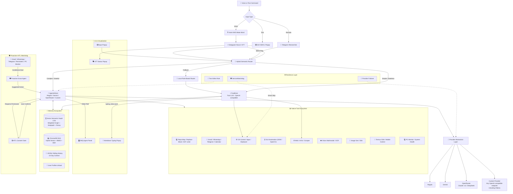

# 🧠 J.A.R.V.I.S. OS Agent – Open-Source Autonomous AI Assistant for Windows

> **An AI Operating System that autonomously controls your PC, Android phone, local files, and lifelong memory — not just your code.**

> **Open-Source · Line-Drift-Free Editing · Lifelong Episodic Memory · Voice-First Multimodal · Proactive HITL · Android Termux SSH · Telegram Remote Control · Hybrid RAG · PC System Monitoring**

[](https://www.python.org/)
[](https://nodejs.org/)
[](https://www.microsoft.com/windows)
[](https://platform.openai.com)
[](https://github.com/thekaifansari01/Jarvis-OS-Agent)
[](https://ollama.com)
[](https://deepgram.com)
[](https://termux.dev/)
[](https://telegram.org)
[](https://github.com/thekaifansari01/Jarvis-OS-Agent)
[](https://github.com/thekaifansari01/Jarvis-OS-Agent)
[](https://whatsapp.com)
[](https://mail.google.com)
[](https://calendar.google.com)
[](LICENSE)
[](https://github.com/thekaifansari01/Jarvis-OS-Agent/pulls)
[](https://github.com/thekaifansari01/Jarvis-OS-Agent/stargazers)
[](https://github.com/thekaifansari01/Jarvis-OS-Agent/forks)

---

## 🎬 Demo

> **📹 Demo video coming soon.**  
> *In the meantime, here is what a real 5-step multi-tool command looks like end-to-end:*

**Input (voice):**
> *"Create a new project called 'AI-powered habit tracker'. Set up a complete project structure on my Desktop, write a README.md, and generate a basic Flask app skeleton. Then send an email to Rahul that I am starting a new project, and schedule a meeting for tomorrow at 5 PM to discuss the project."*

**What Jarvis did autonomously (in one continuous agent loop):**
1. Recalled "Rahul" from the long-term memory graph
2. Created the project folder, README.md, and Flask skeleton on the Desktop
3. Adapted mid-execution when the user injected a live correction ("Send Rahul an email, not a WhatsApp message")
4. Sent a real Gmail to the corrected address
5. Created a real Google Calendar event for tomorrow at 5 PM
6. Voiced a summary — **1.99s reaction time** from text to speech

**Total agent steps:** 6 &nbsp;·&nbsp; **Total time:** ~83 seconds &nbsp;·&nbsp; **Failures:** 0

---

## 📌 Table of Contents

- [Why Jarvis?](#-why-jarvis)
- [Core Features](#-core-features)
- [Performance Metrics](#-performance-metrics)
- [Jarvis vs. Other AI Agents](#-jarvis-vs-other-ai-agents)
- [Technical Architecture](#️-technical-architecture)
- [Dual-Engine AI: FastBrain vs AgenticBrain](#-dual-engine-ai-fastbrain-vs-agenticbrain)
- [Lifelong Episodic Memory & Hybrid RAG](#-lifelong-episodic-memory--hybrid-rag)
- [Android Mobile Control via Termux SSH](#-android-mobile-control-via-termux-ssh)
- [Integrated Tool Ecosystem](#️-integrated-tool-ecosystem)
- [PC System Monitoring & Proactive Alerts](#-pc-system-monitoring--proactive-alerts)
- [Installation](#-installation)
- [Real-World Use Cases](#-real-world-use-cases)
- [CLI & Configuration](#️-cli--configuration)
- [Troubleshooting & FAQ](#-troubleshooting--faq)
- [Contributing](#-contributing)
- [License](#-license)
- [About the Author](#-about-the-author)

---

## 🎯 Why Jarvis?

Most AI coding assistants stop at generating code. Most desktop assistants stop at opening apps. Jarvis is built on a different premise: **an assistant should be able to see, act, remember, and reach out — across your PC, your phone, and your communication channels — with one continuous mind.**

Three things make Jarvis different:

1. **It acts in the real world, not just in chat.** Gmail, WhatsApp, Telegram, Google Calendar, Termux on your Android, file system, terminal, GUI mouse and keyboard — all native tools the agent chooses from autonomously.
2. **It remembers for months, not minutes.** A weighted property-graph memory layer with temporal decay, plus hybrid BM25 and vector RAG for your workspace documents.
3. **It reaches out first when something matters.** Background listeners for email, chat, calendar, and PC health feed a silent "Scout" agent that decides whether to interrupt you — with Human-in-the-Loop consent before any permanent action.

If you want an AI that finishes what it starts, on the machine you actually work on — this is it.

---

## 🎯 Core Features

| Icon | Feature | What It Actually Does |
|:---:|:---|:---|
| 💻 | **Autonomous Software Engineering** | Explores codebases (`repo_map`), reads files (`view`), edits with exact block diffs (`replace_block`), runs Python scripts (`run_python_code`), and executes terminal commands. Iterates on failures using a two-strike debug loop. |
| 🛡️ | **Line-Drift-Free Code Editing** | Uses exact `replace_block` search-and-replace instead of line numbers. Syntax errors are caught via AST lint and auto-corrected without human intervention. |
| 🧠 | **Lifelong Episodic LTM & Hybrid RAG** | Vector-backed property graph with bidirectional edges, confidence scores, and temporal decay. Workspace documents are indexed with smart chunk overlap and retrieved via **Hybrid search (BM25 + Vector + RRF)** with recency boost. |
| 🔄 | **Hybrid Semantic AI Routing** | Semantic router decides FastBrain vs AgenticBrain per command. Falls back to a local rule-based router if the semantic router is unavailable. |
| 📱 | **Android Termux SSH Control** | Remote control of an Android phone over a Tailscale SSH tunnel using the Termux API — calls, SMS, sensors, battery, torch, notifications — with clean JSON output. |
| 🌍 | **Telegram Remote PC Control** | Trigger silent background PC commands from anywhere via a secure Telegram bot, without disturbing your active desktop session. |
| 📨 | **Proactive Automation (Email / WhatsApp / Telegram / Calendar)** | Background listeners plus a Scout agent that filters noise, flags importance, and requests consent before any permanent modification. |
| 💻 | **PC System Monitoring & Alerts** | Tracks CPU, RAM, disk, battery, network, and USB insertion events. Applies smart cooldown, idle and fullscreen suppression, and LLM-based relevance filtering. |
| 🗣️ | **Voice-First Multimodal** | Deepgram Nova-2 STT with Vosk keyword spotting for low-latency wake-word triggering. Edge TTS voice output. OCR, image understanding, and image generation via OpenAI-compatible endpoints with AI Horde fallback. |
| 🖱️ | **Vision-Based GUI Automation** | Set-of-Mark vision overlay with OpenCV edge detection. Two click paths — `click_by_id` with `expected_text` verification (preferred) and raw `click(x, y)` fallback. |
| 🔌 | **Multi-LLM Auto-Failover** | Regolo, Gemini, OpenRouter, or local providers (Ollama, LM Studio, vLLM). Primary provider failure routes to fallback automatically. |
| 🎨 | **Reactive UI Ecosystem** | ZMQ-powered PyQt5 Agent Panel streaming thought, action, and observation in real time. Markdown typing popup with async image preview and glass-morphism styling. |
| 🔒 | **Command-Level Security Guardrails** | `shlex` tokenization blocks destructive terminal commands. Local AES-encrypted tokens (`.enc`) for Gmail, Calendar, and Telegram sessions. |
| ⚙️ | **ServiceWatchdog Resilience** | Monitors STT, Baileys, and Telegram subprocesses. Auto-restarts crashed services and skips unauthenticated modules to prevent log spam. |

---

## 📊 Performance Metrics

Numbers from a typical Windows 11 run on a mid-range machine (5-step multi-tool mission):

| Metric | Value |
|---|---|
| Cold boot to ready | ~40 s |
| Semantic router decision | ~810 ms |
| Voice reaction time (text to audio) | **1.99 s** |
| Multi-tool mission (project + email + calendar) | ~83 s across 6 agent steps |
| FastBrain typical response | sub-2 s |
| Local embedding model load | ~14 s |
| Memory graph recall | ~7 s |

*Your mileage will vary based on provider latency, model choice, and machine specifications.*

---

## 🔥 Jarvis vs. Other AI Agents

A fair look at where Jarvis fits alongside popular alternatives:

| Capability | **Jarvis OS Agent** | **Claude Code** | **AutoGPT / CrewAI** |
|---|:---:|:---:|:---:|
| Cost model | Free, self-hosted | Paid subscription | Free / paid |
| Local LLM support | ✅ Ollama, LM Studio, vLLM | ❌ Cloud only | Partial |
| Line-drift-free edits | ✅ Exact block diffs | ⚠️ Line-number based | ❌ Not focused on editing |
| Lifelong memory | ✅ Weighted property graph | ❌ Session-only | ⚠️ Limited |
| Native real-world tools (email, WhatsApp, calendar) | ✅ | ❌ | ⚠️ Via plugins |
| Voice-first interaction | ✅ Deepgram + Vosk KWS | ❌ | ❌ |
| Proactive background agent | ✅ HITL Scout | ❌ | ❌ |
| Remote control (Telegram, Android) | ✅ | ❌ | ❌ |
| Polished UX | ✅ Excellent | ✅ Excellent | ❌ |
| Enterprise support | ❌ Solo project | ✅ Anthropic-backed | Varies |

**Honest positioning:** Jarvis trades the polish and vendor support of commercial tools for **breadth, extensibility, and local-first autonomy**. If you need a production-grade IDE assistant, use Claude Code. If you want an open, hackable, cross-device autonomous agent, this is for you.

---

## 🏗️ Technical Architecture


```mermaid
flowchart TD
    User["👤 Voice or Text Command"] --> Input{"Input Type"}
    Input -->|Voice| Wake["🎙️ Vosk KWS Wake Word"]
    Input -->|Text| Hotkey["⌨️ Ctrl+Shift+J Popup"]
    Input -->|Remote| TelegramBot["🤖 Telegram Remote Bot"]
    Wake --> STT["⚡ Deepgram Nova-2 STT"]
    Hotkey --> Router["🚦 Hybrid Semantic Router"]
    TelegramBot -->|Silent Flag| Router
    STT --> Router
    Router -->|Fallback| LocalRouter["🔄 Local Rule-Based Router"]
    LocalRouter --> FastBrain

    Router -->|Simple / Stateless| FastBrain["⚡ FastBrain<br/>Fast LLM - OpenAI compatible"]
    Router -->|Complex / Stateful| AgenticBrain["🧠 AgenticBrain<br/>Regolo / Gemini / OpenRouter / Custom"]

    AgenticBrain --> Providers["🔌 Provider Abstraction Layer"]
    Providers --> Regolo["Regolo"]
    Providers --> Gemini["Gemini"]
    Providers --> OpenRouter["OpenRouter<br/>Claude / o1 / DeepSeek"]
    Providers --> Custom["Custom Provider<br/>Any OpenAI compatible endpoint<br/>including Ollama"]

    subgraph Memory["🧠 Memory Ecosystem"]
        LTM[("🗄️ Vector Semantic Graph LTM<br/>Weighted Graph + Subgraph + Decay")]
        RAG[("📚 ChromaDB RAG<br/>Hybrid Vector + BM25 + RRF")]
        JSONL["📜 JSONL Rolling History<br/>15-Day Context"]
        Profile["👤 User Profile & Mood"]
    end

    AgenticBrain <--> Memory
    FastBrain <--> Memory

    subgraph Tools["🛠️ Native Tool Ecosystem"]
        Code["💻 Repo-Map / Replace-Block / AST Linter"]
        Comms["📨 Gmail / WhatsApp / Telegram / Calendar"]
        System["⚙️ OS Control / Apps / Clipboard"]
        GUI["🖱️ GUI Automation (SOM / OpenCV)"]
        Search["🌐 Web / ArXiv / Scraper"]
        Vision["👁️ Vision Multimodal / OCR"]
        Image["🎨 Image Gen / Edit"]
        Mobile["📱 Termux SSH / Mobile Control"]
        PC["💻 PC Monitor / System Health"]
    end

    AgenticBrain --> Tools
    FastBrain --> System
    FastBrain --> Search

    subgraph UI["🎨 UI & Visualization"]
        AgentPanel["🖥️ ZMQ Agent Panel"]
        TypingPopup["📝 Markdown Typing Popup"]
        STTPopup["🗣️ STT Status Popup"]
        InputPopup["⌨️ Input Popup"]
    end

    AgenticBrain -->|ZMQ PUB| AgentPanel
    FastBrain -->|typing_status.json| TypingPopup
    STT --> STTPopup
    InputPopup --> Router

    subgraph Proactive["🛡️ Proactive HITL Watchdog"]
        Listeners["📡 Gmail / WhatsApp / Telegram / Reminders / PC Monitor"]
        Scout["🛡️ Proactive Scout Agent"]
        Consent["🔒 HITL Consent Gate"]
    end

    Listeners -->|Conditional Start| Scout
    Scout -->|Suggested Action| AgenticBrain
    AgenticBrain -->|Requires Permission| Consent
    Consent -->|User Confirms| AgenticBrain

    subgraph Resilience["⚙️ Resilience Layer"]
        Watchdog["🛡️ ServiceWatchdog"]
        Failover["🔄 Provider Failover"]
        Recovery["🔄 Two-Strike Rule"]
    end

    Watchdog -.->|Smart Skip| System
    Failover -.-> Providers
    Recovery -.-> AgenticBrain
```

---

## ⚡ Dual-Engine AI: FastBrain vs AgenticBrain

Jarvis uses two brains to optimize for both speed and depth.

| Feature | ⚡ FastBrain | 🧠 AgenticBrain |
|---|---|---|
| **Philosophy** | Stateless, low-latency (<2s) | Stateful, multi-step tool execution |
| **Routing Trigger** | Short commands, casual chat, simple OS toggles | Complex prompts, engineering, memory, communications |
| **System Controls** | Open or close apps, URLs, YouTube | Full OS automation via Python and shell |
| **Hardware Toggles** | Volume, brightness, mute, screenshot, lock | Included within complex workflows |
| **File Operations** | ❌ | ✅ Full CRUD, `repo_map`, `replace_block` |
| **Communication** | ❌ | ✅ Gmail, WhatsApp, Telegram, Calendar |
| **Code Execution** | ❌ | ✅ `run_python_code`, `execute_terminal_command` |
| **Memory Recall** | ❌ | ✅ Lifetime vector-graph recall |
| **Multimodal Vision** | ❌ | ✅ Image and video analysis, OCR |
| **Web Research** | Quick web search | Deep research, ArXiv, YouTube transcripts |
| **Mobile Control** | ❌ | ✅ Termux SSH |
| **PC Monitoring** | ❌ | ✅ CPU / RAM / Disk / Battery / Network |
| **Proactive HITL** | ❌ | ✅ Consent gate before permanent changes |

---

## 🧠 Lifelong Episodic Memory & Hybrid RAG

Jarvis implements a **four-tier** memory system:

1. **📜 Rolling JSONL History (Short-Term):** 15-day rolling conversation context, auto-pruned and archived.
2. **🗄️ Bidirectional Property Graph Memory (Long-Term):**
   - **Graph Structure:** Built on `NetworkX`. Every fact stores deep context (`metadata`), source messages, and confidence scores.
   - **Bidirectional Awareness:** Auto-generates inverse edges — for example, `[User] -> (FATHER) -> [FatherName]` also creates `[FatherName] -> (CHILD) -> [User]`.
   - **Semantic Edge Routing:** Matches relational edge intent first, then falls back to deep semantic similarity against exact conversation context.
   - **Temporal Decay:** Relations older than 6 months lose half their weight. The embedding engine (`BAAI/bge-small-en-v1.5`) is preloaded at startup for zero-latency multi-entity traversal.
3. **📚 Hybrid RAG (Workspace Documents):**
   - **Smart Chunking:** 1500-character chunks with 200-character overlap.
   - **Hybrid Retrieval:** BM25 keyword search plus vector similarity merged via **Reciprocal Rank Fusion (RRF)**.
   - **Recency Boost:** Recently modified files get a ~20% score lift.
4. **👤 User Profile & Mood Tracker:** Auto-extracts user bio, preferences, and mood states into knowledge-graph triplets.

---

## 📱 Android Mobile Control via Termux SSH

Control your Android phone natively from Windows using Termux API over a Tailscale SSH tunnel.

| Category | Example Capabilities |
|---|---|
| **Telecom** | Direct calls without dialer UI, read and send SMS |
| **Volume & Media** | Volume up or down, mute, custom alert playback |
| **Sensors** | Flashlight, vibrate, battery, location, accelerometer |
| **Notifications** | Read incoming, push custom rich notifications |
| **Automation** | Clipboard sync, silent camera capture |

**Setup:** Install **Termux** and **Termux:API** from F-Droid. Configure OpenSSH (`sshd`) with key-based authentication. Connect both devices via **Tailscale**.

---

## 🛠️ Integrated Tool Ecosystem

| Category | Capabilities |
|---|---|
| 💻 **Software Engineering** | `repo_map`, `replace_block`, AST lint, `create_many` |
| 📨 **Communication** | Gmail (send and read), WhatsApp and Telegram APIs, Google Calendar OAuth |
| 📂 **Workspace & RAG** | File CRUD, recursive repository scanning, hybrid RAG |
| 📱 **Mobile** | Termux API — calls, SMS, battery, torch, sensors |
| 🌍 **Remote Control** | Telegram Bot for silent remote PC commands |
| 🌐 **Search & Research** | Web search, ArXiv, YouTube transcript extraction, deep research |
| ⚙️ **System Automation** | App launch and kill, volume, brightness, clipboard |
| 🖱️ **GUI Automation** | OpenCV edge-vision SOM, autonomous mouse and keyboard |
| 💻 **PC Monitoring** | CPU / RAM / disk / battery / network / USB |
| 👁️ **Multimodal Vision** | Screen and video analysis, object detection, OCR |
| 🎨 **Image Generation** | Text-to-image, image-to-image editing |

---

## 💻 PC System Monitoring & Proactive Alerts

A background PC monitor tracks system health and pushes alerts through the Scout agent.

### What It Monitors

| Component | Trigger | Priority |
|---|---|---|
| CPU | Sustained > 85% | High |
| RAM | > 85% | High |
| Disk | Free < 5 GB on C: | High |
| Battery | < 15% or charging state change | Critical |
| Network | Internet lost | High |
| USB | New device insertion | Normal |

### Smart Suppression

- **Cooldown:** Same alert will not repeat within 60 seconds.
- **Dedup:** Already-processed events are cached and ignored.
- **Idle and Fullscreen:** Resource alerts are suppressed when the user is away (>10 minutes idle) or watching fullscreen media.
- **LLM Filtering:** Alerts pass through the Scout agent, which decides `IGNORE`, `ANNOUNCE`, or `SUGGEST_ACTION` based on context.

### Data Flow

```
PC Monitor (background thread)
   ↓
push_proactive_event("PC_Monitor", data, priority)
   ↓
Proactive Queue (batched every 4 seconds)
   ↓
Proactive Scout Agent (LLM evaluator)
   ↓
IGNORE / ANNOUNCE / SUGGEST_ACTION
   ↓
Jarvis speaks or asks for consent
```

---

## 🚀 Installation

### Prerequisites

- **Windows 10 or 11** (primary supported OS)
- **Python 3.10+**
- **Node.js 18+** (for the WhatsApp Baileys bridge)

### One-Block Setup

```powershell
git clone https://github.com/thekaifansari01/Jarvis-OS-Agent.git
cd Jarvis-OS-Agent

python -m venv .venv
.\.venv\Scripts\Activate.ps1
python -m pip install --upgrade pip
pip install -r requirements.txt

cd tools/Messanger/whatsapp/BaileysServer
npm install
cd ../../../..

python SetupRegistry.py
```

> ⚠️ **Important:** Run `python SetupRegistry.py` from the root `Jarvis-OS-Agent/` directory with the virtual environment activated.

### Global Launch

Open a **new terminal** and run:

```bash
jarvis
```

The `jarvis` command is now registered system-wide — no need to reactivate the virtual environment.

---

## 📋 Real-World Use Cases

### 🐞 Automated Bug Fixing
> *"Run the tests in my Python project and fix any failing ones."*

Jarvis runs `pytest`, reads the failing files, applies `replace_block` edits, re-runs the suite, and reports a summary — with a two-strike fallback if a fix does not take.

### 🚨 Proactive HITL — Executive Assistant Mode
> A background listener catches an email: *"Meeting shifted to 5 PM."*  
> Scout flags it, and Jarvis asks: *"[Alert] Email from Ram — meeting moved to 5 PM. Should I update the calendar?"*  
> The user replies *"Yes, do it."* Jarvis executes and confirms.

### 🧪 Full-Stack App Generation
> *"Create 'TaskFlow' on the Desktop — FastAPI with SQLite backend, React with Tailwind frontend, 10+ unit tests, run pytest, and make all tests pass."*

Jarvis scaffolds folders, writes all files, installs dependencies, runs tests, iterates on failures, and completes.

### 🧠 Weighted Graph Recall
Facts are stored with weights that decay over time. Recent interests outrank stale ones when you ask *"What do I like?"*

### 💻 Proactive System Health
> CPU hits 92% with Chrome as the top process. Scout evaluates the context, sees the user is not idle, and asks: *"CPU at 92% — the top process is Chrome. Want me to close unused tabs?"*

---

## ⚙️ CLI & Configuration

> ⚠️ **Note:** Run memory, login, and reset commands with Jarvis **stopped**.

| Command | Action |
|---|---|
| `jarvis login --whatsapp` | WhatsApp Web QR authentication |
| `jarvis login --telegram` | Telegram authentication (phone + OTP) |
| `jarvis login --mail` | Gmail OAuth2 |
| `jarvis login --calendar` | Google Calendar OAuth2 |
| `jarvis login --all` | Batch authenticate all integrations |
| `jarvis logout --whatsapp` | Destroy WhatsApp session |
| `jarvis logout --telegram` | Destroy Telegram session |
| `jarvis logout --mail` | Revoke Gmail tokens |
| `jarvis logout --calendar` | Revoke Calendar tokens |
| `jarvis logout --all` | Revoke everything |
| `jarvis bot --activate` | Configure and activate the remote Telegram bot |
| `jarvis bot --deactivate` | Revoke and offline the remote bot |
| `jarvis bot --status` | Show live bot status |
| `jarvis memory --clear` | Purge contextual memory (keeps active sessions) |
| `jarvis reset --hard` | **FACTORY RESET** — wipes memory, vectors, sessions |
| `jarvis --help` | Global help |

### Environment Variables (`.env`)

Copy `.env.example` to `.env` and populate your credentials. For 100% local LLM execution (Ollama, LM Studio), configure the Custom Provider block.

| Variable | Purpose | Default |
|---|---|---|
| `FAST_BRAIN_API_KEY` | FastBrain API key | Required |
| `FAST_BRAIN_MODEL` | FastBrain model | `llama-3.3-70b-versatile` |
| `FAST_BRAIN_ENDPOINT` | FastBrain endpoint | `https://api.groq.com/openai/v1` |
| `ROUTER_API_KEY` | Semantic Router API key | Required |
| `ROUTER_MODEL` | Router model | `llama-3.3-70b-versatile` |
| `ROUTER_ENDPOINT` | Router endpoint | `https://api.groq.com/openai/v1` |
| `LTM_EXTRACTION_API_KEY` | LTM extraction key | Required |
| `LTM_EXTRACTION_MODEL` | LTM extraction model | `llama-3.3-70b-versatile` |
| `LTM_EXTRACTION_ENDPOINT` | LTM endpoint | `https://api.groq.com/openai/v1` |
| `IMAGE_GEN_API_KEY` | Image generation key | Optional |
| `IMAGE_GEN_MODEL` | Image model | `dall-e-3` |
| `IMAGE_GEN_ENDPOINT` | Image endpoint | `https://api.openai.com/v1` |
| `PROACTIVE_API_KEY` | Proactive Scout key | Required |
| `PROACTIVE_MODEL` | Scout model | `llama-3.3-70b-versatile` |
| `PROACTIVE_ENDPOINT` | Scout endpoint | `https://api.groq.com/openai/v1` |
| `TTS_API_KEY` | TTS key | Optional (Edge TTS fallback) |
| `TTS_MODEL` | TTS model | `canopylabs/orpheus-v1-english` |
| `TTS_ENDPOINT` | TTS endpoint | `https://api.groq.com/openai/v1` |
| `GEMINI_API_KEY` | Agentic fallback and embeddings | Optional |
| `REGOLO_API_KEY` | Primary Agentic provider | Required for Regolo |
| `OPENROUTER_API_KEY` | Fallback Agentic provider | Optional |
| `TAVILY_API_KEY` | Real-time web search | Required |
| `DEEPGRAM_API_KEY` | Speech-to-text | Required |
| `TELEGRAM_API_ID` | Telegram desktop client | Optional |
| `TELEGRAM_API_HASH` | Telegram desktop client | Optional |
| `CUSTOM_BASE_URL` | Local OpenAI-compatible endpoint | `http://localhost:11434/v1` |
| `CUSTOM_MODEL` | Local model name | `llama3.2:3b` |
| `CUSTOM_API_KEY` | Local provider key | `EMPTY_KEY` |

---

## 🔧 Troubleshooting & FAQ

| Issue | Solution |
|---|---|
| `ModuleNotFoundError` on startup | Activate `.venv` and run `pip install -r requirements.txt` |
| Vosk wake-word model missing | Run `jarvis` once to trigger auto-download, or manually place in `Data/model/vosk-model-small/` |
| WhatsApp service will not start | Verify Node.js 18+, run `npm install` in `tools/Messanger/whatsapp/BaileysServer`, ensure port 3000 is free |
| Telegram client fails | Verify `TELEGRAM_API_ID` and `TELEGRAM_API_HASH` in `.env`; authenticate via `jarvis login --telegram` |
| Remote Telegram bot unresponsive | Run `jarvis bot --activate` with a valid BotFather token, then restart Jarvis |
| `jarvis` not recognized globally | Run `python SetupRegistry.py` from the root with the virtual environment active, then open a new terminal |
| Unwanted authentication popups on boot | Run `jarvis logout --service`. Listeners only start if valid credentials exist. |
| Mobile SSH times out | Confirm Tailscale is connected on both devices and `sshd` is running in Termux |
| Ollama provider fails | Ensure `CUSTOM_BASE_URL` ends with `/v1` and follows the OpenAI schema |
| Knowledge graph feels stale | Delete `Data/jarvis_memory/lifetime_graph.json` and reboot — nodes, weights, and embeddings rebuild |
| Hybrid RAG results poor | Delete `Data/jarvis_memory/rag_chroma_db` and reboot to force a fresh index |
| PC Monitor not starting | Run `pip install psutil pywin32 pygetwindow` |
| Too many PC Monitor alerts | Adjust thresholds in `PCMonitorProactive.py` |
| USB devices not detected | Run PowerShell as Administrator — PC Monitor reads Windows Event Logs |
| FastBrain key invalid | Verify `FAST_BRAIN_API_KEY`, endpoint, and model in `.env` |

### FAQ

**Is it free?**  
Yes. GPLv3. You can run it entirely on local LLMs with zero API cost, or mix free-tier cloud providers.

**Does it work on Mac or Linux?**  
Currently Windows-only. The GUI automation, PC monitor, and Termux bridge assume Windows paths and APIs.

**Is my data safe?**  
Credentials are AES-encrypted locally. Conversation history and memory graphs stay on disk. Only LLM API calls leave your machine — and you can switch to local models entirely.

**Can it run on mobile?**  
No — Jarvis runs on your Windows PC. Your Android phone is *controlled by* Jarvis via Termux SSH.

**How does it differ from ChatGPT or Claude?**  
Those are chat interfaces. Jarvis is an *agent* — it takes actions on your actual system, remembers you across months, and reaches out proactively.

---

## 🤝 Contributing

Contributions are welcome — bug fixes, new providers, documentation, and tool integrations.

1. **Fork** the repository
2. **Create a branch** (`git checkout -b feature/MyFeature`)
3. **Commit** (`git commit -m 'Add MyFeature'`)
4. **Push** (`git push origin feature/MyFeature`)
5. **Open a Pull Request**

> ⚖️ **Contributor License Agreement (CLA):** By submitting a Pull Request, you agree to the terms in [CONTRIBUTING.md](CONTRIBUTING.md). This grants the maintainer rights to use your contribution under both GPLv3 and commercial or proprietary licenses. Please read it before contributing.

Please also review our [Code of Conduct](CODE_OF_CONDUCT.md).

**Good first issues:** Look for the [`good first issue`](https://github.com/thekaifansari01/Jarvis-OS-Agent/labels/good%20first%20issue) label.

---

## 📄 License

This project is distributed under the **GNU General Public License v3.0**. See [LICENSE](LICENSE) for the full text.

---

## 🌟 Star History

[](https://star-history.com/#thekaifansari01/Jarvis-OS-Agent&Date)

## 👤 About the Author

Built by **Kaif Ansari** ([@thekaifansari01](https://github.com/thekaifansari01)) — an 18-year-old solo developer from a commerce background, currently in the first year of BCA. No team. No funding. Just late nights, coffee, and a stubborn belief that one person can build something that matters.

**Connect:** &nbsp; [🐦 Twitter / X](https://twitter.com/thekaifansari01) &nbsp;·&nbsp; [💻 GitHub](https://github.com/thekaifansari01) &nbsp;·&nbsp; [📸 Instagram](https://instagram.com/thekaifansari01) &nbsp;·&nbsp; [💼 LinkedIn](https://linkedin.com/in/thekaifansari01) &nbsp;·&nbsp;[🟣 Reddit](https://reddit.com/user/thekaifansari01) &nbsp;·&nbsp; [🎮 Discord](https://discord.com/users/thekaifansari01) &nbsp;·&nbsp; [📧 Email](mailto:thekaifansari01@gmail.com)

---

## 🌟 Show Your Support

If the **Jarvis OS Agent** streamlined your workflow, autonomously fixed your bugs, or inspired your own AI projects:

- ⭐ **Star** this repository to help it rank and grow the community.
- 🐦 **Follow and share** your use cases by tagging [@thekaifansari01](https://twitter.com/thekaifansari01).
- ☕ **Buy me a coffee** (link coming soon) — late nights, compiling code, and building AI operating systems run purely on caffeine.

Every star, fork, and share helps more developers discover the project.

---

<p align="center">
  <i>"Any sufficiently advanced technology is indistinguishable from magic." — Arthur C. Clarke</i>
</p>