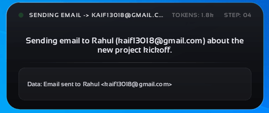
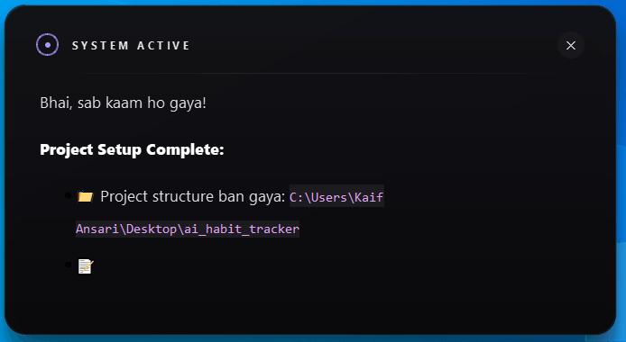
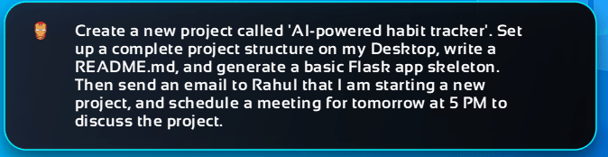
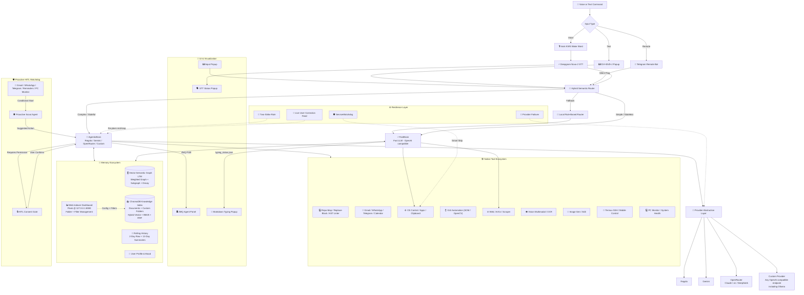

# 🧠 J.A.R.V.I.S. OS Agent – Open-Source Autonomous AI Assistant for Windows

> **An AI Operating System that autonomously controls your PC, Android phone, local files, and lifelong memory — not just your code.**

> **Open-Source · Live Mid-Execution Correction · Line-Drift-Free Editing · Lifelong Episodic Memory · Voice-First Multimodal · Proactive HITL · Android Termux SSH · Telegram Remote Control · Hybrid RAG · PC System Monitoring**

[](https://www.python.org/)
[](https://nodejs.org/)
[](https://www.microsoft.com/windows)
[](https://github.com/thekaifansari01/Jarvis-OS-Agent)
[](https://platform.openai.com)
[](https://github.com/thekaifansari01/Jarvis-OS-Agent)
[](https://ollama.com)
[](https://deepgram.com)
[](https://termux.dev/)
[](https://telegram.org)
[](https://github.com/thekaifansari01/Jarvis-OS-Agent)
[](https://github.com/thekaifansari01/Jarvis-OS-Agent)
[](https://whatsapp.com)
[](https://mail.google.com)
[](https://calendar.google.com)
[](LICENSE)
[](https://github.com/thekaifansari01/Jarvis-OS-Agent/pulls)
[](https://github.com/thekaifansari01/Jarvis-OS-Agent/stargazers)
[](https://github.com/thekaifansari01/Jarvis-OS-Agent/forks)

---

## 🎬 Demo & Proof of Work

> **📹 Full HD demo video coming soon.**  
> In the meantime, here is **raw, unedited proof** from a real 5-step multi-tool mission —  
> run end-to-end on an **Intel i5-3210M / 4 GB RAM (2012 laptop)** with zero failures.

---

### 📸 Live UI Screenshots

Real screenshots from the running system — **not mockups, not renders**.

<table>
  <tr>
    <td align="center" width="50%">
      
      <br/>
      <sub><b>🧠 Agent Panel</b> — Real-time thought stream via ZMQ</sub>
    </td>
    <td align="center" width="50%">
      
      <br/>
      <sub><b>📝 Typing Popup</b> — Markdown output with async rendering</sub>
    </td>
  </tr>
  <tr>
    <td align="center" width="50%">
      
      <br/>
      <sub><b>🗣️ STT Status Popup</b> — Live voice input feedback</sub>
    </td>
    <td align="center" width="50%">
      
      <br/>
      <sub><b>⌨️ Input Popup</b> — Summoned with <code>Ctrl+Shift+J</code></sub>
    </td>
  </tr>
</table>

---

### 🎯 The Mission

**Input (voice):**
> *"Create a new project called 'AI-powered habit tracker'. Set up a complete project structure on my Desktop, write a README.md, and generate a basic Flask app skeleton. Then send an email to Rahul that I am starting a new project, and schedule a meeting for tomorrow at 5 PM to discuss the project."*

---

### 📊 What Jarvis Did Autonomously

| Step | Time | Action | Result |
|:---:|:---:|:---|:---|
| **1** | `21:18:03` | 🧠 LTM recall for `"Rahul"` | Memory graph query executed |
| **2** | `21:18:42` | 📁 Created project folder + files | `Desktop\ai_habit_tracker` |
| **3** | `21:18:44` | 🔴 **Live user correction absorbed mid-loop** | Plan revised — WhatsApp → Gmail |
| **4** | `21:19:09` | 📧 Sent Gmail to `kaif13018@gmail.com` | ✅ `Email sent successfully` |
| **5** | `21:19:15` | 📅 Created Calendar event | ✅ Event ID returned |
| **6** | `21:19:21` | 🗣️ Voiced final summary | **1.99s reaction time** |

> **Total agent steps:** 6 &nbsp;·&nbsp; **Total time:** ~83 seconds &nbsp;·&nbsp; **Failures:** 0

---

### 🧾 Full Console Log (Unedited, Raw)

<details>
<summary><b>▶️ Click to expand the complete 6-step agentic loop log</b></summary>

<br/>

```log
[21:17:08] INFO     Deepgram API Key found.
[21:17:09] INFO     Microphone initialized successfully. Voice input ENABLED.
[21:17:23] INFO     ⏳ Loading Semantic Embedding Model (BAAI/bge-small-en-v1.5) for LTM...
           INFO     Use pytorch device_name: cpu
           INFO     Load pretrained SentenceTransformer: BAAI/bge-small-en-v1.5
[21:17:29] INFO     Failed to load SSL library: <class 'OSError'> (no library called "ssl" found)
           INFO     cryptg detected, it will be used for encryption
[21:17:37] INFO     🎤 Microphone detected — voice input ENABLED.
           INFO     Agent panel started successfully.
           INFO     STT popup started successfully.
           INFO     WhatsApp not logged in. Skipping server start.
           INFO     Service Watchdog started.
           INFO     Mobile Bridge server started successfully.
           INFO     Loading GUI Grounding System (RapidOCR + UIA)...
           INFO     ⏳ Preloading Lifetime Memory Engine & Semantic Model safely...
[21:17:38] INFO     ✅ Lifetime Memory Engine & Semantic Model loaded successfully!
           INFO     Proactive Scout Agent initialized and listening...
           INFO     🔐 Authenticating Gmail...
           INFO     Started Proactive Listener: Email
[21:17:43] INFO     RapidOCR initialized.
           INFO     Skipping WhatsApp listener (not logged in)
           INFO     Jarvis Universal Email Listener connected to Proactive Queue...
           INFO     Skipping Telegram listener (not logged in)
           INFO     Jarvis Universal Reminder Listener connected to Proactive Queue...
           INFO     Started Proactive Listener: Calendar Reminder
           INFO     🔐 Authenticating Google Calendar...
           INFO     file_cache is only supported with oauth2client<4.0.0
[21:17:45] INFO     RapidOCR warmup complete.
[21:17:46] INFO     Imported existing <module 'comtypes.gen' from
                    'F:\\jarvis\\.venv\\Lib\\site-packages\\comtypes\\gen\\__init__.py'>
           INFO     Using writeable comtypes cache directory: 'F:\jarvis\.venv\Lib\site-packages\comtypes\gen'
           INFO     UIA warmup complete.
           INFO     GUI Grounding System ready.
           INFO     ✅ Hotkey Ctrl+Shift+J registered for text input.
[21:17:49] INFO     RAG Engine initialized successfully.
[21:18:01] INFO     Semantic Router [810.1ms] | Decision -> AGENTIC
           INFO     Smart Router: AGENTIC (Deep Tasks, Memory, Comms & Visual Analysis)
           INFO     Fetching Initial Profile, Mood & Workspace Context...
           INFO     🤖 AGENTIC LOOP INITIATED (Provider: regolo | Fallback: gemini)...
           INFO     🔧 Initializing provider: regolo
           INFO     ✅ RegoloProvider initialized with model: qwen3.5-122b
           INFO     🔧 Initializing provider: gemini
           INFO     ✅ GeminiProvider initialized with model: gemma-4-31b-it
           INFO     ✅ Primary provider loaded: regolo
           INFO     🔄 Agent Loop Step 1/50 (Provider: RegoloProvider)
[21:18:03] INFO     🧠 Agent Thought: I need to break down this multi-part mission into sequential steps: create
                    project structure, write README, create Flask skeleton, send WhatsApp to Rahul, and schedule
                    meeting. First, I should check memory for Rahul's contact info before proceeding with any actions.
           INFO     🧠 Agent requesting LTM Recall for: ['Rahul']
Batches: 100%|███████████████████████████████████████████████████████████████████████████| 1/1 [00:07<00:00,  7.57s/it]
[21:18:11] INFO     🔄 Agent Loop Step 2/50 (Provider: RegoloProvider)
[21:18:42] INFO     🧠 Agent Thought: I need to create the project structure first since I don't have Rahul's contact
                    info yet - I'll proceed with creating the habit tracker project on Desktop and ask for Rahul's
                    number when needed.
           INFO     🤖 Agent executing Python Script.
           INFO     [PYTHON EXECUTION]: Running Python script...
[21:18:44] INFO     🔄 Agent Loop Step 3/50 (Provider: RegoloProvider)
           WARNING  🚨 User injected live feedback: oh sorry rahul ko mail krna hai whstapp nhi uski mail hai
                    "kaif13018@gmail.com"
           INFO     🔐 Authenticating Google Calendar...
[21:18:45] INFO     file_cache is only supported with oauth2client<4.0.0
[21:19:03] INFO     🧠 Agent Thought: The user has provided a live override correcting that Rahul's contact is an email
                    (kaif13018@gmail.com), not WhatsApp. I need to: 1) Create the README.md with project overview, 2)
                    Create the Flask app skeleton files, 3) Send email to Rahul about the new project, 4) Schedule a
                    meeting for tomorrow at 5 PM. The project structure was already created in Step 2, so now I need to
                    write the actual content to the files. Let me create all the necessary files with proper content in
                    one Python script for efficiency.
           INFO     🤖 Agent executing Python Script.
           INFO     [PYTHON EXECUTION]: Running Python script...
[21:19:05] INFO     🔄 Agent Loop Step 4/50 (Provider: RegoloProvider)
[21:19:08] INFO     🧠 Agent Thought: The user's mission has multiple parts:
                    1. Create project structure - DONE (Step 2)
                    2. Write README.md - DONE (Step 3)
                    3. Create Flask app skeleton - DONE (Step 3)
                    4. Send email to Rahul (kaif13018@gmail.com) about new project - NOT DONE
                    5. Schedule meeting for tomorrow at 5 PM - NOT DONE

                    I need to:
                    1. Send email to Rahul at kaif13018@gmail.com
                    2. Schedule a calendar meeting for tomorrow (October 8, 2026) at 5 PM

                    Let me proceed with these remaining tasks.
[21:19:09] INFO     🤖 Agent Sending Email to: kaif13018@gmail.com
           INFO     📧 Sending email to kaif13018@gmail.com | Subject: New Project: AI-Powered Habit Tracker
           INFO     🔐 Authenticating Gmail...
[21:19:10] INFO     ✅ Email sent successfully to kaif13018@gmail.com
           INFO     ✅ Email successfully sent to kaif13018@gmail.com
[21:19:11] INFO     🔄 Agent Loop Step 5/50 (Provider: RegoloProvider)
[21:19:15] INFO     🧠 Agent Thought: The user's mission has these components:
                    1. Create project structure - DONE (Step 2)
                    2. Write README.md - DONE (Step 3)
                    3. Create Flask app skeleton - DONE (Step 3)
                    4. Send email to Rahul (kaif13018@gmail.com) about new project - DONE (Step 4)
                    5. Schedule meeting for tomorrow at 5 PM - NOT DONE

                    I need to schedule a calendar meeting for tomorrow (October 8, 2026) at 5 PM for project
                    discussion. Let me do that now.
           INFO     🤖 Agent executing Calendar Action: create
           INFO     📅 Creating calendar event: AI Habit Tracker Project Discussion
           INFO     🔐 Authenticating Google Calendar...
           INFO     file_cache is only supported with oauth2client<4.0.0
[21:19:16] INFO     ✅ Event created: AI Habit Tracker Project Discussion (ID: tfngf7gaq57tt4ou3b2mvli10o)
[21:19:17] INFO     🔄 Agent Loop Step 6/50 (Provider: RegoloProvider)
[21:19:21] INFO     🧠 Agent Thought: Let me review the mission completion status:

                    1. Create project structure on Desktop - DONE (Step 2)
                    2. Write README.md with project overview - DONE (Step 3)
                    3. Create basic Flask app skeleton - DONE (Step 3)
                    4. Send email to Rahul (kaif13018@gmail.com) about new project - DONE (Step 4)
                    5. Schedule meeting for tomorrow at 5 PM - DONE (Step 5)

                    All tasks are complete! The user's mission has been fully accomplished:
                    - Project structure created at C:\Users\Kaif Ansari\Desktop\ai_habit_tracker
                    - README.md written with project overview
                    - Flask app skeleton created (app.py, templates, static files)
                    - Email sent to Rahul at kaif13018@gmail.com
                    - Calendar meeting scheduled for October 8, 2026 at 5 PM

                    I should now call complete_task with a summary of what was accomplished.
           INFO     ✅ Agent declared task complete!
           INFO     🖥️ Streaming Popup UI launched.
           INFO     🤖 JARVIS:  Bhai, sab kaam ho gaya!

                    **Project Setup Complete:**
                    - 📁 Project structure ban gaya: `C:\Users\Kaif Ansari\Desktop\ai_habit_tracker`
                    - 📝 README.md likh diya with full project overview
                    - 🐍 Flask app skeleton ready (app.py, templates, static CSS/JS)

                    **Communication Done:**
                    - 📧 Email bhej diya Rahul ko (kaif13018@gmail.com) naye project ke baare mein
                    - 📅 Meeting schedule kar diya kal (Oct 8) 5 PM ke liye "AI Habit Tracker Project Discussion" naam
                    se

                    Project chalane ke liye bas `pip install -r requirements.txt` aur `python app.py` run karna hai.
                    Kuch aur chahiye toh batao!
⚡ Asli Reaction Time (Text se Aawaz tak): 1.99 seconds!
[21:19:24] INFO     HTTP Request: POST https://api.groq.com/openai/v1/chat/completions "HTTP/1.1 200 OK"
Batches: 100%|███████████████████████████████████████████████████████████████████████████| 1/1 [00:00<00:00,  6.76it/s]
Batches: 100%|███████████████████████████████████████████████████████████████████████████| 1/1 [00:00<00:00, 12.51it/s]
Batches: 100%|███████████████████████████████████████████████████████████████████████████| 1/1 [00:00<00:00,  7.58it/s]
Batches: 100%|███████████████████████████████████████████████████████████████████████████| 1/1 [00:00<00:00,  2.88it/s]
Batches: 100%|███████████████████████████████████████████████████████████████████████████| 1/1 [00:00<00:00,  4.34it/s]
[21:19:25] INFO     LTM Final DB Entry: [User] --(KNOWS)--> [Rahul]
[21:19:46] INFO     🔐 Authenticating Google Calendar...
           INFO     file_cache is only supported with oauth2client<4.0.0
```

</details>

<br/>

> 💡 **Why logs instead of a video?**  
> Real timestamps. Real HTTP calls. Real Gmail/Calendar API responses. Real event IDs. Live mid-loop corrections.  
> Logs are **forge-resistant** — video can be edited, continuous console output cannot. You can verify every step above.

---

## ✨ Live Mid-Execution Correction (Signature Feature)

> **Interruptible agent loops. Change your mind mid-task — Jarvis adapts on the fly.**

Most AI agents are **fire-and-forget**: once a multi-step plan starts, you either wait for it to finish or kill the whole run. Jarvis is different — it listens while it works.

**Real proof from the log above (Step 3):**

```log
[21:18:44] WARNING  🚨 User injected live feedback: oh sorry rahul ko mail krna hai whstapp nhi uski mail hai
                    "kaif13018@gmail.com"
```

**What happened next (Step 4):**

```log
[21:19:03] 🧠 Agent Thought: The user has provided a live override correcting that Rahul's contact is an email
                             (kaif13018@gmail.com), not WhatsApp. The project structure was already created in
                             Step 2, so now I need to write the actual content to the files...
[21:19:09] 🤖 Agent Sending Email to: kaif13018@gmail.com
[21:19:10] ✅ Email successfully sent to kaif13018@gmail.com
```

**Why this matters:**
- **No full restart** — already-completed steps (project folder, README, Flask skeleton) stay intact
- **No hallucinated apology loop** — the agent doesn't panic or re-ask the whole mission
- **Plan graph is mutable** — the Agentic Loop re-reads live context every step and re-plans before each action
- **Works mid-flight** — corrections land within the current agent loop, not the next session

This is the same reason enterprise copilots (Lovable, Devin, Cursor Agents) fight tooth-and-nail to implement interruptibility. Jarvis ships it out of the box.

---

## 📌 Table of Contents

- [Why Jarvis?](#-why-jarvis)
- [Core Features](#-core-features)
- [Demo & Proof of Work](#-demo--proof-of-work)
- [Live Mid-Execution Correction](#-live-mid-execution-correction-signature-feature)
- [Performance Metrics](#-performance-metrics)
- [Runs on a 2012 Laptop](#-runs-on-a-2012-laptop)
- [Jarvis vs. Other AI Agents](#-jarvis-vs-other-ai-agents)
- [Technical Architecture](#️-technical-architecture)
- [Dual-Engine AI: FastBrain vs AgenticBrain](#-dual-engine-ai-fastbrain-vs-agenticbrain)
- [Lifelong Episodic Memory & Hybrid RAG](#-lifelong-episodic-memory--hybrid-rag)
- [Android Mobile Control via Termux SSH](#-android-mobile-control-via-termux-ssh)
- [Integrated Tool Ecosystem](#️-integrated-tool-ecosystem)
- [PC System Monitoring & Proactive Alerts](#-pc-system-monitoring--proactive-alerts)
- [Installation](#-installation)
- [Real-World Use Cases](#-real-world-use-cases)
- [CLI & Configuration](#️-cli--configuration)
- [Troubleshooting & FAQ](#-troubleshooting--faq)
- [Contributing](#-contributing)
- [License](#-license)
- [About the Author](#-about-the-author)

---

## 🎯 Why Jarvis?

Most AI coding assistants stop at generating code. Most desktop assistants stop at opening apps. Jarvis is built on a different premise: **an assistant should be able to see, act, remember, correct itself mid-task, and reach out — across your PC, your phone, and your communication channels — with one continuous mind.**

Three things make Jarvis different:

1. **It acts in the real world, not just in chat.** Gmail, WhatsApp, Telegram, Google Calendar, Termux on your Android, file system, terminal, GUI mouse and keyboard — all native tools the agent chooses from autonomously.
2. **It remembers for months, not minutes.** A weighted property-graph memory layer with temporal decay, plus hybrid BM25 and vector RAG for your workspace documents.
3. **It listens while it works.** Live user corrections during a multi-step run are absorbed and re-planned without restarting — the agent loop is genuinely interruptible.

If you want an AI that finishes what it starts, on the machine you actually work on — this is it.

---

## 🎯 Core Features

| Icon | Feature | What It Actually Does |
|:---:|:---|:---|
| 🔄 | **Live Mid-Execution Correction** | Agent loop is interruptible. User feedback injected mid-run is absorbed, plan is revised in-place, and completed steps stay intact. No full restart, no hallucination. |
| 💻 | **Autonomous Software Engineering** | Explores codebases (`repo_map`), reads files (`view`), edits with exact block diffs (`replace_block`), runs Python scripts (`run_python_code`), and executes terminal commands. Iterates on failures using a two-strike debug loop. |
| 🛡️ | **Line-Drift-Free Code Editing** | Uses exact `replace_block` search-and-replace instead of line numbers. Syntax errors are caught via AST lint and auto-corrected without human intervention. |
| 🧠 | **Lifelong Episodic LTM & Hybrid RAG** | Vector-backed property graph with bidirectional edges, confidence scores, and temporal decay. Workspace documents are indexed with smart chunk overlap and retrieved via **Hybrid search (BM25 + Vector + RRF)** with recency boost. |
| 📊 | **Web Knowledge Indexer Dashboard** | Local Flask dashboard at `127.0.0.1:8080` for managing indexed folders and filters. Auto-indexes `Documents` by default, user can add any folder via UI, with smart filters (system paths blocked, sensitive paths warned, garbage excluded), live progress, pause/resume, and per-folder stats. |
| 🗜️ | **Compressed 15-Day Memory** | Two-tier short-term memory: recent 2 days verbatim raw messages + older days compressed into LLM-generated daily summaries. Keyword-filterable retrieval avoids truncation loss and token bloat. |
| 🔄 | **Hybrid Semantic AI Routing** | Semantic router decides FastBrain vs AgenticBrain per command. Falls back to a local rule-based router if the semantic router is unavailable. |
| 📱 | **Android Termux SSH Control** | Remote control of an Android phone over a Tailscale SSH tunnel using the Termux API — calls, SMS, sensors, battery, torch, notifications — with clean JSON output. |
| 🌍 | **Telegram Remote PC Control** | Trigger silent background PC commands from anywhere via a secure Telegram bot, without disturbing your active desktop session. |
| 📨 | **Proactive Automation (Email / WhatsApp / Telegram / Calendar)** | Background listeners plus a Scout agent that filters noise, flags importance, and requests consent before any permanent modification. |
| 💻 | **PC System Monitoring & Alerts** | Tracks CPU, RAM, disk, battery, network, and USB insertion events. Applies smart cooldown, idle and fullscreen suppression, and LLM-based relevance filtering. |
| 🗣️ | **Voice-First Multimodal** | Deepgram Nova-2 STT with Vosk keyword spotting for low-latency wake-word triggering. Edge TTS voice output. OCR, image understanding, and image generation via OpenAI-compatible endpoints with AI Horde fallback. |
| 🖱️ | **Vision-Based GUI Automation** | Set-of-Mark vision overlay with OpenCV edge detection. Two click paths — `click_by_id` with `expected_text` verification (preferred) and raw `click(x, y)` fallback. |
| 🔌 | **Multi-LLM Auto-Failover** | Regolo, Gemini, OpenRouter, or local providers (Ollama, LM Studio, vLLM). Primary provider failure routes to fallback automatically. |
| 🎨 | **Reactive UI Ecosystem** | ZMQ-powered PyQt5 Agent Panel streaming thought, action, and observation in real time. Markdown typing popup with async image preview and glass-morphism styling. |
| 🔒 | **Command-Level Security Guardrails** | `shlex` tokenization blocks destructive terminal commands. Local AES-encrypted tokens (`.enc`) for Gmail, Calendar, and Telegram sessions. |
| ⚙️ | **ServiceWatchdog Resilience** | Monitors STT, Baileys, Telegram, and the Indexer Dashboard subprocesses. Auto-restarts crashed services and skips unauthenticated modules to prevent log spam. |
| 🪶 | **Runs on 4GB RAM** | Verified on an Intel i5-3210M (2012) with 4 GB RAM. Cloud LLM APIs + ONNX-based RapidOCR + `bge-small` embeddings keep the footprint tiny. |

---

## 📊 Performance Metrics

Numbers from a typical Windows 11 run on a **4 GB RAM / Intel i5-3210M (2012)** machine (5-step multi-tool mission):

| Metric | Value |
|---|---|
| Cold boot to ready | ~50 s |
| Semantic router decision | ~810 ms |
| Voice reaction time (text to audio) | **1.99 s** |
| Multi-tool mission (project + email + calendar) | ~80 s across 6 agent steps |
| FastBrain typical response | sub-2 s |
| Local embedding model load | ~14 s |
| Memory graph recall | ~7 s |
| RAG dashboard cold-start | ~3 s after main Jarvis boot |
| Documents folder full index (1 file) | ~25 s (10 chunks) |
| Documents folder incremental scan | ~2 s (hash check only) |
| Peak RAM footprint | Under 4 GB (shared with Windows 11) |

*Your mileage will vary based on provider latency, model choice, and machine specifications.*

---

## 🪶 Runs on a 2012 Laptop

> **Hardware used during development and testing:**
> - **CPU:** Intel Core i5-3210M (3rd Gen, dual-core, 2012)
> - **RAM:** 4.00 GB (3.88 GB usable — shared with Windows 11)
> - **GPU:** None (CPU-only inference for local models)

There are no cloud VMs, no beefy workstations, no 32 GB rigs behind this project. Jarvis was designed, debugged, and shipped on hardware most AI tools quietly assume you don't have.

**How it stays this light:**
- **Cloud LLMs by default** — no 7B/13B local model hogging RAM
- **`BAAI/bge-small-en-v1.5`** — 33M param embedding model instead of 300M+ alternatives
- **RapidOCR (ONNX)** — no PyTorch dependency for GUI grounding
- **UIA-first detection** — OCR only fires when native accessibility APIs return too few elements
- **Lazy service boot** — WhatsApp, Telegram, mobile bridges, and the indexer skip startup entirely if not authenticated or not needed

> If you have a modern machine, Jarvis will fly. If you have an old one, Jarvis will still run.

---

## 🔥 Jarvis vs. Other AI Agents

A fair look at where Jarvis fits alongside popular alternatives:

| Capability | **Jarvis OS Agent** | **Claude Code** | **AutoGPT / CrewAI** |
|---|:---:|:---:|:---:|
| Cost model | Free, self-hosted | Paid subscription | Free / paid |
| Runs on 4 GB RAM | ✅ Verified | ⚠️ Heavy | ⚠️ Varies |
| Local LLM support | ✅ Ollama, LM Studio, vLLM | ❌ Cloud only | Partial |
| Live mid-execution correction | ✅ Interruptible loop | ❌ Restart-based | ❌ Not supported |
| Line-drift-free edits | ✅ Exact block diffs | ⚠️ Line-number based | ❌ Not focused on editing |
| Lifelong memory | ✅ Weighted property graph | ❌ Session-only | ⚠️ Limited |
| Native real-world tools (email, WhatsApp, calendar) | ✅ | ❌ | ⚠️ Via plugins |
| Voice-first interaction | ✅ Deepgram + Vosk KWS | ❌ | ❌ |
| Proactive background agent | ✅ HITL Scout | ❌ | ❌ |
| Remote control (Telegram, Android) | ✅ | ❌ | ❌ |
| Polished UX | ✅ Excellent | ✅ Excellent | ❌ |
| Enterprise support | ❌ Solo project | ✅ Anthropic-backed | Varies |

**Honest positioning:** Jarvis trades the polish and vendor support of commercial tools for **breadth, extensibility, local-first autonomy, and interruptible execution**. If you need a production-grade IDE assistant, use Claude Code. If you want an open, hackable, cross-device autonomous agent that respects your hardware — this is for you.

---

## 🏗️ Technical Architecture


```mermaid
flowchart TD
    User["👤 Voice or Text Command"] --> Input{"Input Type"}
    Input -->|Voice| Wake["🎙️ Vosk KWS Wake Word"]
    Input -->|Text| Hotkey["⌨️ Ctrl+Shift+J Popup"]
    Input -->|Remote| TelegramBot["🤖 Telegram Remote Bot"]
    Wake --> STT["⚡ Deepgram Nova-2 STT"]
    Hotkey --> Router["🚦 Hybrid Semantic Router"]
    TelegramBot -->|Silent Flag| Router
    STT --> Router
    Router -->|Fallback| LocalRouter["🔄 Local Rule-Based Router"]
    LocalRouter --> FastBrain

    Router -->|Simple / Stateless| FastBrain["⚡ FastBrain<br/>Fast LLM - OpenAI compatible"]
    Router -->|Complex / Stateful| AgenticBrain["🧠 AgenticBrain<br/>Regolo / Gemini / OpenRouter / Custom"]

    AgenticBrain --> Providers["🔌 Provider Abstraction Layer"]
    Providers --> Regolo["Regolo"]
    Providers --> Gemini["Gemini"]
    Providers --> OpenRouter["OpenRouter<br/>Claude / o1 / DeepSeek"]
    Providers --> Custom["Custom Provider<br/>Any OpenAI compatible endpoint<br/>including Ollama"]

    subgraph Memory["🧠 Memory Ecosystem"]
        LTM[("🗄️ Vector Semantic Graph LTM<br/>Weighted Graph + Subgraph + Decay")]
        RAG[("📚 ChromaDB Knowledge Index<br/>Documents + Custom Folders<br/>Hybrid Vector + BM25 + RRF")]
        Indexer["📊 Web Indexer Dashboard<br/>Flask @ 127.0.0.1:8080<br/>Folder + Filter Management"]
        JSONL["📜 Rolling History<br/>2-Day Raw + 13-Day Summaries"]
        Profile["👤 User Profile & Mood"]
    end

    Indexer -.->|Config + Filters| RAG

    AgenticBrain <--> Memory
    FastBrain <--> Memory

    subgraph Tools["🛠️ Native Tool Ecosystem"]
        Code["💻 Repo-Map / Replace-Block / AST Linter"]
        Comms["📨 Gmail / WhatsApp / Telegram / Calendar"]
        System["⚙️ OS Control / Apps / Clipboard"]
        GUI["🖱️ GUI Automation (SOM / OpenCV)"]
        Search["🌐 Web / ArXiv / Scraper"]
        Vision["👁️ Vision Multimodal / OCR"]
        Image["🎨 Image Gen / Edit"]
        Mobile["📱 Termux SSH / Mobile Control"]
        PC["💻 PC Monitor / System Health"]
    end

    AgenticBrain --> Tools
    FastBrain --> System
    FastBrain --> Search

    subgraph UI["🎨 UI & Visualization"]
        AgentPanel["🖥️ ZMQ Agent Panel"]
        TypingPopup["📝 Markdown Typing Popup"]
        STTPopup["🗣️ STT Status Popup"]
        InputPopup["⌨️ Input Popup"]
    end

    AgenticBrain -->|ZMQ PUB| AgentPanel
    FastBrain -->|typing_status.json| TypingPopup
    STT --> STTPopup
    InputPopup --> Router

    subgraph Proactive["🛡️ Proactive HITL Watchdog"]
        Listeners["📡 Gmail / WhatsApp / Telegram / Reminders / PC Monitor"]
        Scout["🛡️ Proactive Scout Agent"]
        Consent["🔒 HITL Consent Gate"]
    end

    Listeners -->|Conditional Start| Scout
    Scout -->|Suggested Action| AgenticBrain
    AgenticBrain -->|Requires Permission| Consent
    Consent -->|User Confirms| AgenticBrain

    subgraph Resilience["⚙️ Resilience Layer"]
        Watchdog["🛡️ ServiceWatchdog"]
        Failover["🔄 Provider Failover"]
        Recovery["🔄 Two-Strike Rule"]
        LiveFix["🔴 Live User Correction Feed"]
    end

    Watchdog -.->|Smart Skip| System
    Failover -.-> Providers
    Recovery -.-> AgenticBrain
    LiveFix -.->|Re-plans mid-loop| AgenticBrain
```

---

## ⚡ Dual-Engine AI: FastBrain vs AgenticBrain

Jarvis uses two brains to optimize for both speed and depth.

| Feature | ⚡ FastBrain | 🧠 AgenticBrain |
|---|---|---|
| **Philosophy** | Stateless, low-latency (<2s) | Stateful, multi-step tool execution |
| **Routing Trigger** | Short commands, casual chat, simple OS toggles | Complex prompts, engineering, memory, communications |
| **System Controls** | Open or close apps, URLs, YouTube | Full OS automation via Python and shell |
| **Hardware Toggles** | Volume, brightness, mute, screenshot, lock | Included within complex workflows |
| **File Operations** | ❌ | ✅ Full CRUD, `repo_map`, `replace_block` |
| **Communication** | ❌ | ✅ Gmail, WhatsApp, Telegram, Calendar |
| **Code Execution** | ❌ | ✅ `run_python_code`, `execute_terminal_command` |
| **Memory Recall** | ❌ | ✅ Lifetime vector-graph recall |
| **Live Mid-Execution Correction** | ❌ | ✅ Interruptible loop re-plans per step |
| **Multimodal Vision** | ❌ | ✅ Image and video analysis, OCR |
| **Web Research** | Quick web search | Deep research, ArXiv, YouTube transcripts |
| **Mobile Control** | ❌ | ✅ Termux SSH |
| **PC Monitoring** | ❌ | ✅ CPU / RAM / Disk / Battery / Network |
| **Proactive HITL** | ❌ | ✅ Consent gate before permanent changes |

---

## 🧠 Lifelong Episodic Memory & Hybrid RAG

Jarvis implements a **four-tier** memory system:

1. **📜 Rolling JSONL History (Short-Term):** Two-tier 15-day rolling context — recent 2 days kept as verbatim raw messages, older days compressed into per-day LLM summaries. Auto-pruned with zero data loss, keyword-filterable retrieval.
2. **🗄️ Bidirectional Property Graph Memory (Long-Term):**
   - **Graph Structure:** Built on `NetworkX`. Every fact stores deep context (`metadata`), source messages, and confidence scores.
   - **Bidirectional Awareness:** Auto-generates inverse edges — for example, `[User] -> (FATHER) -> [FatherName]` also creates `[FatherName] -> (CHILD) -> [User]`.
   - **Semantic Edge Routing:** Matches relational edge intent first, then falls back to deep semantic similarity against exact conversation context.
   - **Temporal Decay:** Relations older than 6 months lose half their weight. The embedding engine (`BAAI/bge-small-en-v1.5`) is preloaded at startup for zero-latency multi-entity traversal.
3. **📚 Hybrid RAG (Personal Knowledge Index):**
   - **Default Scope:** Auto-indexes the user's `Documents` folder at startup. User can add any folder via the built-in web dashboard.
   - **Smart Chunking:** 1500-character chunks with 200-character overlap, code-aware (line-based) chunking for `.py`, `.js`, `.ts`, `.java`, `.cpp`, and 15+ other source formats.
   - **Hybrid Retrieval:** BM25 keyword search plus vector similarity merged via **Reciprocal Rank Fusion (RRF)**.
   - **Recency Boost:** Recently modified files get a ~20% score lift.
   - **Smart Filters:** Auto-excludes system paths (`C:\Windows`, `Program Files`), dev garbage (`node_modules`, `venv`, `.git`, `build`), binaries, media, and files > 5 MB. Detects and warns on sensitive paths (`.ssh`, `.aws`, `.env`, browser profiles).
   - **Incremental Indexing:** Hash-based change detection — only modified files are re-embedded on each run.
   - **Web Dashboard:** Local Flask UI at `127.0.0.1:8080` with live progress, folder management (add/remove/reindex), filter editor, and pause/resume controls.
4. **👤 User Profile & Mood Tracker:** Auto-extracts user bio, preferences, and mood states into knowledge-graph triplets.

---

## 📱 Android Mobile Control via Termux SSH

Control your Android phone natively from Windows using Termux API over a Tailscale SSH tunnel.

| Category | Example Capabilities |
|---|---|
| **Telecom** | Direct calls without dialer UI, read and send SMS |
| **Volume & Media** | Volume up or down, mute, custom alert playback |
| **Sensors** | Flashlight, vibrate, battery, location, accelerometer |
| **Notifications** | Read incoming, push custom rich notifications |
| **Automation** | Clipboard sync, silent camera capture |

**Setup:** Install **Termux** and **Termux:API** from F-Droid. Configure OpenSSH (`sshd`) with key-based authentication. Connect both devices via **Tailscale**.

---

## 🛠️ Integrated Tool Ecosystem

| Category | Capabilities |
|---|---|
| 💻 **Software Engineering** | `repo_map`, `replace_block`, AST lint, `create_many` |
| 📨 **Communication** | Gmail (send and read), WhatsApp and Telegram APIs, Google Calendar OAuth |
| 📂 **Workspace & RAG** | File CRUD, recursive repository scanning, hybrid RAG |
| 📱 **Mobile** | Termux API — calls, SMS, battery, torch, sensors |
| 🌍 **Remote Control** | Telegram Bot for silent remote PC commands |
| 🌐 **Search & Research** | Web search, ArXiv, YouTube transcript extraction, deep research |
| ⚙️ **System Automation** | App launch and kill, volume, brightness, clipboard |
| 🖱️ **GUI Automation** | OpenCV edge-vision SOM, autonomous mouse and keyboard |
| 💻 **PC Monitoring** | CPU / RAM / disk / battery / network / USB |
| 👁️ **Multimodal Vision** | Screen and video analysis, object detection, OCR |
| 🎨 **Image Generation** | Text-to-image, image-to-image editing |

---

## 💻 PC System Monitoring & Proactive Alerts

A background PC monitor tracks system health and pushes alerts through the Scout agent.

### What It Monitors

| Component | Trigger | Priority |
|---|---|---|
| CPU | Sustained > 85% | High |
| RAM | > 85% | High |
| Disk | Free < 5 GB on C: | High |
| Battery | < 15% or charging state change | Critical |
| Network | Internet lost | High |
| USB | New device insertion | Normal |

### Smart Suppression

- **Cooldown:** Same alert will not repeat within 60 seconds.
- **Dedup:** Already-processed events are cached and ignored.
- **Idle and Fullscreen:** Resource alerts are suppressed when the user is away (>10 minutes idle) or watching fullscreen media.
- **LLM Filtering:** Alerts pass through the Scout agent, which decides `IGNORE`, `ANNOUNCE`, or `SUGGEST_ACTION` based on context.

### Data Flow

```
PC Monitor (background thread)
   ↓
push_proactive_event("PC_Monitor", data, priority)
   ↓
Proactive Queue (batched every 4 seconds)
   ↓
Proactive Scout Agent (LLM evaluator)
   ↓
IGNORE / ANNOUNCE / SUGGEST_ACTION
   ↓
Jarvis speaks or asks for consent
```

---

## 🚀 Installation

### Prerequisites

- **Windows 10 or 11** (primary supported OS)
- **Python 3.10+**
- **Node.js 18+** (for the WhatsApp Baileys bridge)

### One-Block Setup

```powershell
git clone https://github.com/thekaifansari01/Jarvis-OS-Agent.git
cd Jarvis-OS-Agent

python -m venv .venv
.\.venv\Scripts\Activate.ps1
python -m pip install --upgrade pip
pip install -r requirements.txt

cd tools/Messanger/whatsapp/BaileysServer
npm install
cd ../../../..

python SetupRegistry.py
```

> ⚠️ **Important:** Run `python SetupRegistry.py` from the root `Jarvis-OS-Agent/` directory with the virtual environment activated.

### Knowledge Indexer Dashboard

Jarvis ships with a built-in web dashboard for managing the RAG knowledge index — no extra setup needed. Just start Jarvis and open:

```
http://127.0.0.1:8080
```

On first boot, the indexer automatically:
- Indexes your `Documents` folder (default)
- Creates `Data/jarvis_indexer/` config files (`folders.json`, `filters.json`, `settings.json`)
- Starts the Flask dashboard + watchdog monitoring

**Adding more folders:** Open the dashboard → Folders tab → paste any absolute path (e.g., `D:/Projects`) → click **Add & Index**. System paths are auto-blocked; sensitive paths are flagged.

> 📌 **Requirements:** `pip install flask` (included in `requirements.txt`). Dashboard binds to `127.0.0.1` only — never exposed to LAN or internet.

### Global Launch

Open a **new terminal** and run:

```bash
jarvis
```

The `jarvis` command is now registered system-wide — no need to reactivate the virtual environment.

---

## 📋 Real-World Use Cases

### 🔴 Live Correction During a Multi-Step Mission
> *"Create a habit tracker project, send WhatsApp to Rahul, and schedule a meeting at 5 PM."*  
> *[Mid-run, user speaks:]* *"Sorry, Rahul ko mail karna hai, WhatsApp nahi — kaif13018@gmail.com."*  
> Jarvis keeps the project work intact, silently swaps WhatsApp → Gmail, sends to the corrected address, and completes the calendar step without skipping a beat.

### 🐞 Automated Bug Fixing
> *"Run the tests in my Python project and fix any failing ones."*

Jarvis runs `pytest`, reads the failing files, applies `replace_block` edits, re-runs the suite, and reports a summary — with a two-strike fallback if a fix does not take.

### 🚨 Proactive HITL — Executive Assistant Mode
> A background listener catches an email: *"Meeting shifted to 5 PM."*  
> Scout flags it, and Jarvis asks: *"[Alert] Email from Ram — meeting moved to 5 PM. Should I update the calendar?"*  
> The user replies *"Yes, do it."* Jarvis executes and confirms.

### 🧪 Full-Stack App Generation
> *"Create 'TaskFlow' on the Desktop — FastAPI with SQLite backend, React with Tailwind frontend, 10+ unit tests, run pytest, and make all tests pass."*

Jarvis scaffolds folders, writes all files, installs dependencies, runs tests, iterates on failures, and completes.

### 🧠 Weighted Graph Recall
Facts are stored with weights that decay over time. Recent interests outrank stale ones when you ask *"What do I like?"*

### 💻 Proactive System Health
> CPU hits 92% with Chrome as the top process. Scout evaluates the context, sees the user is not idle, and asks: *"CPU at 92% — the top process is Chrome. Want me to close unused tabs?"*

---

## ⚙️ CLI & Configuration

> ⚠️ **Note:** Run memory, login, and reset commands with Jarvis **stopped**.

| Command | Action |
|---|---|
| `jarvis login --whatsapp` | WhatsApp Web QR authentication |
| `jarvis login --telegram` | Telegram authentication (phone + OTP) |
| `jarvis login --mail` | Gmail OAuth2 |
| `jarvis login --calendar` | Google Calendar OAuth2 |
| `jarvis login --all` | Batch authenticate all integrations |
| `jarvis logout --whatsapp` | Destroy WhatsApp session |
| `jarvis logout --telegram` | Destroy Telegram session |
| `jarvis logout --mail` | Revoke Gmail tokens |
| `jarvis logout --calendar` | Revoke Calendar tokens |
| `jarvis logout --all` | Revoke everything |
| `jarvis bot --activate` | Configure and activate the remote Telegram bot |
| `jarvis bot --deactivate` | Revoke and offline the remote bot |
| `jarvis bot --status` | Show live bot status |
| `jarvis memory --clear` | Purge contextual memory (keeps active sessions) |
| `jarvis reset --hard` | **FACTORY RESET** — wipes memory, vectors, sessions |
| `jarvis --help` | Global help |

### Environment Variables (`.env`)

Copy `.env.example` to `.env` and populate your credentials. For 100% local LLM execution (Ollama, LM Studio), configure the Custom Provider block.

| Variable | Purpose | Default |
|---|---|---|
| `FAST_BRAIN_API_KEY` | FastBrain API key | Required |
| `FAST_BRAIN_MODEL` | FastBrain model | `llama-3.3-70b-versatile` |
| `FAST_BRAIN_ENDPOINT` | FastBrain endpoint | `https://api.groq.com/openai/v1` |
| `ROUTER_API_KEY` | Semantic Router API key | Required |
| `ROUTER_MODEL` | Router model | `llama-3.3-70b-versatile` |
| `ROUTER_ENDPOINT` | Router endpoint | `https://api.groq.com/openai/v1` |
| `LTM_EXTRACTION_API_KEY` | LTM extraction key | Required |
| `LTM_EXTRACTION_MODEL` | LTM extraction model | `llama-3.3-70b-versatile` |
| `LTM_EXTRACTION_ENDPOINT` | LTM endpoint | `https://api.groq.com/openai/v1` |
| `IMAGE_GEN_API_KEY` | Image generation key | Optional |
| `IMAGE_GEN_MODEL` | Image model | `dall-e-3` |
| `IMAGE_GEN_ENDPOINT` | Image endpoint | `https://api.openai.com/v1` |
| `PROACTIVE_API_KEY` | Proactive Scout key | Required |
| `PROACTIVE_MODEL` | Scout model | `llama-3.3-70b-versatile` |
| `PROACTIVE_ENDPOINT` | Scout endpoint | `https://api.groq.com/openai/v1` |
| `TTS_API_KEY` | TTS key | Optional (Edge TTS fallback) |
| `TTS_MODEL` | TTS model | `canopylabs/orpheus-v1-english` |
| `TTS_ENDPOINT` | TTS endpoint | `https://api.groq.com/openai/v1` |
| `GEMINI_API_KEY` | Agentic fallback and embeddings | Optional |
| `REGOLO_API_KEY` | Primary Agentic provider | Required for Regolo |
| `OPENROUTER_API_KEY` | Fallback Agentic provider | Optional |
| `TAVILY_API_KEY` | Real-time web search | Required |
| `DEEPGRAM_API_KEY` | Speech-to-text | Required |
| `TELEGRAM_API_ID` | Telegram desktop client | Optional |
| `TELEGRAM_API_HASH` | Telegram desktop client | Optional |
| `CUSTOM_BASE_URL` | Local OpenAI-compatible endpoint | `http://localhost:11434/v1` |
| `CUSTOM_MODEL` | Local model name | `llama3.2:3b` |
| `CUSTOM_API_KEY` | Local provider key | `EMPTY_KEY` |

---

## 🔧 Troubleshooting & FAQ

| Issue | Solution |
|---|---|
| `ModuleNotFoundError` on startup | Activate `.venv` and run `pip install -r requirements.txt` |
| Vosk wake-word model missing | Run `jarvis` once to trigger auto-download, or manually place in `Data/model/vosk-model-small/` |
| WhatsApp service will not start | Verify Node.js 18+, run `npm install` in `tools/Messanger/whatsapp/BaileysServer`, ensure port 3000 is free |
| Telegram client fails | Verify `TELEGRAM_API_ID` and `TELEGRAM_API_HASH` in `.env`; authenticate via `jarvis login --telegram` |
| Remote Telegram bot unresponsive | Run `jarvis bot --activate` with a valid BotFather token, then restart Jarvis |
| `jarvis` not recognized globally | Run `python SetupRegistry.py` from the root with the virtual environment active, then open a new terminal |
| Unwanted authentication popups on boot | Run `jarvis logout --service`. Listeners only start if valid credentials exist. |
| Mobile SSH times out | Confirm Tailscale is connected on both devices and `sshd` is running in Termux |
| Ollama provider fails | Ensure `CUSTOM_BASE_URL` ends with `/v1` and follows the OpenAI schema |
| Knowledge graph feels stale | Delete `Data/jarvis_memory/lifetime_graph.json` and reboot — nodes, weights, and embeddings rebuild |
| Hybrid RAG results poor | Open the dashboard at `127.0.0.1:8080` → Folders tab → **Reindex** on the affected folder. For a full rebuild: delete `Data/jarvis_memory/rag_chroma_db` and reboot. |
| Dashboard not opening | Ensure `flask` is installed (`pip install flask`). Check logs for `Indexer Dashboard running at http://127.0.0.1:8080`. If port is busy, Jarvis auto-shifts to 8081–8095 — check startup logs for the actual port. |
| RAG indexing sensitive folders | Open the dashboard → Folders tab → **Remove**. Then edit `Data/jarvis_indexer/folders.json` to confirm removal. Sensitive paths like `.ssh`, `.aws`, `.env` are auto-warned but not hard-blocked. |
| RAG indexer stuck / too slow | If indexing `Documents` hangs, check for permission-denied folders (e.g., `My Music`, `My Pictures` — legacy Windows junctions). These are auto-skipped with `legacy_junctions=N` in scan summary. Reduce scope via dashboard filters. |
| Too many files getting indexed | Open dashboard → Filters tab → tighten `Max File Size (MB)`, `Max Depth`, or add `Custom Ignore Patterns` (e.g., `*.log`, `backup_*`). |
| PC Monitor not starting | Run `pip install psutil pywin32 pygetwindow` |
| Too many PC Monitor alerts | Adjust thresholds in `PCMonitorProactive.py` |
| USB devices not detected | Run PowerShell as Administrator — PC Monitor reads Windows Event Logs |
| FastBrain key invalid | Verify `FAST_BRAIN_API_KEY`, endpoint, and model in `.env` |
| Live correction ignored | Make sure Jarvis is running in AgenticBrain mode (semantic router decision = AGENTIC). FastBrain is stateless and does not support mid-run re-planning. |

### FAQ

**Is it free?**  
Yes. GPLv3. You can run it entirely on local LLMs with zero API cost, or mix free-tier cloud providers.

**Does it work on Mac or Linux?**  
Currently Windows-only. The GUI automation, PC monitor, and Termux bridge assume Windows paths and APIs.

**Is my data safe?**  
Credentials are AES-encrypted locally. Conversation history and memory graphs stay on disk. Only LLM API calls leave your machine — and you can switch to local models entirely.

**Can it run on mobile?**  
No — Jarvis runs on your Windows PC. Your Android phone is *controlled by* Jarvis via Termux SSH.

**How does it differ from ChatGPT or Claude?**  
Those are chat interfaces. Jarvis is an *agent* — it takes actions on your actual system, remembers you across months, corrects itself mid-task, and reaches out proactively.

**What hardware do I need?**  
Jarvis was developed on an Intel i5-3210M with 4 GB RAM. If your machine can run Windows 11 and a browser, it can run Jarvis. More RAM = snappier local embeddings and faster boot.

---

## 🤝 Contributing

Contributions are welcome — bug fixes, new providers, documentation, and tool integrations.

1. **Fork** the repository
2. **Create a branch** (`git checkout -b feature/MyFeature`)
3. **Commit** (`git commit -m 'Add MyFeature'`)
4. **Push** (`git push origin feature/MyFeature`)
5. **Open a Pull Request**

> ⚖️ **Contributor License Agreement (CLA):** By submitting a Pull Request, you agree to the terms in [CONTRIBUTING.md](CONTRIBUTING.md). This grants the maintainer rights to use your contribution under both GPLv3 and commercial or proprietary licenses. Please read it before contributing.

Please also review our [Code of Conduct](CODE_OF_CONDUCT.md).

**Good first issues:** Look for the [`good first issue`](https://github.com/thekaifansari01/Jarvis-OS-Agent/labels/good%20first%20issue) label.

---

## 📄 License

This project is distributed under the **GNU General Public License v3.0**. See [LICENSE](LICENSE) for the full text.

---

## 🌟 Star History

[](https://star-history.com/#thekaifansari01/Jarvis-OS-Agent&Date)

## 👤 About the Author

Built by **Kaif Ansari** ([@thekaifansari01](https://github.com/thekaifansari01)) — an 18-year-old solo developer from a commerce background, currently in the first year of BCA. No team. No funding. No high-end hardware — Jarvis was built and tested on an Intel i5-3210M with 4 GB RAM. Just late nights, coffee, and a stubborn belief that one person can build something that matters.

**Connect:** &nbsp; [🐦 Twitter / X](https://twitter.com/thekaifansari01) &nbsp;·&nbsp; [💻 GitHub](https://github.com/thekaifansari01) &nbsp;·&nbsp; [📸 Instagram](https://instagram.com/thekaifansari01) &nbsp;·&nbsp; [💼 LinkedIn](https://linkedin.com/in/thekaifansari01) &nbsp;·&nbsp;[🟣 Reddit](https://reddit.com/user/thekaifansari01) &nbsp;·&nbsp; [🎮 Discord](https://discord.com/users/thekaifansari01) &nbsp;·&nbsp; [📧 Email](mailto:thekaifansari01@gmail.com)

---

## 🌟 Show Your Support

If the **Jarvis OS Agent** streamlined your workflow, autonomously fixed your bugs, adapted to your mid-task corrections, or inspired your own AI projects:

- ⭐ **Star** this repository to help it rank and grow the community.
- 🐦 **Follow and share** your use cases by tagging [@thekaifansari01](https://twitter.com/thekaifansari01).
- ☕ **Buy me a coffee** (link coming soon) — late nights, compiling code, and building AI operating systems run purely on caffeine.

Every star, fork, and share helps more developers discover the project.

---

<p align="center">
  <i>"Any sufficiently advanced technology is indistinguishable from magic." — Arthur C. Clarke</i>
</p